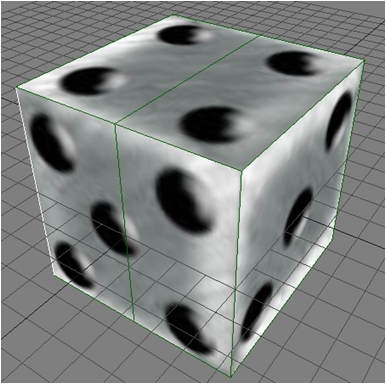

Geralmente, um programador tem dificuldades quando precisa fazer algum tipo de design, e vice-versa, principalmente na área de games onde um programador de games é muito mais que um programador web, e um artista é muito mais que um web designer, por exemplo. Eu sou programador, mas meus primeiros estágios foram em web design, então pelo menos sei que #FFFFFF é branco (rs), mas fazer algo como modelagem 3D é bem mais complicado.

Na pós-graduação, tive aula de Modelagem 3D. No começo foi muito complicado me ambientar em um software de modelagem 3D, parece confuso, mas depois de mexer um pouco é fácil de se acostumar. O software que useri foi o Softimage XSI 6.5, no site da [Softimage ](http://www.softimage.com/downloads/ "Softimage")existe uma versão free deste software, o Softimage XSI Mod Tool 6.0, porém os dois não trabalham com o mesmo tipo de arquivo (o que foi um grande problema pra mim), ou seja, arquivos feitos em um não podem ser utilizados no outro.

Não mexi ainda em outros softwares 3D como Blender, Maya e Studio Max, mas posso dizer que o XSI é bem simples de usar depois que você se acostuma com ele, até mesmo para quem nunca mexeu com isso. No site da [Softimage](http://www.softimage.com/products/xsi/customer_stories/default.aspx "Softimage") é possível ver alguns jogos que foram feitos com XSI, entre eles Metal Gear Solid 4, Devil My Cry 4 e Ninja Gaiden 2.

Aprendi três técnicas para modelagem 3D: Primitivas Geométricas, Linhas (Extrusão e Revolução) e Livre (Poly By Poly e Box Modeling). Abaixo estão algumas modelagens que fiz no curso (as menos piores) utilizando as técnicas acima. Além da dificuldade em me acostumar com o ambiente, o que achei mais complicado foi abrir a malha (também conhecido como Mapeamento, consiste em desdobrar o modelo em um plano) e aplicar a textura, que é como montar um quebra-cabeça.

<figure class="wp-caption aligncenter" id="attachment_21" style="width: 386px"><figcaption class="wp-caption-text">Modelagem utilizando técnicas de Primitivas Geométricas e Revelução</figcaption></figure><figure class="wp-caption aligncenter" id="attachment_23" style="width: 366px"><figcaption class="wp-caption-text">Modelagem utilizando técnicas de Primitivas Geométricas e Revolução</figcaption></figure><figure class="wp-caption aligncenter" id="attachment_24" style="width: 386px"><figcaption class="wp-caption-text">Modelagem utilizando técnica de abertura de malha e textura</figcaption></figure><figure class="wp-caption aligncenter" id="attachment_25" style="width: 495px">")<figcaption class="wp-caption-text">Modelagem utilizando ténicas de Primitivas Geométricas, Extrusão, abertura de malha e textura</figcaption></figure><figure class="wp-caption aligncenter" id="attachment_27" style="width: 381px">")<figcaption class="wp-caption-text">Modelagem utilizando técnicas de Rotoscopia, Extrusão, abertura de malha e textura</figcaption></figure><figure class="wp-caption aligncenter" id="attachment_28" style="width: 450px">")<figcaption class="wp-caption-text">Modelagem utilizando técnica de simetria no modelo anterior e imagem da textura utilizada</figcaption></figure>Descrição (simplificada) das técnicas mencionadas acima:

**Primitiva Geométrica:** O modelo é montado utilizando figuras geométricas “encaixadas”. Na primeira imagem, do Boneco de Neve, utilizei várias esferas para formar o modelo.

**Revolução:** Quando não há uma primitiva geométrica na forma que queremos, podemos desenhá-la com Revolução. Criamos uma linha com a forma que desejamos e, quando aplicamos a Revolução na linha, ela é duplicada diversas vezes em curva para dentro. Por exemplo, na segunda image, do Toad, fiz uma linha para o corpo do personagem, e utilizei revolução para criar o corpo. A Revolução pode ser utilizada em outros casos também, além deste.

**Extrusão: **Criamos uma nova forma a partir da extrusão de uma face de um objeto. É como se a face fosse puxada para fora, duplicando-a.

**Abertura de malha:** Abrimos o objeto criado como se fosse uma dobradura, esticamos suas faces em um plano. Isto é feito para aplicar a textura, e é uma das partes mais complicadas de fazer, dependendo da complexidade do modelo.

**Textura: **Com a malha aberta, montamos o quebra-cabeça, encaixando cada parte da textura na face correspondente. É tão complicado quanto abrir a malha.

Além das técnicas acima, para a modelagem de personagens existem duas metodologias: Rotoscopia (utilizar uma imagem como base e modelar em cima) e Edge-Loop (criar linhas nas faces para mudar sua forma, muito utilizado para detalhes). As definições acima são minhas interpretações do que vi nas aulas, talvez não sejam academicamente corretas, mas espero que dê para ententer, qualquer coisa é só postar a dúvida.

No próximo post irei escrever sobre as aulas de Técnicas de Programação de Games.

Até mais!
