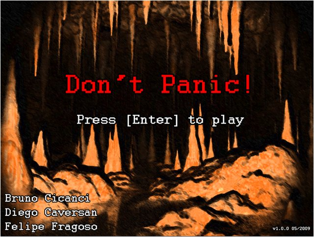

Como havia comentado em outro post, vou falar sobre a matéria de Técnicas de Programação de Games que tive na pós, onde o foco era apresentar as principais técnicas de programação, muitas aplicáveis não somente a games, e fazer um primeiro contato com uma biblioteca específica para games, que neste caso foi a [SDL](http://www.libsdl.org/ "SDL").

Para programar os exercícios, utilizamos o Visual Studio 2005 e a linguagem de programação C++. Ao final desta matéria, tivemos que entregar um game, ou pelo menos uma demo de um game, utilizando os conceitos que foram apresentados nas aulas.

Neste post quero falar um pouco sobre o que vi, sem me aprofundar, e falar sobre o projeto de game que desenvolvi junto com meu grupo. Vou citar alguns dos conceitos, em outro post eu irei tratar mais a fundo estes conceitos e como aplicá-los em programação de games.

Tópicos que foram abordados nas aulas:  
 – Conceitos gerais de programação com C++  
 – Estruturas de Dados  
 – Documentação com UML  
 – Metodologia de Desenvolvimento Ágil XP (eXtreme Programming)  
 – A biblioteca SDL  
 – Técnica de Main Loop (parte do código onde o game é controlado)  
 – Técnicas de Detecção de Colisão  
 – Arquitetura de Software para Games  
 – Máquina de Estados para Games  
 – DirectX (overview)  
 – Padrões de Projetos para Games (Design Patterns)  
 – Conceitos de Otimização de código

Apesar de tudo ter sido apresentado sem muita profundidade, aprendi muitas coisas que não conhecia e que realmente fazem diferença na hora de programar. Foi praticamente o meu primeiro contato com C++, que não foi um “Hello World”.

Vamos ao projeto agora. O nome do jogo foi definido como “Don’t Panic!”, e o objetivo e as características do game deixa claro o por que do nome:  
 – Jogo de estratégia casual 2D  
 – Jogador controla um personagem, fazendo-o escapar das rochas que caem aleatóriamente da parte superior da tela  
 – O objetivo é resistir pelo maior tempo possível sem ser atingido por uma rocha  
 – As rochas que caem no chão podem ser empurradas, se não estiverem obstruídas por outras rochas nas laterais e em cima  
 – Se as rochas formarem uma fileira horizontal completa, esta fileira desaparece dando mais espaço ao jogador e pontos  
 – Se uma fileira de rochas não ficar completa, mais rochas irão cair em cima de outras rochas até o jogador não conseguir escapar  
 – A pontuação é baseada no tempo em que o jogador resistir, mais um bônus recebido por cada fileira completa que desaparecer

Imagens do desenvolvimento do game, do início ao fim:

<figure class="wp-caption aligncenter" id="attachment_53" style="width: 495px"><figcaption class="wp-caption-text">Concept Art</figcaption></figure><figure class="wp-caption aligncenter" id="attachment_54" style="width: 495px"><figcaption class="wp-caption-text">Desenvolvimento</figcaption></figure><figure class="wp-caption aligncenter" id="attachment_57" style="width: 495px"><figcaption class="wp-caption-text">Tela de Abertura</figcaption></figure><figure class="wp-caption aligncenter" id="attachment_58" style="width: 495px"><figcaption class="wp-caption-text">Tela do Jogo</figcaption></figure><figure class="wp-caption aligncenter" id="attachment_59" style="width: 495px"><figcaption class="wp-caption-text">Game Over</figcaption></figure>Não conseguimos implementar tudo que queríamos. Criamos um demo, mas sem algumas coisas como pontuação e fazer o personagem pular e ficar em cima dos blocos. Algumas dificuldades que tivemos no desenvolvimento deste game:  
 – Entender conceitos de movimentação do personagem  
 – Controlar vários objetos ao mesmo tempo na tela  
 – Verificar a colisão de cada objeto com os demais e o jogador  
 – Dificuldades gerais com C++  
 – Desenvolver arte para o jogo (por isso colocamos o personagem de Alex Kid)  
 – Incluir música e efeitos sonoros no jogo

Espero um dia terminar este game. Estou pensando em adaptá-la para o DS, já que estou estudando desenvolvimento para esta plataforma (preciso escrever sobre isso também!).

