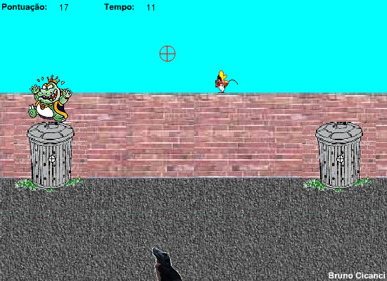

Hoje assisti uma palestra na Alpha Channel sobre Web Games, que me incentivou a escrever este post, e também me lembrou de um web game em flash que fiz em 2005, seguindo um tutorial que achei no Google. Foi o primeiro jogo que fiz, quando estava aprendendo Flash no meu primeiro estágio de web designer.

<figure class="wp-caption aligncenter" id="attachment_78" style="width: 495px"><figcaption class="wp-caption-text">Clique na imagem para jogar</figcaption></figure>

Web games são jogos de desenvolvimento curto, geralmente simples e casuais, e que podem ensinar muitas coisas sobre o desenvolvimento de um jogo. Uma das principais vantagens de desenvolver este tipo de jogo é a possibilidade de fazer um bom jogo sozinho, além do Flash ser uma ferramenta poderosa e não muito complicada de mexer, bem mais simples de se familiarizar do que começar a desenvolver em C++, por exemplo.

Como já escrevi neste [post](http://gamedeveloper.com.br/blog/2009/05/27/programador-de-games-por-onde-comecar/ "programador de games: por onde começar?"), o Flash é uma opção para começar a estudar o desenvolvimento de games, talvez a mais simples para quem não conheça muita coisa de programação. Este tipo de jogo, mesmo sendo simples e, muitas vezes, cópia de algum outro jogo existente, pode ajudar muito a formar um portifólio.

As empresas brasileiras que desenvolvem este tipo de jogo vendem isto como uma opção de solução de publicidade e marketing, também conhecido como Advert games. Esta deve ser a melhor forma de gerar lucro, pois jogos puramente de entretenimento não dão retorno financeiro, embora possa ser explorada a venda de publicidade no site em que o jogo está hospedado, tudo depende do modelo de negócio da empresa ou do desenvolvedor.

Espero que gostem do jogo que fiz, comentários serão muito bem vindos!
