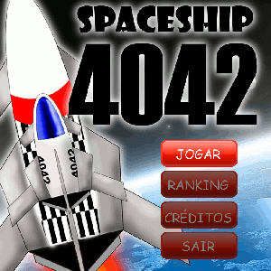

O **SENAC São Paulo** organizou sua primeira competição de jogos digitais, o [e-Games](http://www3.sp.senac.br/hotsites/gd2/egames/ "e-games"), onde os concorrentes deveriam criar um jogo utilizando [XNA](http://creators.xna.com/ "XNA"). Além do jogo feito com XNA, foi necessário entregar um vídeo, documento de game design, apresentação, resumo e guia de instalação. [**O Download do jogo pode ser feito clicando aqui**](http://www.gamedeveloper.com.br/cicanci/games/SpaceShip4042_Windows_20091025.zip "SpaceShip 4042 com XNA"), ele necessita do [.Net Framework 3.5](http://www.microsoft.com/downloads/details.aspx?FamilyId=333325FD-AE52-4E35-B531-508D977D32A6&displaylang=en ".Net 3.5") e [Microsoft XNA Framework Redistributable 3.1](http://www.microsoft.com/downloads/details.aspx?FamilyID=53867a2a-e249-4560-8011-98eb3e799ef2&displaylang=en "XNA Framework 3.1") instalados para rodar, não é necessário instalar o jogo, apenas executar o **SpaceShip4042.exe**.

<figure class="wp-caption aligncenter" id="attachment_228" style="width: 300px"><figcaption class="wp-caption-text">Tela inicial do jogo desenvolvido com XNA</figcaption></figure>

O prazo para entrega foi na última sexta-feira, e eu decidi participar disto uma semana antes e sozinho. Ou seja, **tive apenas uma semana para fazer tudo isso**, além de ter que trabalhar e ir para a faculdade. Como estava sem tempo, decidi criar uma **versão do meu jogo de celular SpaceShip 4042** em XNA, pois já tenho todas as imagens para criar o jogo, além de ter todo o conceito pronto, só foi necessário programar.

Depois de uma semana dormindo menos de 4 horas por dia, virando noites programando, o resultado não foi exatamente o que eu imaginei, mas consegui terminar meu jogo com tudo que a versão de celular tem, com excessão de som, pois tive dificuldades com isto e estava sem tempo. Além disso, no lugar de um High Score, fiz um Ranking top 5.

Embora eu tivesse apenas que programar, tive vários problemas por não conhecer muitas coisas no XNA e não ter tempo suficiente para estudar melhor. **O maior problema que tive foi com a detecção de colisão por pixel.** No JME existe uma função que verifica a colisião entre dois Sprites, inclusive existe o tipo de dado Sprite. Já no XNA não é tão fácil assim, não existe Sprite e método de detecção de colisão pronto.

<iframe allowfullscreen="true" class="youtube-player" frameborder="0" height="402" src="http://www.youtube.com/embed/pDpPqLm1BMk?version=3&rel=1&fs=1&autohide=2&showsearch=0&showinfo=1&iv_load_policy=1&wmode=transparent" type="text/html" width="660"></iframe>

O método de colisão que utilizei consiste em **verificar se existe a interseção entre a área da imagem** dos dois Sprites que estão colidindo. Uma vez que esta interseção existe, vem a parte mais complicada que é verificar se existe a sobreposição dos pixels que não são transparentes na imagem, utilizando um vetor com a cor da cada pixel da imagem. Não é tão complicado quanto parece, mas é bem chatinho de fazer.

Resolvi o problema do Sprite criando uma classe com os atributos que achei necessários para a fazer a nave, os meteoros, os itens e os tiros. Os principais atributos são: um Vector2D para a posição do objeto, uma lista de Texture2D para guardar todos as imagens que compoem a animação do Sprite, um Rectangle para ser utilizado na detecção da colisão, um vetor de Color com as cores da imagem, um bool para a visibilidade, e inteiros para armazenar vida, frame da animação e movimentação do objeto. Criei métodos para desenhar, mover, esconder, causar dano e verificar se o sprite “morreu”.

Outro problema que tive, mas que foi simples de resolver, foi a animação, pois o XNA também não possui algo que facilite isto como o incrível arquivo GameDesign do JME. Utilizando um inteiro, controlei a animação do Sprite em cada quadro. Também tive dificuldades com a criação das telas e sua maniulação. Criei uma interface para telas, e todas as telas implementam os métodos default do XNA: Update, Draw e LoadContent, além de um para controlar a inicilização das variáveis. A classe principal do jogo inicia todas as variáveis que representam as telas e tem responsabilidade de controlar a exibição de cada uma, de acordo com o estado do jogo.

<figure class="wp-caption aligncenter" id="attachment_229" style="width: 500px"><figcaption class="wp-caption-text">Tela do jogo com os três tipos de Sprite criados</figcaption></figure>Se eu tivesse tido mais tempo, ou começado bem antes quando fiquei sabendo desde concurso, eu poderia ter feito muitas outras coisas e melhor, mas fiquei satisfeito em fazer um jogo em XNA em tão pouco tempo e sem conhecer tão bem as características desta tecnologia. **Fiz muitas coisas básicas para um jogo 2D**, e na minha opinião só faltou colocar som no jogo.

Assim como no JME, que tive dificuldades no começo, **tive dificuldades** com o XNA também, mas meus próximos jogos 2D nessas plataformas ficarão muito melhores, e provavelmente levarei menos tempo para programar, pois **aprendi muitas coisas desenvolvendo para plataformas diferentes com tecnologias distintas.** Praticamente tudo que utilizei aprendi fuçando nos exemplos do [XNA Creators Club](http://creators.xna.com/ "Creators Club") e nas dúvidas no forum, são ótimas fontes de informações.

Meu próximo passo agora é começar a estudar programação de jogos em 3D com C++. Este estudo é o primeiro passo para o meu **TCC ano que vem**, que provavelmente será um jogo em 3D com C++. Tenho algumas idéias para o jogo, mas nada decidido ainda, porém preciso aprender este tipo de programação, que eu tive contanto apenas no XNA para movimentação de modelos 3D simples na tela.

