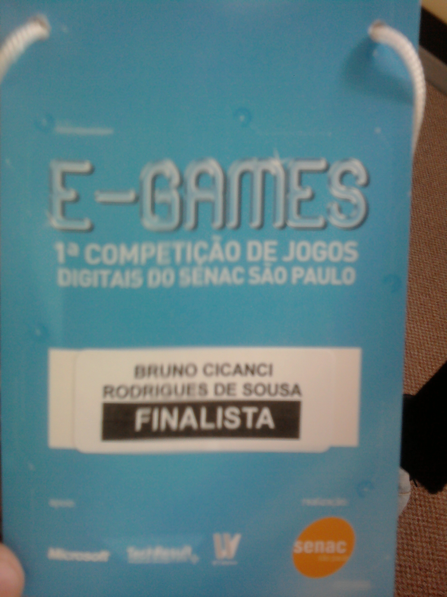

Ontem foi a final da primeira edição do concurso de jogos digitais organizado pelo SENAC São Paulo, o e-Games. Eu e mais 4 equipes finalistas apresentamos nossos jogos para um banca que os avaliou e decidiram os 3 melhores. Infelizmente não fiquei entre os 3 melhores jogos, **fiquei em 5º lugar**. No fundo eu esperava isso, já que fiquei bem surpreso por ser um finalista, sendo que fiz o jogo em apenas uma semana. Segundo a organização do evento, pouco mais de 60 equipes se inscreveram para este concurso, e apenas 20 e poucas equipes enviaram tudo que era necessário para participar.

<figure class="wp-caption aligncenter" id="attachment_261" style="width: 500px"><figcaption class="wp-caption-text">Entrada do evento no SENAC Santo Amaro</figcaption></figure>

Existem vários outros concursos como este que pretendo participar, com a Imagine Cup, o XNA Challenge e o Dream Build Play, mas agora vou me dedicar mais. Consegui um desempenho muito bom com um jogo simples e não muito original. Acho que uma desvantagem que tive foi fazer tudo sozinho, enquanto as demais equipes tinham pelo menos um artista. Preciso encontrar algum artista para me ajudar a fazer jogos, já que meu forte é a programação.

<figure class="wp-caption aligncenter" id="attachment_262" style="width: 500px"><figcaption class="wp-caption-text">Certificado de Finalista no e-Games 2009</figcaption></figure>O evento foi bem legal e muito bem organizado pelo SENAC. Todas as equipes deram entrevista para o Programa Novo da TV Cultura, teve um ótimo coffee break, ganhei uma camiseta e um certificado de finalista, e dei bastante risadas com as conversas com os demais finalistas. Embora eu não tenha ganho, valeu muito a pena participar disso tudo, e as equipes vencedoras mereceram o que conquistaram.

<figure class="wp-caption aligncenter" id="attachment_263" style="width: 500px"><figcaption class="wp-caption-text">Identificação de Finalista no e-Games 2009</figcaption></figure>Depois atualizo este post com mais imagens e videos que encontrar na internet sobre este evento, estou torcendo para que tenha muitas outras edições e que seja mais divulgado também.

**Atualizado:** Adicionei dois videos feitos no dia do evento: a entrevista para o Programa Novo da TV Cultura e o video feito pelo [Rodrigo van Kampen](http://peixefresco.net/ "peixe fresco"), membro da equipe vencedora do concurso, ambos retirados do blog [continue](http://continue.com.br/13/11/2009/post-convidado-conhece-o-e-games-nao-entao-vai-conhecer-um-pouco-agora "continue").

<iframe allowfullscreen="true" class="youtube-player" frameborder="0" height="402" src="http://www.youtube.com/embed/5RfoyJuz0Qw?version=3&rel=1&fs=1&autohide=2&showsearch=0&showinfo=1&iv_load_policy=1&wmode=transparent" type="text/html" width="660"></iframe>

<iframe allowfullscreen="true" class="youtube-player" frameborder="0" height="402" src="http://www.youtube.com/embed/UYcqzWXYkaM?version=3&rel=1&fs=1&autohide=2&showsearch=0&showinfo=1&iv_load_policy=1&wmode=transparent" type="text/html" width="660"></iframe>

