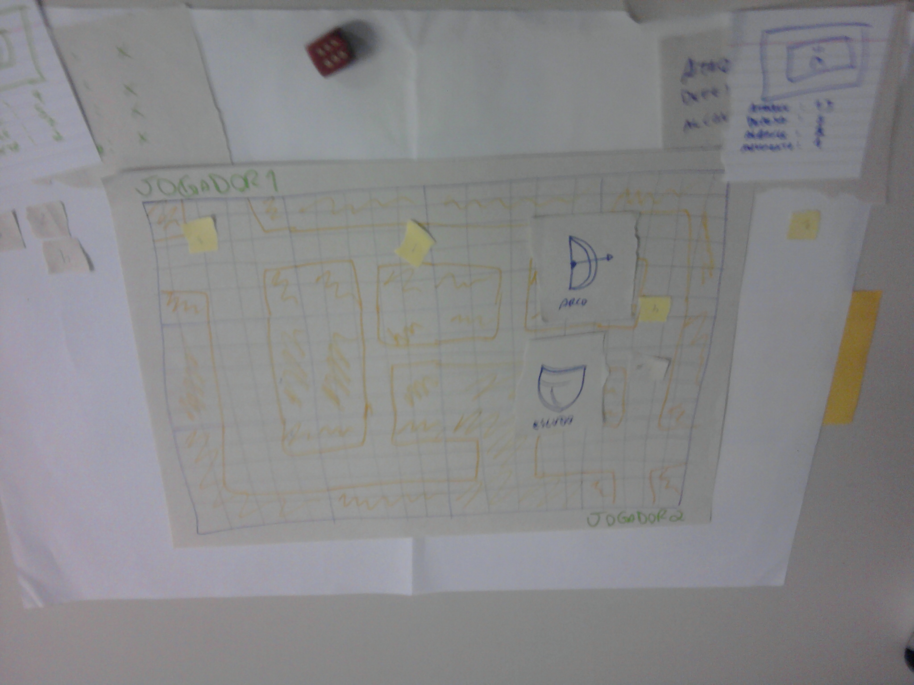

A usabilidade de um jogo digital é tão importante quanto a interface de um web site ou software, e em alguns aspectos as interfaces são semelhantes. Assim, podemos usar os mesmos métodos de análise de interface e usuabilidade em todos estes produtos citados.

Uma interface fraca e confusa pode fazer um web site perder clientes da mesma forma que, em um jogo digital, o jogador pode desistir de explorar mais o conteúdo e não gostar do jogo. **Por mais que o jogo seja inovador e divertido, uma interface ruim e mal desenhada pode estragá-lo**.

A análise de interface de um jogo digital é uma tarefa de game design, refletida no trabalho de programação de interfaces. Podemos utilizar vários métodos de análise de usabilidade, como os conceitos de [Jacob Nielsen](http://www.useit.com/ "Jacob Nielsen"), que possui uma bibliografia muito boa sobre usabilidade e interface homem-máquina. Seus conceitos podem ser utilizados em qualquer tipo de produto que precise de uma interface com alta usabilidade.

Neste semestre na pós-graduação tive aula de Projeto de Interfaces, onde estudamos a interação homem-máquina, usabilidade de sistemas e protótipos para validação de inteface. **Sem dúvidas a parte mais surpreendente desta matéria foi o protótipo de papel.**

Com pedaços de papel, post-it, canetas e lápis, criamos a interface de um jogo, desde o menu, a configuração, modo de jogo e o jogo em si. Com isto, foi possível testar a interface e alterá-la entre um teste e outro. O resultado foi ótimo, conseguimos deixar a interface do nosso jogo com uma usabilidade muito boa após 3 testes, sendo um deles com dois jogadores simultâneos.

Este é o conceito do jogo *Luta Encarniçada*, que criamos para testar a interface:

> Enfrente o exército inimigo comandando seus personagens até derrotar seu oponente em calabouços únicos. Cada mapa pode ser construído e customizado para que cada batalha necessite de estratégias diferentes. Cada guerreiro possui atributos de Ataque, Defesa, Mobilidade e Alcance balanceados, para que a montagem dos exércitos torne o jogo competitivo.

O teste de interface funciona da seguinte maneira: nossa equipe era compostar por um observador (apenas observa as reações do jogador e faz anotações e verifica o que pode ser melhorado), um “CPU” (altera a interface de acordo com a ação do jogador, imitando o comportamento de uma máquina) e um facilitador (informa ao jogador o que está sendo exibido na tela e espera pela sua reação, não pode induzir o jogador a tomar uma decisão e nem falar o que ele deve fazer). O jogador deve explorar a interface sem “travar”, caso seja muito necessário o facilitador pode dar uma dica, mas isto significa que a interface possui uma falha que deve ser arrumada para o próximo teste.

<figure class="wp-caption aligncenter" id="attachment_282" style="width: 500px"><figcaption class="wp-caption-text">Teste de usabilidade de interface com protótipo de papel</figcaption></figure>O protótipo feito com papel serve apenas para validar a interface e, se o jogo não for complexo, é possível validar um pouco da jogabilidade, que foi o que fizemos também. Esta é a conclusão do relatório da análise de interface que fizemos:

> O método de protótipo de papel é muito útil para avaliar a interface e a jogabilidade em jogos. Dependendo da complexidade do jogo, a jogabilidade fica difícil de ser testada devido à limitação do uso de papel e caneta, mas na validação de interface é perfeita e poupa re-trabalho.
>
> De maneira bem rápida e prática podemos alterar a interface e deixá-la pronta para testes sem ter que mexer com imagens ou linhas de código. Este tipo de prototipagem deve ser simples para que funcione corretamente, e é muito importante observar as ações do usuário e não induzí-lo a realizar uma ação que desejamos e consideramos a mais correta.

Este método de teste de interface é muito rápido, dinâmico e economiza muito tempo de programação e re-trabalho. É muito simples fazer um protótipo de papel – muito mais fácil do que criar uma demo para validar a interface. Acho bem legal também utilizar isto para validar a jogabilidade antes de pensar em programar, se a complexidade do jogo permitir isto.
