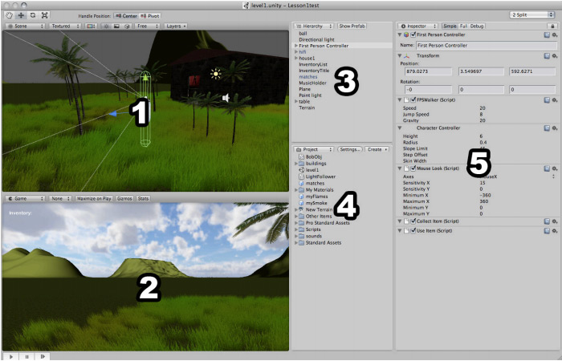

No final do ano passado, **duas grandes game engines ganharam versões gratuitas**, a [Unity](http://unity3d.com/ "Unity3D") e a [Unreal Development Kit (UDK)](http://www.udk.com/ "UDK"). Talvez estas foram as melhores notícias para os desenvolvedores independentes e estudantes no em 2009, pois agora **podemos desenvolver jogos utilizando game engines profissionais**. Pra mim foi muito bom, pois poderei utilizar uma destas game engines no meu TCC neste ano.

Na pós-graduação, em uma aula de Game Engine, meu grupo fez uma apresentação da Unity e um tech demo. A Unity tinha uma versão indie, que custava $200, que não é algo caro para uma pequena empresa, mas para quem quer apenas estudar isto não vale muito a pena, e foi esta versão que ficou gratuita. Existe também uma versão Pro, com muitas outras coisas a mais pelo preço de $1499.

<figure class="wp-caption aligncenter" id="attachment_348" style="width: 500px"><figcaption class="wp-caption-text">Interface da Unity</figcaption></figure>Minha primeira coisa que pensei ao abrir a Unity foi “certo… e agora?”. Para quem nunca viu, tudo pode parecer confuso, mas lembra bastante uma interface de um software de modelagem 3D como o Softimage XSI. Estudando a interface da Unity podemos aprender muitas coisas, pois quase tudo é intuitivo. **O que realmente é necessário é ter uma noção de ambientes 3D** e estudar algumas técnicas utilizadas em modelagem, isto pode facilitar bastante.

Com a versão gratuita, podemos desenvolver jogos para plataforma [Windows, MAC e Web](http://unity3d.com/unity/features/deployment "Windows, MAC e Web") (para Web é necessário instalar um plugin, semelhante ao flash). Existem complementos para a versão Pro que permite o desenvolvimento de jogos para [iPhone](http://unity3d.com/unity/features/iphone-publishing "iPhone") e [Wii](http://unity3d.com/unity/features/wii-publishing "Wii"). A [programação](http://unity3d.com/unity/features/scripting "Programação") pode ser feita utilizando C# (a Unity é baseada no [Mono](http://mono-project.com/Main_Page "Mono")), JavaScript ou [Boo](http://boo.codehaus.org/ "Boo") (uma variação de Python, feita por um brasileiro).

<figure class="wp-caption aligncenter" id="attachment_349" style="width: 375px"><figcaption class="wp-caption-text">Unity no iPhone</figcaption></figure>Podemos criar [modelos 3D](http://unity3d.com/unity/features/asset-importing "Modelos 3D") em diversos softwares e importar na Unity,de uma maneira incrivelmente fácil e simples: basta colocar o modelo no diretório da “Assets” do seu projeto, que ela automaticamente adiciona dentro do projeto, nem é necessário abrir e fechar o projeto. Isto é tão útil que podemos alterar o modelo salvo em Assets e visualizar o resultado dentro da Unity.

Apensar de ser um ambiente 3D, podemos criar um jogo em 2.5D, como o este [exemplo de tutorial](http://unity3d.com/support/resources/tutorials/3d-platform-game "Tutorial Plataforma") de jogo de plataforma. Outro ponto forte desta game engine é a utilização de [audio e vídeo](http://unity3d.com/unity/features/audio-and-video "Audio e Video") (vídeo só na versão Pro) nos jogos, da mesma maneira simples e prática que importamos um modelo 3D.

Estas são algumas das *features* da Unity:

- Editor integrado: Fácil utilização, pode ser customizado, funciona com drag n’ drop
- Gráficos: Renderização em tempo real, sistemas de partículas, suporte a DirectX e OpenGL
- Importação de modelos: Aceita diversos formatos, com suporte a texturas, bones e animações
- Publicação: Windows, Mac, Web, Wii e iPhone
- Shaders, Luz e Sombra: Efeitos prontos, elementos naturais, editor de shaders
- Rede: Suporte a sincronização, acesso remoto e conexão
- Física: Utiliza a PhysX da Nvidia, e possui recursos específicos, como componente de física para rodas, por exemplo
- Programação: Suporte a C#, JavaScript e Boo. Pode ser integrado à uma solução do Visual Studio
- Debug: Todos os parâmetros de qualquer objeto ou modelo podem ser alterados em tempo de execução, além de existir a possibilidade de pausar a execução para verificar parâmetros

Existem muitas outras [*features*](http://unity3d.com/unity/ "Unity features") na Unity, porém estas acima já a torna uma grande game engine, **cheia de recursos**. Além desta parte técnica, existe algo na Unity que merece muito destaque: sua [comunidade](http://unity3d.com/support/community "Unity comunidade"). Através do site, podemos entrar em contato direto com os desenvolvedores para dar sugestões e feedback. Existem também **foruns diversos e ativos**, com pessoas dispostas a te ajudar sempre que for necessário, além de um vasto material que inclui um **FAQ, Wiki, dicas, repositório de exemplos e um chat** (IRC). Ah, também existe uma revista publicada por eles, a **Unity Develop Magazine**.

Além de tudo isso, ainda podemos contar com um completo [suporte](http://unity3d.com/support/ "Unity suporte"), que oferece documentação técnica, manual, referências, exemplos de script, tutoriais, exemplos de projetos, vídeo aulas, artigos, e recursos gratuitos, como plugins desenvolvidos pela comunidade.

Por enquanto encontrei apenas um livro dedicado a Unity, o [Unity Game Development Essentials](http://www.amazon.com/Unity-Game-Development-Essentials-Goldstone/dp/184719818X/ref=sr_1_1?ie=UTF8&s=books&qid=1265712227&sr=8-1 "Unity book"), do [Will Goldstone](www.learnmesilly.com "Will Goldstone"). Em seu site, existem **excelentes vídeo aulas sobre a Unity**, e outros softwares. Eu fiz meu tech demo depois de assistir a primeira vídeo aula.

<figure class="wp-caption aligncenter" id="attachment_346" style="width: 243px"><figcaption class="wp-caption-text">Desenvolvimento de jogos com a Unity</figcaption></figure>Hoje, grande parte dos jogos feitos com a Unity são para PC e/ou Mac (inclusive um MMO), enquanto **jogos para Web enfrentam a barreira do Flash**. Mais de 325 jogos foram feitos e publicados para iPhone, porém poucos foram feitos para Wii.

Ao abrir a Unity pela primeira vez, após instalar, ela carrega um projeto demo, que é de uma ilha que utiliza diversos recursos. Este demo é muito legal para estudar, pois possui uma infinidade de pequenos detalhes que mostram o poder da Unity.

<figure class="wp-caption aligncenter" id="attachment_353" style="width: 500px"><figcaption class="wp-caption-text">Demo da Ilha na Unity</figcaption></figure>Vale muito a pena dar uma olhada no site da Unity, que possui muitas coisas legais para os desenvolvedores. Existem também muitos sites e tutoriais espalhados pela internet, estes são alguns que eu já usei e recomendo:

- Learn Me Silly: [http://www.learnmesilly.com/](http://www.learnmesilly.com/ "link1")
- Learn Unity3D: [http://learnunity3d.com/](http://learnunity3d.com/ "link2")
- Unify Community: [http://www.unifycommunity.com/](http://www.unifycommunity.com/ "link3")
- Unity: [http://unity3d.com/](http://unity3d.com/ "link4")

Eu comecei a estudar a Unity há pouco tempo, então não fiz muita coisa além de “brincar”. Provavelmente irei utilizar esta game engine no meu TCC da Pós-Graduação, e durante o desenvolvimento irei publicar aqui tutoriais sobre desenvolvimento de jogos com a Unity. Se quiser ver o **tech demo que fiz**, [clique aqui para fazer o download ](http://www.gamedeveloper.com.br/cicanci/games/UnityLesson01_BrunoCicanci_20100209.rar "Download tech demo")(versão para windows).

**UPDATE:**

Mais um link de tutoriais, Unity3D Student: [http://www.unity3dstudent.com/](http://www.unity3dstudent.com/ "link5")
