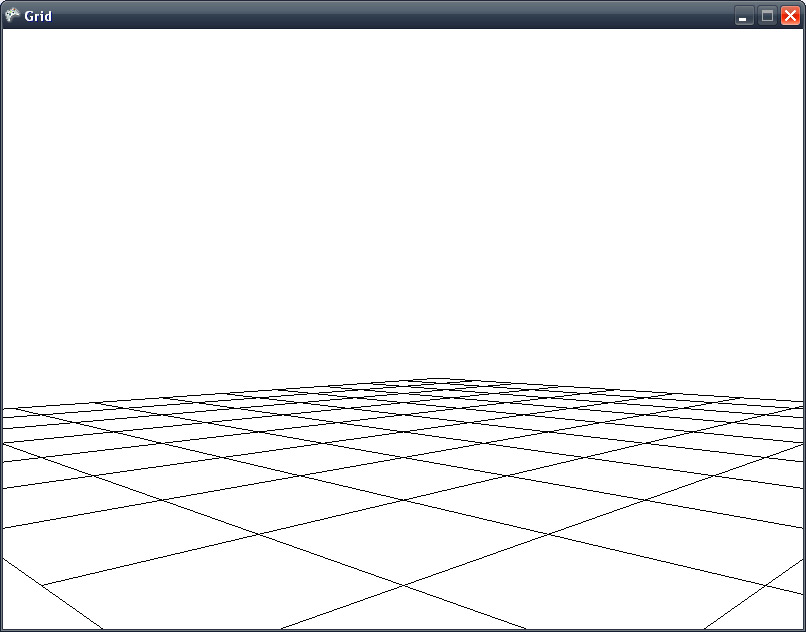

Uma das coisas que tenho estudando bastante ultimamente, além da Unity e de C++, é o XNA. Por ser algo gratuito e bem difundido pela Microsoft, é bem fácil de encontrar ajuda na internet sobre qualquer coisa que você quer fazer ou algum erro estranho, principalmente no fórum oficial do [XNA Creators Club](http://forums.xna.com/forums/ "XNA Creators Club"), além dos exemplos e tutoriais que podem ser encontrados neste site. Mesmo assim, sempre existe aquele detalhe que você não consegue encontrar ou que simplesmente não funciona do jeito que deveria.

Isto aconteceu comigo quando estava tentando montar um Grid em 3D com XNA. Eu queria criar um método para gerar um Grid dinâmico, com o número de linhas de colunas que seriam recebidos por parâmetros. Encontrei diversas soluções, porém nenhuma funcionou do jeito que eu queria, ou não consegui adaptar para o que eu precisava. Assim, tive que estudar como fazer desenho de pontos e retas em 3D e criar meu próprio método para isto.

Primeiro eu tinha pensando em desenhar uma célula, e depois utilizar um conjunto de células em uma classe Grid. Esta idéia não deu muito certo, pois ficaria bem complicado gerenciar o desenho de cada célula. A minha solução final ficou mais simples: criei uma classe Grid onde eu traço retas em pontos que formam o meu Grid, de acordo com o número de linhas e colunas. Abaixo trecho do código responsável por montar o Grid:

<figure class="wp-caption aligncenter" id="attachment_391" style="width: 521px"><figcaption class="wp-caption-text">Código do Grid no XNA</figcaption></figure>Após montar o Grid em uma variável VertexPositionColor, basta utilizar o método DrawUserPrimitives() desenhando uma LineList. Para visualizar o Grid é necessário outras coisas além disso, como definir uma matrix de View e uma de Projeção, que são coisas bem mais básicas do que a lógica de desenhar um Grid. Além do XNA Creators Club, existe o [XNA MSDN Library](http://msdn.microsoft.com/en-us/library/bb200104.aspx "MSDN") da Microsoft, que também é muito útil para aprender.

<figure class="wp-caption aligncenter" id="attachment_392" style="width: 564px"><figcaption class="wp-caption-text">Desenho do Grid em 3D</figcaption></figure><figure class="wp-caption aligncenter" id="attachment_393" style="width: 564px"><figcaption class="wp-caption-text">Desenho do Grid em 3D</figcaption></figure>Espero que isto seja útil para quem está aprendendo XNA. Qualquer dúvida é só perguntar nos comentários!
