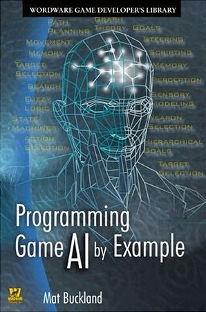

Em muitos jogos, a Inteligência Artificial é a principal responsável pela diversão que um game proporciona. Por exemplo, você consegue imaginar jogos como CALL OF DUTY ou GTA sem a inteligência que os NPCs possuem? Segundo este [artigo do David Wong](http://www.cracked.com/article_15748_gamers-manifesto.html "Gamer Manifesto"), a aprimoração da I.A. nos jogos é uma das coisas que os jogadores hardcore desejam. Quanto mais real, melhor para a experiência do usuário.

A I.A. é muito importante, mas alguns jogos ficam perfeitos com uma** I.A. simples** e limitada, ao contrário de jogos como SPORE que deve ter uma implementação absurda de** Redes Neurais**. O desenvolvedor de jogos deve conhecer os principais algoritmos de I.A., mas não é necessário sempre usá-los em todos os projetos. Na pós-graduação, tivemos uma matéria dedicada a I.A. nos jogos digitais, onde o professor [Murilo Garcia](http://www.murilogarcia.com.br "Murilo Garcia") apresentou as principais técnicas e quais problemas elas ajudam a resolver.

Como trabalho para avaliação, tivemos que implementar técnicas de I.A. que serão úteis em nossos TCCs. Abaixo está uma descrição do techdemo que fiz:

<figure class="wp-caption aligncenter" id="attachment_484" style="width: 550px"><figcaption class="wp-caption-text">Imagem do Techdemo de Inteligência Artificial</figcaption></figure>> Neste techdemo o quadrado verde fica patrulhando o canto superior esquerdo da tela, enquanto o usuário/jogador controla o quadrado azul com as teclas direcionais do teclado.
>
> O quadrado verde fica no estado de patrulha enquanto o quadrado azul estiver a certa distância dele. Quando o quadrado azul se aproximar, o quadrado verde ficará vermelho e mudará o seu comportamento para perseguição do quadrado azul.
>
> No estado de perseguição, o quadrado azul deverá fugir, até ficar um pouco distante do quadrado vermelho. Quando estive longe do quadrado azul, o quadrado vermelho volta para o estado de patrulho no canto superior esquerdo e ficará novamente verde.
>
> Para a troca do comportamento do quadrado verde/vermelho foi feita uma máquina de estado, que varia entre Patrulha e Perseguição. Quando o quadrado está verde, a patrulha é fixa no canto superior esquerdo, sendo que esquete quadrado sempre voltará para patrulhar o seu canto quando o estado de Perseguição se tornar Patrulha.
>
> No estado de perseguição, com o quadrado tornando-se vermelho, o quadrado azul é perseguido em uma velocidade constante, pouco inferior à velocidade do jogador, e só muda de estado quando a distância entre os dois quadrados se tornar grande o bastante para o quadrado verde voltar a patrulhar seu canto.
>
> Este techdemo foi desenvolvido com C++ e SDL, utilizando o Visual Studio 2008.

A implementação das técnicas citadas pode não ser a mais perfeita do mundo, mas se você quiser ver como foi feita,[** o código fonte está neste link**](http://pastie.org/901265 "Código Fonte"). Qualquer dúvida é só comentar aqui!

Vou aproveitar este post sobre I.A. e indicar mais um livro, este é um dos que foi utilizado pelo professor como bibliografia desta matéria, o **Programming Game AI by Example** de MatBuckland, que ensina vários conceitos e algoritmos de I.A. com exemplos de implementação. Este livro trata I.A. no geral, não exclusivamente para games, mas praticamente tudo que está nele é aplicável em um jogo digital:

<figure class="wp-caption aligncenter" id="attachment_487" style="width: 298px"><figcaption class="wp-caption-text">Programming Game AI by Example</figcaption></figure>
