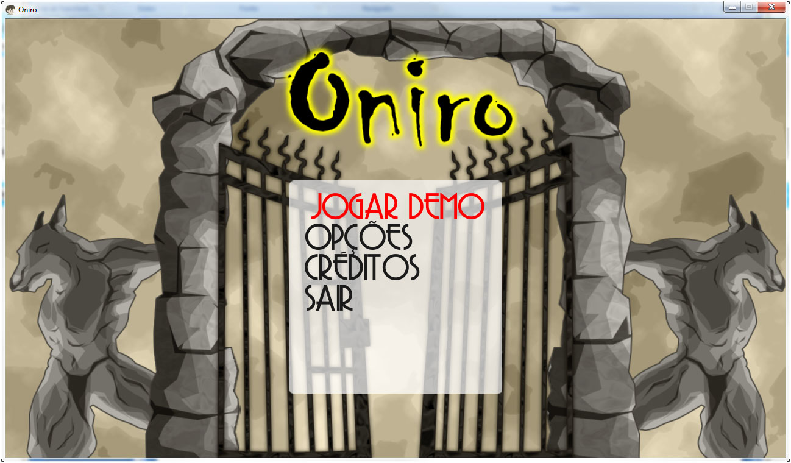
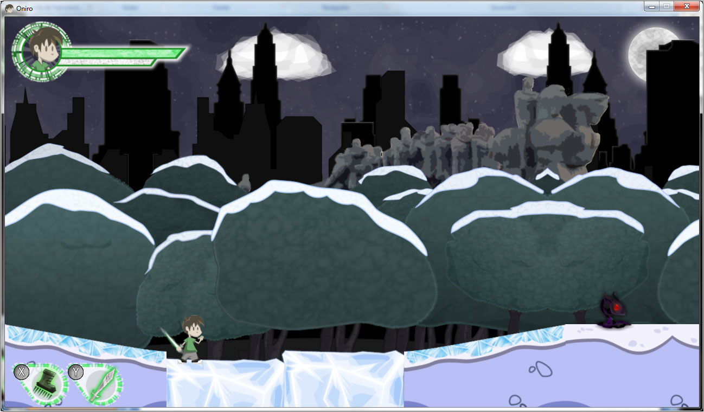
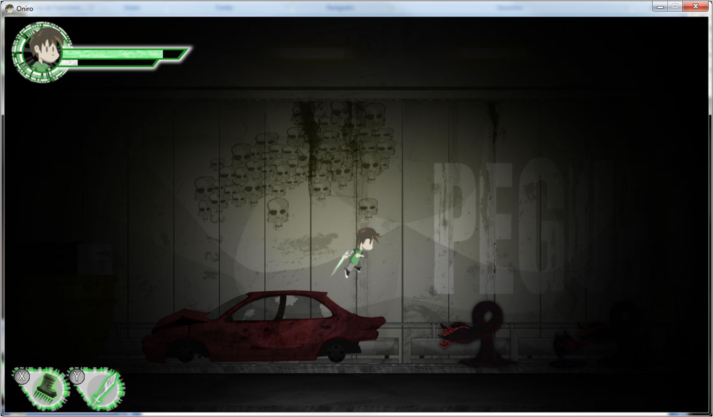
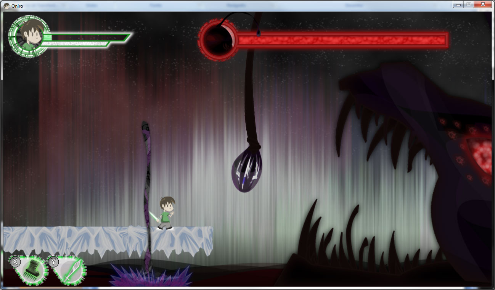

Depois de 4 meses de desenvolvimento (game design, programação e arte), e algumas noites sem dormir, consegui terminar o meu  TCC da pós-graduação em Games: Produção e Programação no SENAC. Meu projeto foi a versão de demonstração do Oniro, um jogo de aventura com plataformas em 2D, desenvolvido utilizando XNA e [FlatRedBall](http://www.flatredball.com/ "FlatRedBall").

Fiquei muito feliz, pois além de ter conseguido terminar o projeto no prazo ele ficou muito bom, tanto que tirei **nota 10** na apresentação para a banca no SENAC. Não teria conseguido isto sem a ajuda do Osmar de Melo Júnior, que fez toda a arte. Obrigado! =)

### [**Aqui está o link para download da versão demo do Oniro**](https://s3-sa-east-1.amazonaws.com/blog-gd/games/Oniro_20101206.rar "Oniro").

Em um [post mais antigo](http://gamedeveloper.com.br/blog/2010/05/07/inicio-do-meu-projeto-de-jogo-para-tcc/ "Início do TCC"), escrevi sobre o início do projeto com a escolha da tecnologia utilizada baseada no estilo do meu jogo. Agora vou contar um pouco sobre o jogo e sobre o processo de desenvolvimento após a decisão de fazer um jogo de plataforma em 2D utilizando XNA. Isto é praticamente o *post mortem* do meu projeto. Dividi o processo em 4 partes: Game Design, Programação, Arte e Pós-produção.

<figure class="wp-caption aligncenter" id="attachment_594" style="width: 556px"><figcaption class="wp-caption-text">Oniro – Tela de Menu</figcaption></figure>**Game Design**

Aqui é onde tudo começa. Com a idéia de fazer um jogo de plataforma 2D, comecei a pesquisar que tipo de jogo poderia utilizar como referência. Provavelmente o primeiro game que pensamos ao falar “Plataforma 2D” é o Super Mario Bros., mas no meu caso a inspiração veio de outro grande game: [Braid](http://www.braid-game.com/ "Braid"). Este é um jogo de plataforma 2D independente, genial e muito bonito, sem falar na sua trilha sonora praticamente perfeita. Eu escolhi este jogo para ser uma base do que eu queria fazer, claro que não seria uma cópia dele, é apenas uma referência.

Com a tecnologia e a mecânica do jogo definidas, faltou uma parte importante: o tema do jogo. No início do ano, quando comecei a pensar no meu TCC, eu estava com um grande interesse pelas obras de Neil Gaiman, principalmente Sandman. Decidi que o tema do jogo teria o deus grego dos sonhos Morfeus, mas para não ficar uma cópia da obra de Gaiman, eu fui atrás das referências que ele utilizou para criar Sandman, e sua principal fonte foi a mitologia grega. Assim, o jogo teria como personagem secundário o mesmo deus, porém teria mais mitologia do que a HQ de Gaiman.

Neste contexto, encontrei o que diferenciaria meu jogo de Sandman, sem deixar de ter isto como uma forte referência: o mundo dos sonhos de Morfeu foi dominado por Pesadelos, e ele precisará da ajuda de um garoto para salvar o mundo dos sonhos e recuperar relíquias roubadas pelos Pesadelos de outros deuses gregos. Ai encontrei outro problema: como seria o mundo dos sonhos? Então tive a idéia de que o mundo dos sonhos é formado pelas lembranças de onde o garoto que irá ajudar Morfeu vive, porém suas lembranças foram distorcidas pelos Pesadelos. E o local escolhido foi também uma homenagem minha para o locar onde vivo, portanto escolhi a cidade de São Paulo como referência para o mundo dos sonhos pela visão do garoto. Assim, os níveis tem detalhes que são de alguns locais na cidade de São Paulo, porém em nenhum momento isto é revelado para o jogador. Esta é a sinopse do jogo:

Jogo de aventura onde um garoto, Paulo, é escolhido pelo Deus Grego dos Sonhos Morfeu para ajudá-lo a recuperar as 12 relíquias quer permitem o acesso dos doze dos Deuses do Olímpio ao Mundo dos Sonhos. As relíquias foram roubadas pelos Pesadelos, seres sombrios que querem dominar o Mundo dos Sonhos, lar e reino de Morfeu e seus irmãos, local onde todas as criaturas que sonham vão ao cair no sono.

Oniro significa Sonho em grego. Este nome foi escolhido por que o jogo será baseado na mitologia grega e será ambientado no Mundo dos Sonhos do deus grego Morfeu.
> Jogo de aventura onde um garoto, Paulo, é escolhido pelo Deus Grego dos Sonhos Morfeu para ajudá-lo a recuperar as 12 relíquias quer permitem o acesso dos doze dos Deuses do Olímpio ao Mundo dos Sonhos. As relíquias foram roubadas pelos Pesadelos, seres sombrios que querem dominar o Mundo dos Sonhos, lar e reino de Morfeu e seus irmãos, local onde todas as criaturas que sonham vão ao cair no sono.
>
> Oniro significa Sonho em grego. Este nome foi escolhido por que o jogo será baseado na mitologia grega e será ambientado no Mundo dos Sonhos do deus grego Morfeu.
>
> O público-alvo do Oniro são jogadores casuais com idade entre 15 e 20 anos, porém este produto também deve atingir outras faixas etárias e jogadores hardcore. O jogo apresentará um nível de dificuldade crescente em seus desafios além de diversas conquistas que o jogador não precisará conseguir para finalizar o jogo, mas são objetivos secundários que podem chamar atenção do público hardcore.

Com o conceito definido, iniciei o Game Design Document (GDD). Ainda não encontrei um modelo de GDD que me agradou, o que utilizei é uma mistura de diversos outros modelos que encontrei na internet e em livros de Game Design. No documento, separei as características do jogo nestas categorias: Visão Geral; Produto; Game Design; Level Design; Personagens; História; Especificações Técnicas; Versão DEMO. Como eu não sou Game Designer, achei que ficou bem fraco este documento, talvez se tivesse o foco apenas nisso o documento e o jogo teriam ficado mais legais, mas como tive que pensar muito em programação, isto acabou me limitando e forçando a pensar em coisas simples.

[Neste link](https://s3-sa-east-1.amazonaws.com/blog-gd/download/GDD_Oniro_BrunoCicanci.pdf "GDD Oniro") você pode baixar o GDD. Estou disponibilizando o documento para download por que fica mais fácil entender os conceitos do jogo e também para quem quiser ver o modelo de GDD que utilizei. Por favor, não reproduza este arquivo ou parte dele, use apenas como referência.

<figure class="wp-caption aligncenter" id="attachment_599" style="width: 556px"><figcaption class="wp-caption-text">Oniro – Parque do Ibirapuera</figcaption></figure>**Programação**

Esta foi a parte em que mais me dediquei. Fiz muitas coisas que no final ajudaram muito, e outras nem tanto. Deste o início eu tive uma preocupação principal: deixar o código flexível para implementar facilmente qualquer alteração ou incluir novas funcionalidades. Nesta parte minha experiência de quase 4 anos como Analista de Sistemas ajudou muito, pois pude utilizar alguns design patterns e metodologia de desenvolvimento ágil que costumava utilizar em softwares comerciais. O resultado foi muito bom. Com exceção de algumas partes do código, tudo foi desenvolvido da maneira que imaginei, inclusive tive tempo para reescrever alguns trechos de código que não estava muito bem feitos ou que existiam uma maneira melhor para fazer.

Eu geralmente sou muito crítico com o que faço, e raramente acho que algo está tão bom que não precise ser melhorado, mas no caso deste jogo eu gostei do meu trabalho. Claro que daqui um ano quando eu olhar este código novamente vou achar vários defeitos e pontos que poderiam ser feitos de outra maneira. Acho que o com meu nível de conhecimento de programação de jogos, o código está bom o bastante para ser reutilizado ou continuado até a versão final do jogo.

Quando escolhi utilizar o XNA foi devido ao meu conhecimento desta ferramenta e também de C#. E esta escolha foi muito inteligente, pois tive tempo para melhorar o código ao invés de estudar e pesquisar o funcionamento de coisas básicas. Porém, nem toda a decisão foi boa. Procurei frameworks complementares para o XNA, e encontrei três que pude analisar e escolher o mais indicado para minha necessidade:

- **Farseer Physics Engine:** Uma biblioteca para o XNA com foco na simulação de física muito simples de utilizar. Apesar ser muito boa para física, não possui suporte para outras partes de um jogo, como criação de níveis e animações. Utilizando a Farseer haveria a necessidade de desenvolver muitas funcionalidades para o jogo, funcionalidades que estavam sendo buscadas em um complemento para o XNA e, assim, focar apenas no desenvolvimento do jogo.
- **Torque X 2D:** Uma game engine muito fácil de utilizar que requer pouca programação, uma vez que tudo pode ser feito em sua interface visual. Apesar de possuir suporte a diversas funcionalidades, muitas delas são vendidas separadas da game engine, que também não é gratuita. Esta solução foi descartada devido ao investimento necessário, além de um problema maior: seria necessário aprender a utilizar esta game engine para o desenvolvimento do jogo, e uma das prioridades do projeto era não perder tempo.
- **FlatRedBall:** Esta biblioteca para XNA surgiu como a melhor solução para o que estava sendo buscado: um complemento com funcionalidades prontas para economizar tempo de desenvolvimento e focar no jogo. Com uma física inferior à da Farseer, porém com mais funcionalidades relacionadas à criação de níveis e animações, a FlatRedBall foi escolhida como complemento ao XNA. Esta game engine é gratuita, porém pede a inclusão de seu logo no início do jogo. A FlatRedBall possui diversos softwares para criação de animações, telas, entre outros, chamado Glue. Porém, ela permite a criação de tudo isso através de programação, funcionando apenas como uma biblioteca de recursos para o XNA. Assim, o projeto não ficou preso ao Glue, foi utilizada apenas a DLL da FlatRedBall no jogo.

A decisão de utilizar a FlatRedBall junto com o XNA foi muito boa no início, mesmo perdendo alguns dias para testá-la. Durante o desenvolvimento do projeto, diversos recursos foram extremamente úteis, porém perto do final do projeto tive um grande problema: detecção de colisões. Nos testes que fiz, verifiquei a colisão de objetos simples, como dois quadrados, mas no jogo existem colisões mais complexas e simultâneas, e foi ai que tive problemas. Parte dos problemas foi culpa minha, porém depois que arrumei tudo que estava errado, comecei a esbarrar com limitações da FlatRedBall. Como esta engine é gratuita e está em desenvolvimento contínuo, muitos dos problemas que tive ainda não tinham uma solução definitiva ou não tinha sido implementado, então tive que escrever código que deveria estar na engine.

Esta foi a parte quem que a minha decisão não foi tão boa. No final me arrependi um pouco de ter utilizado a FlatRedBall devido aos problemas que tive e a sua falta de recursos. Acredito que se tivesse utilizado a Farseer para a física e tivesse desenvolvido todo o resto que usei da FlatRedBall (basicamente recursos como sprites e screen) o resultado final teria sido melhor e menos problemático.

<figure class="wp-caption aligncenter" id="attachment_601" style="width: 556px"><figcaption class="wp-caption-text">Oniro – Túnel Ayrton Senna</figcaption></figure>**Arte**

Desde o início do projeto eu tinha idéia de como queria que a arte do jogo fosse feita, eu só não tinha gente pra fazer isso pra mim. Até tentei encontrar alguém, mas como não encontrei decidi começar o projeto utilizando imagens da internet, e depois que tivesse alguém para fazer a arte eu só teria o trabalho de substituir as imagens de teste pela arte final. Estava com medo de não encontrar alguém para desenhar o conteúdo do jogo, e pensei até em fazer um curso de desenho, mas não teria tempo para aprender o bastante pra fazer a arte do jogo. Outra idéia que tive era utilizar fotos com efeitos, porém acho que isso ficaria meio estranho.

Nesta parte eu tive sorte. Muita sorte mesmo. Durante o desenvolvimento do meu TCC eu entrei na Glu Mobile como engenheiro de software para trabalhar no porting de jogos feitos com J2ME para a América do Norte, e lá conheci o Osmar, que em apenas um mês conseguiu desenvolver toda a arte do jogo, e o resultado final ficou muito melhor do que eu imaginava. Trabalhar com ele foi bem legal, pois não precisei dizer o que eu queria, apenas falei das influências que tive quando pensei no jogo e mostrei o GDD para ele, a partir disso ele conseguiu criar a arte dos personagens e níveis que ficaram perfeitos para o jogo.

Enquanto ele desenhava a arte e me enviava as imagens, fiquei surpreso que a minha idéia de programar com imagens da internet de depois substituir funcionou perfeitamente, eu praticamente não tive que alterar nada do meu código, tive apenas que substituir as imagens temporárias pelas novas. Outro recurso que fiz, e ajudou muito no final, foi utilizar arquivos de texto para definir como seria cada parte do nível, com as imagens, tipos de colisão, itens, armadilhas, inimigos e seus comportamentos.

Este foi outro recurso simples que pensei no início do projeto, mas que na hora de montar o nível precisei escrever pouco código, toda a configuração estava no arquivo de texto. Neste ponto descobri que toda a minha preocupação com a flexibilidade do jogo tinha dado certo, o código estava bom o bastante para funcionar com qualquer coisa que eu quisesse fazer no nível, e com pouca ou nenhuma programação adicional. Também fiz um template para criar níveis. Só faltou mesmo fazer um editor de níveis visual, mas isso não era necessário para a versão demo e também tomaria um tempo que eu não tinha.

<figure class="wp-caption aligncenter" id="attachment_602" style="width: 556px"><figcaption class="wp-caption-text">Oniro – Lago do Ibirapuera</figcaption></figure>**Pós-produção**

Ao todo, o desenvolvimento do projeto levou 4 meses: 3 meses em que fiquei programando toda a base do jogo com imagens temporárias e pensando no game design, e depois mais 1 mês onde o Osmar fez as imagens e eu criei os níveis com elas. Neste último mês também tive a oportunidade de melhorar o código e corrigir alguns bugs. Como sempre testei muito durante o desenvolvimento, não tinham muitos bugs para corrigir no final do projeto.

Existe apenas uma coisa que não consegui fazer: a trilha sonora do jogo. Eu queria muito compor a música do jogo, principalmente por que toco teclado e guitarra há anos, era uma chance de incluir no meu jogo mais uma característica minha, porém não tive tempo e acabei utilizando músicas de domínio livre disponíveis na internet.

Aprendi diversas coisas durante o desenvolvimento deste projeto, que considero o meu primeiro jogo de verdade, embora seja uma versão de demonstração apenas. Este é um resumo das principais coisas que aprendi no projeto:

Coisas que deram certo:

- A preocupação com a flexibilidade do código e uso de design patterns
- Escolher uma tecnologia que eu já conhecia para desenvolver o jogo: XNA
- Criar um sistema para criação/edição de níveis, mesmo que seja apenas um arquivo texto
- Utilizar imagens da internet durante o desenvolvimento e depois substituir pela arte final

Coisas que NÃO deram certo:

- Utilizar a FlatRedBall pensando que não teria que me preocupar com nada
- Perder muito tempo estudando qual tecnologia iria utilizar – deveria ter utilizado XNA desde o início
- Fiz uns três cronogramas – ignorei todos =p
- Fazer a programação e o game design juntos – dei pouca atenção ao game design, estava mais preocupado com a programação desde o início

Apesar da correria que feito fazer este projeto, parte por culpa minha mesmo, eu gostei muito. Eu não teria conseguido fazer um jogo tão legal se não fosse pela ajudar do Osmar também, espero fazer muitos outros jogos com ele. Por enquanto não tenho interesse em continuar este projeto, vou deixar ele parado por enquanto. Agora quero dar prioridade para estudar desenvolvimento para iOS, C++ e Unity. Outra prioridade que terei é atualizar mais vezes este blog.

[**Aqui está o link para download da versão demo do Oniro**](http://www.qubit.com.br/cicanci/games/Oniro_20101206.rar "Oniro").

Espero que você goste, e por favor deixe comentários sobre o que achou do jogo. Até mais!

**UPDATE:**

Adicionei um vídeo que mostra as fases do jogo, infelizmente não tem som:

<iframe allowfullscreen="true" class="youtube-player" frameborder="0" height="402" src="http://www.youtube.com/embed/R7JdGcBFQt8?version=3&rel=1&fs=1&autohide=2&showsearch=0&showinfo=1&iv_load_policy=1&wmode=transparent" type="text/html" width="660"></iframe>
