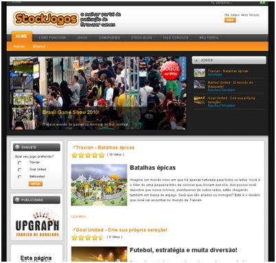

Hoje começa um novo tipo de post aqui no blog onde realizo uma entrevista com alguém que tenha experiência na indústria de games, sempre com perguntas a respeito da opinião do entrevistado sobre mercado de games no Brasil e no mundo. A primeira pessoa entrevistada é o [Andreas Stock](http://www.ganz-stock.de/pt/perfil-andreas-stock "Andreas Stock"), da [StockJogos](http://www.stockjogos.com.br "StockJogos"). Consegui essa estrevista através de um amigo que trabalha com ele, o [Juliano Kimura](http://julianokimura.com/ "Juliano Kimura") (obrigado!).

Antes de ler a entrevista talvez seja interessante que você saiba quem é Andreas Stock primeiro, certo?

Profissional com 15 anos de experiência no mercado de games da Europa. Ocupou cargos de gestão em grandes empresas multinacionais. Também foi considerado um dos melhores instrutores na Games Academy.

Cargos de Gestão nas empresas: SEGA, Avalon (Virgin Interactive), Cryo Interactive (França)

Gerente de Marketing Intel Europa: Gestão de conteúdo para produtos de entretenimento, Gestão de parcerias para marcas como Disney, Microsoft e Nokia

Gerente Geral da Activision – Europa Central:  Estruturação da divisão da produtora e triplicação de faturamento, responsável por um volume de negócios de mais de 50 milhões de Euros.

Sócio-Gerente da Games Academy: Estruturação da filial da Game Academy em Frankfurt e globalização de sua instituição de educação privada.

Consultor para o ramo de Entretenimento / Andreas Stock Consulting

Sócio-Diretor: Ganz & Stock  (Experiência em Projetos na área de Entretenimento)
> **Andreas Stock**
> 
> Profissional com 15 anos de experiência no mercado de games da Europa. Ocupou cargos de gestão em grandes empresas multinacionais. Também foi considerado um dos melhores instrutores na Games Academy.
> 
> - Cargos de Gestão nas empresas: SEGA, Avalon (Virgin Interactive), Cryo Interactive (França).
> - Gerente de Marketing Intel Europa: Gestão de conteúdo para produtos de entretenimento, Gestão de parcerias para marcas como Disney, Microsoft e Nokia.
> - Gerente Geral da Activision – Europa Central:  Estruturação da divisão da produtora e triplicação de faturamento, responsável por um volume de negócios de mais de 50 milhões de Euros.
> - Sócio-Gerente da Games Academy: Estruturação da filial da Game Academy em Frankfurt e globalização de sua instituição de educação privada.
> - Consultor para o ramo de Entretenimento / Andreas Stock Consulting.
> - Sócio-Diretor: Ganz & Stock  (Experiência em Projetos na área de Entretenimento).
> 
> Fonte: [http://stockjogos.com.br/](http://stockjogos.com.br/ "Stock Jogos") e [http://www.ganz-stock.de/](http://www.ganz-stock.de/ "Ganz Stock")

Pela descrição acima da para ver que é alguém que realmente entender do assunto, não? Ao mesmo tempo foi legal e difícil pensar no que perguntar para uma pessoa com tanta experiência em uma indústria que cada vez mais conheço um pouco. Agora vou apresentar a sua empresa, a StockJogos, que tem o foco em publicação de browser games.

> **Nova publisher de Browser Games chega ao Brasil!**
> 
> A Stockjogos é a mais nova Publisher a desembarcar no Brasil com foco em jogos para Browser e uma proposta diferenciada para a comunidade, a empresa aposta em inovação e relacionamento. Os jogos para navegador (AKA browser games) recebem pouca atenção ou quase nenhuma de grandes empresas, mesmo em países como o Brasil que vem crescendo no uso da internet. É normal criarmos a ilusão de que todos têm computadores bons e acesso a banda larga. Isso porque em nosso circulo social é normal ter pessoas com o mesmo interesse ou que frequentam o mesmo lugar, mas a verdade é que os números do uso da internet ainda estão em crescimento no Brasil.
> 
> Além de um trabalho sério com esse tipo de jogo, ainda existe uma falta de atenção com a comunidade. Mesmo que os jogos façam sucesso e por mais que os fãs tentem, o jogo não vinga.  Aqui entra outro ponto importante da Stockjogos: o carinho pela comunidade. A proposta aqui é diferente de um atendimento ao cliente ou um relacionamento, mas sim colocar a comunidade e seus jogadores em evidência. Não queremos recompensar os esforços dos jogadores com prêmios ou dinheiro, mas sim com reconhecimento. A produção de conteúdo como vídeos e fanarts é algo notável em vários títulos de sucesso, mas a falta de atenção da empresa e das mídias para esse conteúdo beira o descaso.
> 
> A chegada da Stockjogos pode não pode ser comparada com uma Blizzard ou Ubisoft, mas nossas propostas e objetivos são únicos e inovadores.
> 
> Fonte: [http://stockjogos.com.br/](http://stockjogos.com.br/ "Stock Jogos")

<figure class="wp-caption aligncenter" id="attachment_644" style="width: 402px"><figcaption class="wp-caption-text">Portal StockJogos</figcaption></figure>Eu escrevi algumas perguntas e o Andreas respondeu por e-mail (em inglês). Achei melhor não traduzir a entrevista, para manter o texto original. Como a StockJogos é especializada em publicar browser games fiz perguntas relacionadas a este tipo de plataforma, o impulso que o facebook deu (e recebeu) deste tipo de jogo, por que empresas muito grandes investem pouco em jogos para navegador (e em conseqüência disso pequenas empresas crescem bastante), integração com redes sociais, quais são os diferenciais da StockJogos nesse mercado e o que ele acha da indústria de games no Brasil. Abaixo você confere a entrevista (em inglês) e depois meus comentários sobre suas respostas.

> **Game Developer: The browser games market could be overloaded because the complexity (more easily) to create and publish this kind of games?**
> 
> Andreas Stock: Yes and No. It is not so easy anymore to develop a browsergame just with 3 people. You can create a mobile game or a social network game alone or with a handful of people. The successfull browsergames these days have develpment teams of 15 people and more. But there are more and more professional companies in Asia and Russia that have the manpower and technology background to produce a lot of browsergames. But on the other hand it is amazing that these titles do not get big in the Western world. The culture of  earning money with free to play games is very different. In Asia and Russia people pay in browsergames for items and they expect to win because they spent money. For the people that not payed is that ok. If you would implement that economy in Europe all the player that do not pay (and that are 90% of all players!) would stop playing. So there will be a lot of games at the market but like in all other places there are just a few good ones that will make money.
> 
> **GD: What do you think about the visibility of  browser games here in brazil? Did Browser games were weak before facebook? Why?**
> 
> AS: The visibility of browser games in Brazil is not so huge at the moment. But you have several million players and it is growing significantly. The social network games are huge in terms of users but they stop playing very fast as well because most of the games are just fun if you spent money. You can play a browsergame for years without spending money. The target group of social network games are woman e.g. housewifes. The target group of browsergames are mostly man between 15-30. So the target group is quite different. But if I would be a developer in Brazil I would do a game on Orkut very fast;-)
> 
> **GD: Do you believe that Facebook (social games) success is related with browser games?**
> 
> AS: Yes of course, who was there first? The browsergames. So some guys did the same in social networks and through the facebook “spam” some time ago companies like Zynga got big. The big browsergames publishers like Bigpoint didn’t see the chances at that time. They were focused more on players that play many hours per week(have a console at home as well) and not on the casual player who wants to play just a few minutes per day. But they underestimated the mentality of the casual players who suddenly checked every evening their Farmeville status.
> 
> **GD: In your opinion, why the big companies don’t invest in browser games?**
> 
> AS: Even worse are the bigger boxed games publisher like Activision, EA and Konami and all the other. Just one or two try to enter the new markets and business models. Most of the real big publishers are American or Japanese companies. But the developers of browergames are European. And the biggest markets for these companies are markets like Poland or Brazil that are not interesting for the big boxed games publishers. So, in the first place they simply did not see the success and secondly the were scared about the free to play model. They do not want to adapt that new business model. Instead they worked with monthly subscription fees that just work out for World of Warcraft and some other titles. All the other games failed. A COO of a real big company told me they loose just money with these online games. Of course that game was based on a subscription fee. But now they are not trusting in the free to play market. Good for all the other ones…
> 
> **GD: How important is a browser games publisher for the new and small developers?**
> 
> AS: At the beginning it could be very good to work with a publisher, because if you are small you will never appear on huge webportals like UOL, Terra etc. Just the publisher can bring you together with his platform to these huge traffic sites. After you have a name and a good user base you could go your own way and publish your game yourself. If your game is a success from the beginning you could start market yourself as well. But please be aware that browsergames are only successful if you publish the game in a lot of languages (minimum 7!) and in a lot of territories as well. A game that just has the Brazilians as a target group will probabely not make enough money to survive. So, be international from the beginning.
> 
> **GD: What’s the key points for success or fail in a Broswer games?**
> 
> AS: Nobody can answer that question. Obviously the key point for a game is that it makes fun and rewards you as a player. The good think about a browsergame is that you get the feedback from the players and you can test it everyday. Your players give you feedback everyday and you can choose what feedback can be a real value for all the other players as well.
> 
> **GD: How important is the connection between games and social network? Is it essential?**
> 
> AS: I think that depends on the game. If you have a space ship game I think you get more players form other sources. Should you thinking about casual browsergames like Zoomumba social networks are very important. Nevertheless it is always helpful to work with social networks but they give you just a part of your players.
> 
> **GD: What stockjogos does different from the others?**
> 
> AS: Stockjogos is just in Brazilian portugues and so far the only Brazilian Browsergames Portal with different games from different browsergame companies. Level up is focused on client based online games, Atrativa and other sites are focused on mini games and then there are some games sites that are concentrated on payment options. Bigpoint, Gameforge, Aeria and other are developer/publisher offer their services in many languages and just have more or less just their own games. Stockjogos can select the best games from small developers and these big browsergame companies. So, we can select the games specifically to the Brazilian market. On the other hand we offer our forum for the Brazilian player just with player from Brazil.
> 
> **GD: New small companies and  independent developers have opportunities to publish their games in stockjogos?**
> 
> AS: That depends on the quality of the games. But yes we are open to implement browsergames from Brazilian independent developers.
> 
> **GD: Give a overview of brazilian game industry.**
> 
> AS: 5 years ago I looked at the Brazilian market and thought: “how can I do something with my 15 years gaming knowledge in Brazil.” At that time the market for boxed games was weak and the developers just published games for the national market. Not very interesting and very tough for everybody in the market. Later the Wii and NDS was a worldwide success and because of the low entrance barrier a lot of developers over here started to develop for these platforms. But the good times did not long because the world crisis hurt the Nintendo market extremly badly. So, we are at zero again. Some companies like Hoplon, Levelup and Musigames conquered the new areas of online gaming and mobile gaming, but the mass unfortunately not. International companies like Aeria, Vostu, Bigpoint and others open their offices over here.Unfortunately every browsergames publisher told me that they are not looking for Brazilian developer. In terms of markting and sales foreign companies see Brazil as an interesting market. From a consumer perspective it will be great because more content will be in Portuguese and if more and more Brazilians play I hope that there will be some good games from Brazilian developers with an international quality level as well.

Em suas respostas, Andreas destacou a importância que browser games tem em um mercado como o Brasil, e que este mercado está em constante crescimento. Jogos gratuitos, de fácil acesso e que tenham uma integração com redes sociais são aspectos chave para que um jogo tenha sucesso por aqui. Ele concorda que o Facebook ajudou este mercado, e que algumas empresas como a Zynga viram que a oportunidade estava em jogos que as pessoas podem jogar um pouco por dia e compartilhar suas experiências com seus amigos nas redes sociais.

Gostei bastante desta minha primeira entrevista, e espero que o Andreas também tenha gostado. Fico feliz de poder ter contato com pessoas importantes da indústria e por poder mostrar aqui no blog sua opinião sobre diversos aspectos da produção e publicação de games. Espero que você tenha gostado também, e sugestões são sempre bem vindas para próximas entrevistas. Até mais!

