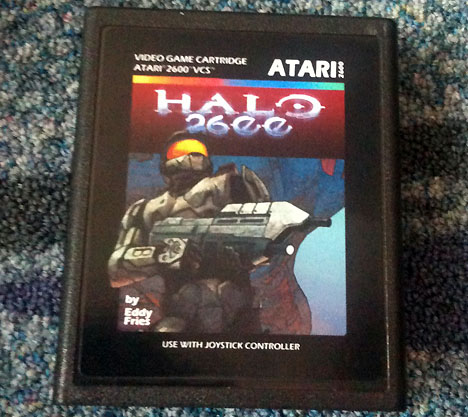
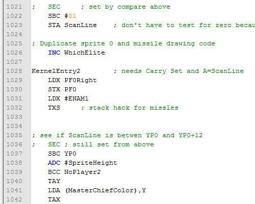

[Ed Fries](http://en.wikipedia.org/wiki/Ed_Fries "Ed Fries"), um veterano da indústria de jogos, criou uma versão do [Halo](http://halo.xbox.com/en-us/ "Halo") para [Atari 2600](http://pt.wikipedia.org/wiki/Atari_2600 "Atari 2600") e apresentou seu jogo na [Classic Gaming Expo](http://www.cgexpo.com/ "CGExpo"), em 2010. No evento, Ed vendeu alguns cartuchos limitados com seu jogo e depois [publicou gratuitamente](http://www.atariage.com/forums/topic/166916-halo-for-the-2600-released-at-cge-download-the-game-here/ "Halo 2600") na internet para ser rodado em emuladores de atari ou gravado em curtuchos, como o [Harmony Cartridge](http://harmony.atariage.com/ "Harmony").

Você já imaginou como é desenvolver um jogo para um hardware muito antigo, utilizando programação Assembler e apenas 4KB de memória? Eu também não tinha muita noção, até ver o [código fonte desse jogo](http://www.atariage.com/forums/topic/185693-halo-2600-source/ "Halo 2600"), que foi publicado neste ano, um ano após sua apresentação na Classic Gaming Expo.

<figure class="wp-caption aligncenter" id="attachment_955" style="width: 468px"><figcaption class="wp-caption-text">Cartucho do Halo 2600 vendido na Classic Gaming Expo</figcaption></figure>O código fonte, disponível aqui, é um arquivo único com extensão ASM, que pode ser aberto em editores como o [Notepad++](http://notepad-plus-plus.org/ "Notepad++") (alias, indispensável para programadores!). Para quem está acostumado com linguagens de programação como C/C++, C# e Java, esse código vai parecer muito estranho. É uns script com 3580 linhas que contém um jogo capaz de rodar em um Atari 2600, incrível não?

<figure class="wp-caption aligncenter" id="attachment_958" style="width: 500px"><figcaption class="wp-caption-text">Trecho do código fonte</figcaption></figure>Não se preocupe se o código parecer confuso, eu precisaria pesquisar várias instruções para poder entender bem este código. Hoje em dia acho muito difícil alguém querer fazer jogos para Atari, embora seja desafiador. Acho que no futuro eu tentaria fazer um Hello World para rodar em um emulador, só para ver como funciona. Se você está aprendendo a desenvolver jogos, não recomendo tentar fazer um jogo assim. Vale mais a pena estudar bastante as tecnologias mais novas, e depois dar uma olhada nisso por curiosidade.

<figure class="wp-caption aligncenter" id="attachment_959" style="width: 520px"><figcaption class="wp-caption-text">Fase inicial do Halo 2600</figcaption></figure>[Você pode jogar também a versão em flash do Halo 2600 disponível aqui](http://members.shaw.ca/jeffv/halo2600.html "Halo 2600"). Recomendo, pois é muito divertido. Ed conseguiu simplificar Halo o bastante para colocar em um jogo de Atari, bem como balancear a dificuldade do jogo e deixá-lo parecido com os jogos da época. Um trabalho respeitável e muito bem feito.

