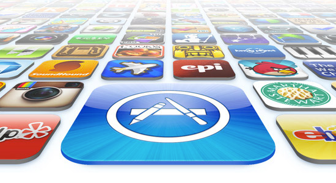

Demorou, mas chegou! Agora temos a categoria de jogos na App Store brasileira, a loja de aplicativos da Apple para seus aparelhos com iOS. Isso é uma ótima notícia para os jogadores, que agora poderão comprar seus jogos com uma conta e cartão de crédito brasileiro, mas também é uma ótima notícia para nós desenvolvedores de jogos!

Agora os desenvolvedores de jogos brasileiros, assim como os estrangeiros, podem colocar seus jogos a venda no Brasil, que é tem um mercado de dispositivos móveis que cresce cada vez mais. Eu tenho certeza de que quem compra um aparelho com iOS vai preferir pagar menos de R$2 em um jogo (mesmo preço que o mundo inteiro paga), do que pagar para desbloquear o seu aparelho.

Como acontece em outros países, o preço do jogo não é diferenciado, é sempre o mesmo em dólar. Esse valor é convertido para a moeda local do país na fatura do cartão de crédito.

Com a categoria de jogos no Brasil, jogos de entretenimento e advert games podem atingir o público brasileiro, que já provou ser muito viciado em jogos sociais. Android sempre foi uma alternativa, mas mesmo o número de aparelhos com o sistema operacional do Google ser bem expressivo, a App Store é consolidada como uma melhor opção do que o Google Play. Isso pode mudar um dia, mas por enquanto é bom aproveitar.

Esse lançamento no Brasil foi meio em silêncio, sem grandes alardes por parte da Apple, mas podemos considerar um dos principais acontecimentos desse ano para a indústria de jogos no Brasil. Estou muito empolgado com isso, acredito que agora teremos mais conteúdo feitos pro brasileiros, e para brasileiros.

