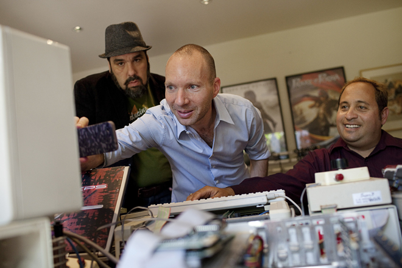

Você consegue imaginar como era programar um jogo em 1989? Naquela época o Apple II era um muito popular entre os desenvolvedores de jogos, e muitos deles programavam sozinhos seus projetos. E foi assim que [Jordan Mechner](http://jordanmechner.com/ "Jordan Mechner") desenvolveu o primeiro Prince of Persia.

<figure class="wp-caption aligncenter" id="attachment_1176" style="width: 496px"><figcaption class="wp-caption-text">Prince of Persia para Apple II</figcaption></figure>Antes de comentar sobre como o código foi recuperado, eu quero contar sobre o processo de desenvolvimento do Prince of Persia. Jordan se graduou em Yale e começou a desenvolver jogos em algumas empresas. Quando teve a idéia para Prince of Persia, ele também pensou em uma maneira muito criativa de recriar os movimentos do personagem: ele [gravou seu irmão](http://jordanmechner.com/old-journals/1985/10/october-20-1985/ "Irmão") pulando e subindo em paredes, e colocou esses movimentos no jogo, isso em 1985!

<iframe allowfullscreen="true" class="youtube-player" frameborder="0" height="402" src="http://www.youtube.com/embed/gC3WEwSJoHs?version=3&rel=1&fs=1&autohide=2&showsearch=0&showinfo=1&iv_load_policy=1&wmode=transparent" type="text/html" width="660"></iframe>

No vídeo acima o que o irmão de Jordan fez para ajudá-lo a criar o sucesso que seria lançado em 1989 para Apple II. Jordan também lançou um [ebook Making of Prince of Persia](http://jordanmechner.com/ebook/ "Ebook"), onde ele conta muitos outros detalhes sobre o desenvolvimento do primeiro capítulo de uma das franquias mais famosos dos video games.

<figure class="wp-caption aligncenter" id="attachment_1174" style="width: 528px"><figcaption class="wp-caption-text">Jordan Mechner recuperando o código do Prince of Persia</figcaption></figure>Agora, voltando ao código. Por muitos anos Jordan pensou ter perdido o código de seu grande sucesso, até um dia em que seu pai [enviou-lhe uma caixa com algumas coisas antigas](http://jordanmechner.com/blog/2012/03/prince-of-persia-source-code-found/ "Caixa"), como jogos, disquetes e o código original do Prince of Persia! Nesse momento Jordan publicou um post em seu blog contanto isso, e começou a planejar como iria recuperar o código.

<figure class="wp-caption aligncenter" id="attachment_1171" style="width: 540px"><figcaption class="wp-caption-text">Caixa enviada pelo pai de Jordan</figcaption></figure>A [revista Wired](http://www.wired.com/gamelife/2012/04/prince-of-persia-source-code "Wired") acompanhou o dia em que especialistas em recuperar dados de disquetes antigos e programadores de Apple II ajudaram Jordan a recuperar o código do jogo, vale muito a pena ler a matéria toda, pois mais coisas foram recuperadas além do Prince of Persia.

<figure class="wp-caption aligncenter" id="attachment_1173" style="width: 528px"><figcaption class="wp-caption-text">Disquete com o código de Prince of Persia</figcaption></figure>O mais legal de tudo isso é que [Jordan liberou o código do jogo](http://jordanmechner.com/blog/2012/04/source/ "Código") no [GitHub](https://github.com/jmechner/Prince-of-Persia-Apple-II "Github") [,](http://jordanmechner.com/blog/2012/04/source/ "Código") inclusive com documentos técnicos para ajudar quem quiser tentar compilar o código. Eu baixei um emulador de Apple II para Windows, mas não faço idéia ainda de como compilar esse código.

Eu acho incrível ver o código de um jogo de tanto sucesso, escrito em uma época com computadores limitados e programadores criativos. Esse código representa um sonho que tornou-se realidade, divertiu muita gente, inspirou pessoas, e agora mostra para todos como era bem complicado fazer um jogo simples, bom e viciante.

