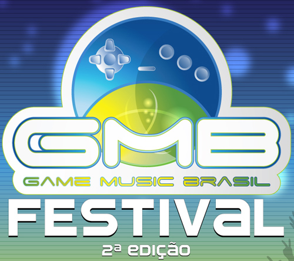

A inscrições para o Game Music Brasil Festival – 2ª Edição estão abertas, e você tem até 9 de setembro para participar da edição de 2012 desse evento que reúne desenvolvimento de jogos e música. Você pode inscrever seu jogo para concorrer nas categorias Melhor Trilha Sonora, Melhor Game Indie, Melhor Remix ou Melhor Chiptune.

Confiram o vídeo de divulgação e o texto abaixo explicando detalhes do concurso, e [não deixe de participar](http://www.gamemusicbrasil.com.br/new/?page_id=241 "Game Music Brasil 2012")!

<iframe allowfullscreen="true" class="youtube-player" frameborder="0" height="402" src="http://www.youtube.com/embed/vKTGgxzTkXQ?version=3&rel=1&fs=1&autohide=2&showsearch=0&showinfo=1&iv_load_policy=1&wmode=transparent" type="text/html" width="660"></iframe>

> O Brasil sedia a segunda edição do Game Music Brasil Festival, o maior festival de composição de música para games e desenvolvimento de jogos do país.
>
> Inscrições gratuitas pelo site www.gamemusicbrasil.com.br começam no dia 14 de maio a 09 de setembro de 2012.
>
> No ano de 2012, pela primeira vez, o Grammy, maior prêmio internacional da indústria musical, terá trilhas sonoras de games competindo ao lado de músicas feitas para cinema e televisão nas categorias Melhor Música, Melhor Canção, Melhor Compilação de Trilha Sonora e Melhor Partitura de Trilha Sonora. O fato que abriu precedente para essa inclusão dos videogames em um prêmio musical de tamanha importância foi a música Baba Yetu, do jogo Civilization IV, ter sido premiada com um Grammy em 2011, seis anos após o lançamento do jogo que a lançou. Esse é um reconhecimento de que as trilhas de videogames são tão elaboradas quanto as composições para o cinema, além de terem um papel fundamental de complementar a narrativa do jogo e trazer emoções para o jogador.
>
> No Brasil, na intenção de alertar o mercado musical para a música de games, acontece em maio a segunda edição do maior festival nacional de composição de trilha sonora para jogos eletrônicos: o Game Music Brasil Festival, organizado pela Conexão Cultural. A competição conta com quatro categorias: melhor trilha sonora, melhor jogo indie, melhor chip tune e melhor remix. A edição também contará com um novo regulamento. “O objetivo do Game Music Brasil é fazer com que os músicos descubram este novo mercado, que tem crescido a cada ano”, diz Sergio Murilo de Carvalho, sócio da Conexão Cultural e idealizador do evento. No ano de 2011, o mercado de games gerou US$24 bilhões de receita em todo o mundo, segundo a empresa de pesquisa americana NPD.
>
> Sobre o Game Music Brasil:
>
> As inscrições para participar do festival vão do dia 14 de maio a 9 de setembro no site www.gamemusicbrasil.com.br. Pessoas de todo o país poderão se inscrever gratuitamente para concorrer no festival. A primeira fase, que acontece através de voto popular, terá as votações encerradas em 20 de setembro. No dia 30 do mesmo mês, através de votação de 10 jurados do mercado fonográfico, músicos, jornalistas e representantes da área comercial do mercado de games, serão escolhidos os ganhadores de cada uma das categorias. A apresentação dos vencedores acontece no dia 14 de outubro, durante o concerto Video Games Live em São Paulo.
>
> Na categoria composição, os participantes precisam criar uma trilha para games que serão disponibilizados no site, desenvolvidos pelas empresas Hoplon e Swordtales. A previsão de lançamento desses jogos é para o final de 2012. Para participar, o concorrente da categoria Composição precisa se inscrever no site, fazer o download de um teaser do novo game, gravar a trilha sonora para o teaser e fazer um upload de um vídeo que contenha sua composição em sincronia com as imagens do game.
>
> Na categoria jogo indie, o candidato desenvolverá um jogo eletrônico e postar um trecho do jogo no site. Serão avaliados a jogabilidade, os gráficos, a trilha sonora, entre outros quesitos.
>
> Uma das novas categorias da edição 2012 do festival é a Chip Music. Os chiptunes são músicas que relembram o estilo das trilhas sonoras dos videogames antigos. O participante dessa categoria deve produzir uma música inspirado nos sons dos consoles clássicos de 4, 8 e 16 bits. A composição, porém, deve ser original, excluindo a possibilidade de covers e remixes de músicas já existentes. Os critérios de avaliação dessa produção serão arranjo, melodia, utilização das principais características da chip music e inovação na escolha do estilo musical. Os votos serão populares na primeira etapa e, na etapa seguinte, através de jurados especializados.
>
> A segunda categoria estreante na segunda edição do Game Music Brasil é a de Remix. Para participar, o competidor deve gravar em vídeo um remix de alguma trilha sonora de games já existente e postar a gravação do site do GMB. As músicas serão avaliadas baseadas nos conceitos de originalidade, arranjo, desenvolvimento e adaptação do estilo musical, também passando pelas fases de popular e voto de especialistas.
>
> O festival, ainda sem patrocínio, conta com o apoio da MTV, ACIGAMES, PUC RJ, PUC SP, PUC RS, TECNOPUC, UNICAP PE, Universidade Positivo Curitiba, Porto Digital PE, Jogos Digitais UNICAP PE e GANG – Games Audio Network Guild – USA – L.A.
>
> Sobre a Conexão Cultural: Empresa dirigida pelo produtor cultural Sergio Murilo Carvalho, que atua há mais de 30 anos no segmento de entretenimento. A Conexão Cultural trouxe para o Brasil o concerto de músicas de videogame Video Games Live, assinando a produção e a organização do evento em 2006, 2007, 2008, 2009, 2010 e 2011.

[via [Game Music Brasil](http://www.gamemusicbrasil.com.br "Game Music Brasil")]
