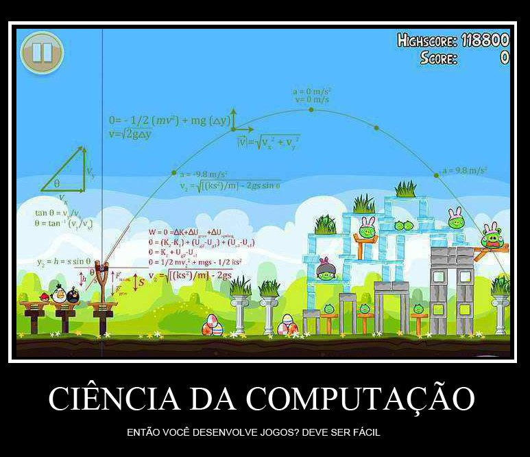

[Nate Rode](http://www.rodedev.com/ "Nate Rode") fez um [tutorial interativo em flash](http://www.rodedev.com/tutorials/gamephysics/ "Tutorial") bem legal em seu site para explicar conceitos básicos de programação da física de jogos 2D . No tutorial são apresentados conceitos de gravidade, velocidade, aceleração, entre outros, todos com exemplo pra você ver em tempo real e o código-fonte para você entender a lógica.

São conceitos bem básicos, mas que da pra fazer muita coisa legal! Um jogo como Angry Birds tem muito desses conceitos simples implementados, junto com alguns cálculos mais sofisticados. Se você quer fazer um jogo em 2D e está com dúvida em algumas implementações de física básica, este tutorial vai te ajudar muito. [Clique aqui para ver o tutorial](http://www.rodedev.com/tutorials/gamephysics/ "Tutorial") (em inglês).

Por falar em Angry Birds e física, eu vi essa imagem sendo compartilhada no Facebook e decidi colocar aqui. Infelizmente não sei quem criou para dar os créditos, mas ficou bem legal. Se alguém souber da onde é me fala nos comentários que eu atualizo aqui.

