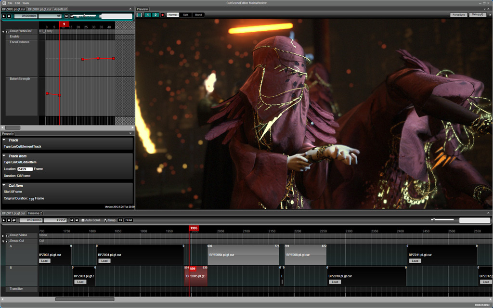

Pensando na próxima geração de consoles, a Square Enix desenvolveu uma nova game engine. E, para demonstrar todo o poder do seu novo motor gráfico, foi apresentado uma tech demo chamada [Agni’s Philosophy](http://www.agnisphilosophy.com/en/index.html "Agnis Philosophy"), baseado no universo de sua famosa franquia Final Fantasy.

<iframe allowfullscreen="true" class="youtube-player" frameborder="0" height="402" src="http://www.youtube.com/embed/UVX0OUO9ptU?version=3&rel=1&fs=1&autohide=2&showsearch=0&showinfo=1&iv_load_policy=1&wmode=transparent" type="text/html" width="660"></iframe>

Existe mais um detalhe que torna essa demonstração ainda mais impressionado: a animação é renderizada em tempo real! Animações, como filmes ou cutscenes, geralmente são pré-renderizados, para não exigir muito do hardware e garantir que a qualidade fique boa.

Se prestarem atenção no vídeo, poderão reparar nos detalhes como poeira, fumaça, fluídos e muitos outros efeitos gráficos que enriquecem a qualidade da engine e impressionam por serem feitos em tempo real.

Eu nem consigo imaginar o tamanho dos arquivos desse projeto, e as técnicas gráficas avançadas implementadas, mas tenho certeza de uma coisa: a próxima geração de consoles contarão com tecnologias incríveis para os desenvolvedores!

Dica do Diego Dedize! [Não esqueçam de curtir a página do blog no Facebook!](https://www.facebook.com/GameDeveloperBlog "Facebook")
