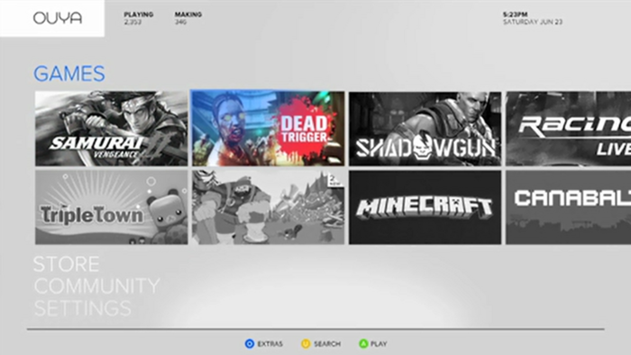
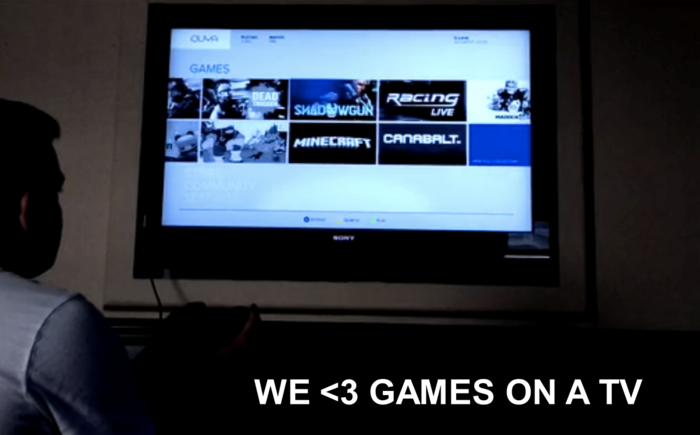

O [OUYA](http://www.kickstarter.com/projects/ouya/ouya-a-new-kind-of-video-game-console "OUYA") é um projeto de console de video game, baseado na plataforma Android, que precisava de “apenas” $1 milhão de dólares para sua produção e comercialização, e eles já conseguiram mais de $5 milhões no [Kickstarter](http://www.kickstarter.com/projects/ouya/ouya-a-new-kind-of-video-game-console "Kickstarter").

  
 Sua proposta é revolucionar a indústria de games oferecendo um console de baixo custo (cerca de $99 dólares), com muitos jogos gratuitos (e alguns bem baratos), sem a necessidade de mídia física. Seu hardware possui uma boa configuração para rodar o sistema operacional Android, totalmente aberto e pronto para ser explorado em todos seus limites pelos desenvolvedores (e hackers).

<iframe allowfullscreen="true" class="youtube-player" frameborder="0" height="402" src="http://www.youtube.com/embed/xh6Ji_6Wg9c?version=3&rel=1&fs=1&autohide=2&showsearch=0&showinfo=1&iv_load_policy=1&wmode=transparent" type="text/html" width="660"></iframe>

O modelo de negócios pretendido pelo OUYA é uma versão muito melhorado do falido console brasileiro [Zeebo](http://www.zeebo.com.br/ "Zeebo"). Diferente do Zeebo, o hardware do OUYA é bom para rodar jogos mobile, e provavelmente muitos títulos famosos e atuais estarão disponíveis na sua loja virtual.

Uma das características que me chamou mais a atenção é o suporte que eles darão aos desenvolvedores. Qualquer console pode ser utilizado para desenvolvimento, e o devkit não precisa ser comprado, nem sequer uma licença para desenvolver. Por ser um sistema Android, o desenvolvimento é basicamente o mesmo que mobile, apenas é necessário adaptar o jogo para usar o controle do OUYA e sua lib.

Podem ser necessárias algumas adaptações de gameplay, pois todo jogo android é baseado em touch, mas essa deve ser uma das poucas camada de desenvolvimento necessárias para fazer um jogo android rodar no OUYA. Mais detalhes sobre o projeto podem ser vistos no site do [Kickstarter](http://www.kickstarter.com/projects/ouya/ouya-a-new-kind-of-video-game-console "Kickstarter"), e o IGN fez uma mini review no vídeo abaixo para apresentar o console.

<iframe allowfullscreen="true" class="youtube-player" frameborder="0" height="402" src="http://www.youtube.com/embed/r7uWLTJ7ebc?version=3&rel=1&fs=1&autohide=2&showsearch=0&showinfo=1&iv_load_policy=1&wmode=transparent" type="text/html" width="660"></iframe>

