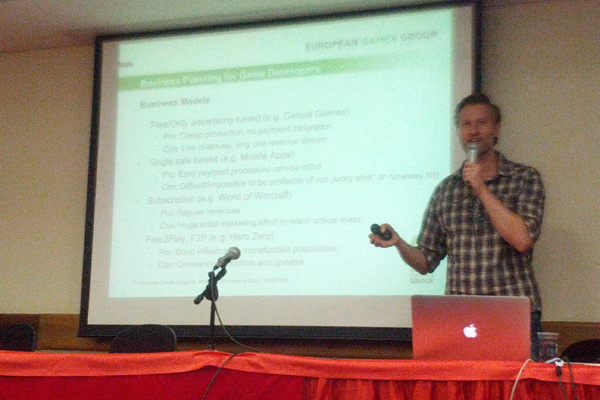

[No post anterior](http://gamedeveloper.com.br/blog/2013/02/21/workshop-de-business-para-desenvolvedores-de-jogos-online/ "Post anterior") falei sobre um evento que iria acontecer na Universidade Mackenzie em São Paulo, sobre a parte de negócios relacionada ao desenvolvimento e publicação de jogos online. Neste post vou contar um pouco de como foi o evento, e qual a sua importância para os desenvolvedores brasileiros.

O evento, realizado em parceria com a [ABRAGAMES](http://www.abragames.org/ "Abragames") e a [Universidade Presbiteriana Mackenzie](http://www.mackenzie.br "Mackenzie"), contou com a apresentação dos fundadores do [European Games Group](http://www.gamesgroup.com.br/ "EGG"). A empresa fundada por três veteranos de business e marketing de entretenimento digital (Johannes Sevket Gözalan, Justin Stolzenberg e Tim Fabian Besser), a EGG tem como propósito cuidar de toda promoção, marketing e monetização de um jogo online.

<figure class="wp-caption aligncenter" id="attachment_1555" style="width: 600px"><figcaption class="wp-caption-text">Johannes Sevket Gözalan</figcaption></figure>A EGG analisa um jogo e calcula seu custo e vida útil, para determinar se vale a pena o investimento em divulgação. Eles trabalham com o modelo freemium, que consiste em jogos gratuitos com comercialização de itens no jogo. Eles não desenvolvem jogos, mas fornecem um investimento e cuidam de toda divulgação (mundial) do jogo, caso o projeto seja rentável.

No evento eles apresentaram um case de um jogo que já foi publicado em alguns países, e agora está chegando no Brasil com apoio da emissora Band, chamado [Hero Zero](http://www.herozerogame.com "Hero Zero"). Eles mostraram dados reais do custo do desenvolvimento e da campanha de divulgação do jogo, demonstrando muita profissionalidade e know-how em como fazer o jogo ser um sucesso.

<figure class="wp-caption aligncenter" id="attachment_1557" style="width: 600px"><figcaption class="wp-caption-text">Justin Stolzenberg</figcaption></figure>Através de gráficos, demonstraram a importância de ações de marketing para venda dos produtos digitais. Para um jogo freemium, o importante é manter o jogo com atualizações constantes em uma frequência determinada (semanal, mensal, etc), para o que o jogador fique acostumado com essa frequência de updates. Assim você mantém o jogador sempre na expectativa de ver novidades no jogo, e ele fica confiante em gastar pois tem a segurança de que o jogo não irá morrer do nada.

Os três palestrantes demonstraram ser bem receptivos para analisar um jogo, seja uma idéia definida ou um produto praticamente finalizado, e calcular a viabilidade do projeto e o retorno do investimento. Portante, se você tem um jogo envie para eles analisarem.  O [contato pode ser realizado pelo site](http://www.gamesgroup.com.br/ "EGG"), e o Tim fala português!

<figure class="wp-caption aligncenter" id="attachment_1558" style="width: 600px"><figcaption class="wp-caption-text">Tim Fabian Besser</figcaption></figure>Lembrando que a [SBGames](http://www.sbgames.org/sbgames2013/ "SBGames") desse ano também será realizada na Mackenzie em São Paulo, com organização da Profª. Dr.ª Pollyana Mustaro (Mackenzie) e do [Profº. Drº. Ricardo Nakamura](http://ricardonakamura.org "Ricardo Nakamura") (Poli-USP).

