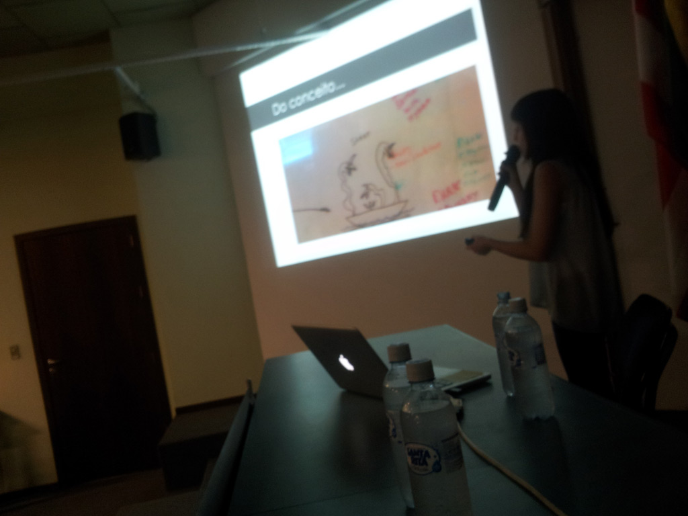
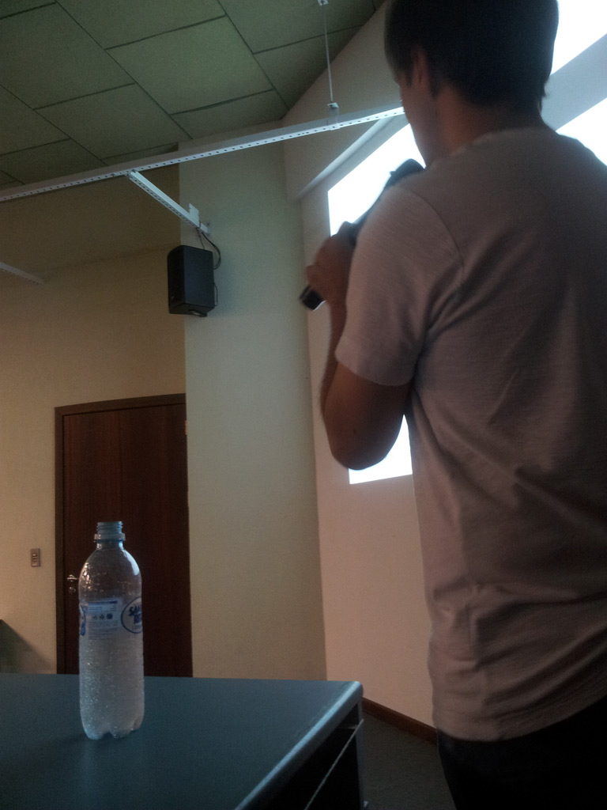

Voltamos hoje para São Paulo após uma experiência muito legal em Blumenau. A [palestra sobre desenvolvimento de jogos com Cocos2d-x](http://gamedeveloper.com.br/blog/2013/04/08/palestra-furb-cocos2d-x/ "Palestra") foi muito boa, e ficamos contentes com a recepção e perguntas do público!

A palestra foi apresentada em 5 partes, sendo as 3 primeiras apresentadas pela Letícia e as restantes por mim. O auditório da biblioteca da Universidade de Blumenau logo encheu, com mais de 200 pessoas segundo o professor Everaldo.

<figure class="wp-caption aligncenter" id="attachment_1590" style="width: 614px"><figcaption class="wp-caption-text">Letícia apresentando sua parte da palestra</figcaption></figure>Ambos estávamos um pouco nervosos, mas a palestra correu bem e acreditamos que os alunos que assistiram gostam, principalmente pelas perguntas que fizeram no final da apresentação.  Foi muito bom também conversar com as pessoas que vieram até nós após a palestra.

<figure class="wp-caption aligncenter" id="attachment_1591" style="width: 461px"><figcaption class="wp-caption-text">Eu apresentando minha parte</figcaption></figure>Depois vou postar mais fotos do evento aqui. Abaixo está a apresentação como foi prometido! Fiquem a vontade para baixar, tem links muito legais nos últimos slides. Qualquer dúvida é só deixar um comentário aqui que logo responderemos!

<iframe allowfullscreen="" frameborder="0" height="356" marginheight="0" marginwidth="0" scrolling="no" src="https://www.slideshare.net/slideshow/embed_code/key/L5iDrOaeuD1S4Y" style="border:1px solid #CCC; border-width:1px; margin-bottom:5px; max-width: 100%;" width="427"></iframe>

**[Desenvolvimento de jogos com Cocos2d-x](https://www.slideshare.net/cicanci/desenvolvimento-de-jogos-com-cocos2dx "Desenvolvimento de jogos com Cocos2d-x")** from **[Bruno Cicanci](http://www.slideshare.net/cicanci)**
Muito obrigado ao pessoal da FURB pela oportunidade de ir até lá falar sobre desenvolvimento de jogos, especialmente o professor Everaldo e o Júlio. Obrigado!

