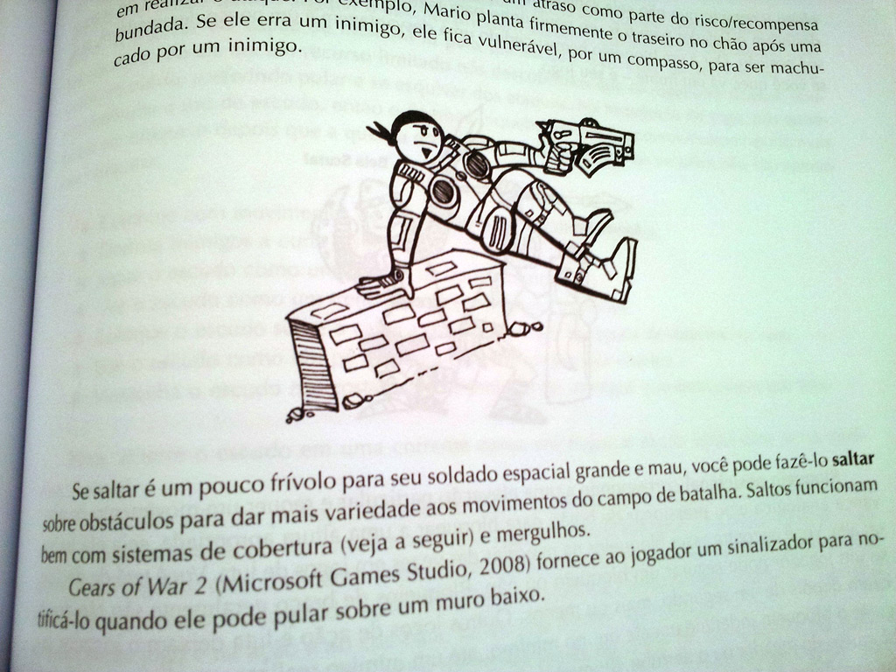

Apesar de eu ser programador, sempre gostei de ler sobre game design. Já li alguns livros, mas este é realmente o mais prático e direto de todos. [Level Up: Um guia para o design de grandes jogos](http://www.blucher.com.br/produto/07009/level-up "Level Up"), de [Scott Rogers](http://mrbossdesign.blogspot.com.br/ "Scott Rogers"), é uma obra essencial para estudantes e profissionais da indústria de games.

O livro foi lançado recentemente no Brasil pela editora [Blucher](http://www.blucher.com.br/ "Blucher"), a mesma que trouxe a [coleção Regras do Jogo](http://gamedeveloper.com.br/blog/2012/08/15/regras-do-jogo-editora-blucher/ "Regras do Jogo"), e a qualidade é novamente muito boa. Eu já tinha ouvido falar desse livro, mas nunca tinha lido. Eu fiquei impressionado só de ler o conteúdo no índice do livro, cada capítulo ensina tudo que você precisa saber sobre design de jogos de uma maneira bem objetiva e didática.

Na introdução do livro o autor explica diversas coisas básicas sobre desenvolvimento de jogos, como diferenças de gêneros, quem faz o quê na equipe, distribuição do produto, entre outras coisas essenciais para uma boa base, antes de partir para o game design. Logo no começo o livro apresenta algo que eu não vi em outro livro: um documento de game design (GDD). E não apenas isso, mas mostra a importância de começar o documento antes mesmo de iniciar o projeto, pois lá que estará definido tudo o que terá em seu livro.

Após a introdução, o autor apresenta a definição dos três “Cs”: Character, Camera e Control. Cada um dos “Cs” é importante para definir a jogabilidade, pois envolve pensar no personagem e seus atributos, a câmera do jogo e com será o controle do jogo. É simples, mas muito inteligente e eficaz. Definindo os três “Cs” no seu GDD, seu jogo estará caminhando para uma jogabilidade bem definida. É claro que isso não quer dizer que será divertida ou viável, essas coisas você só descobrirá testando com protótipos.

O autor também fala de usabilidade da interface, design de níveis, inimigos, multiplayer, música, feedback, entre vários outros aspectos que devem ser bem definidos no GDD. Outra parte muito impressionante no livro é o apêndice, que contém muitas coisas legais, como um modelo de GDD e até um exemplo completo! O livro é muito completo, com leitura fácil, muitas ilustrações e um conteúdo muito bom.

Sabe por que esse livro é tão bom? O autor, Scott Rogers, trabalha na indústria de jogos a mais de 20 anos, e chegou a trabalhar com jogos 16 bits para Super Nintendo e Mega Drive. Vou citar alguns dos jogos que ele participou do desenvolvimento: [Pac-Man World, Maximo, God of War Collection, Darksiders, entre outros](http://www.giantbomb.com/scott-rogers/3040-36702/ "Scott Rogers"). Atualmente ele trabalha na Disney Interactive como Produtor, além de ser professor de Level Design na Universidade do Sul da Califórnia e autor de dois livros (este e um outro de [game design para touchscreens](http://www.amazon.com/Swipe-This-Guide-Touchscreen-Design/dp/1119966965/ref=sr_1_3?ie=UTF8&qid=1368745402&sr=8-3&keywords=scott+rogers "Game Design")).

Este livro é muito bom por que foi escrito por alguém que realmente trabalha com game design, e entende muito do assunto. A própria linguagem do livro é mais fácil, pois você sente como se o autor estivesse do seu lado te explicando como fazer um bom game design. Esse livro é obrigatório para estudantes e game designers, e essencial para programadores e artistas que querem conhecer mais sobre game design.

Quero agradecer a editora Blucher por ter me enviado uma cópia desse livro, muito obrigado!

