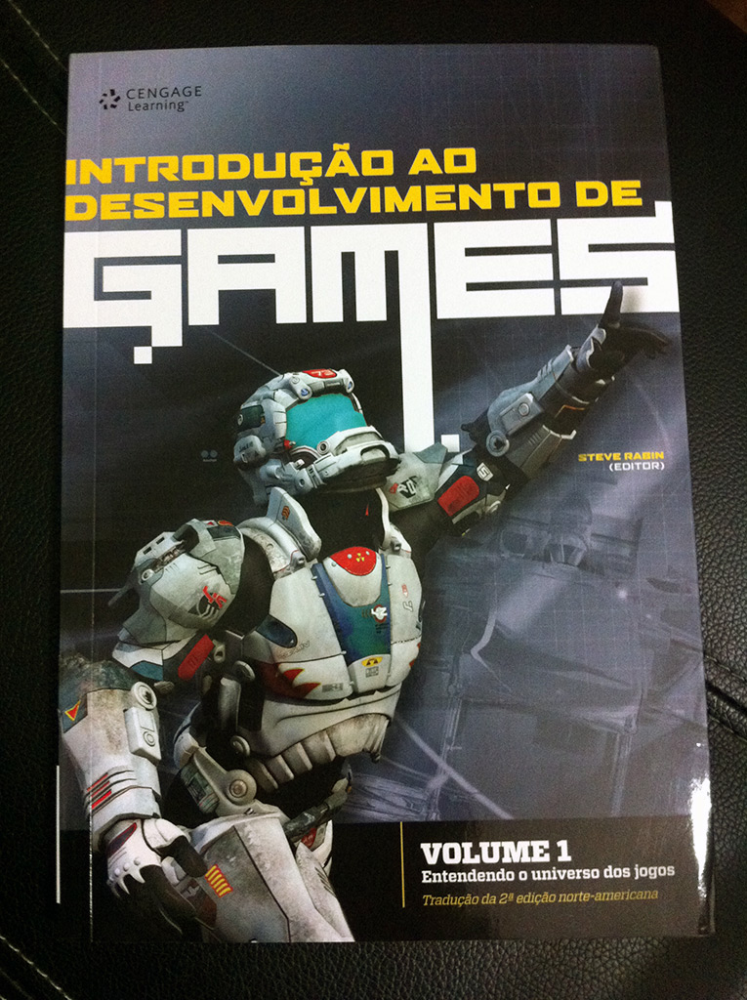

A editora [Cengage Learning](http://www.cengage.com.br/ "Cengage") lançou a tradução da segunda edição do livro [Introdução ao desenvolvimento de games](http://www.cengage.com.br/ls/introducao-ao-desenvolvimento-de-games-traducao-da-2a-edicao-norte-americana/ "Livro"), e eu recebi o Volume 1: Entendendo o universo dos jogos, e fiquei bem impressionado com o conteúdo.

Acho que eu esperava apenas mais um livro de desenvolvimento de jogos, mas este aqui superou minhas expectativas pela abordagem do assunto. Este é o primeiro volume de quatro livros organizados por Steve Rabin, que é o principal engenheiro de software da [Nintendo](http://www.nintendo.com/?country=US&lang=en "Nintendo") nos EUA e também é professor na [Digipen](https://www.digipen.edu/ "Digipen"). Ele reuniu um time de profissionais da industria games, como o idealizador do [Vídeo Games Live](http://www.videogameslive.com/ "VGL") Tommy Tallarico, entre outros, e juntos criaram esta obra que aborda praticamente tudo que envolve desenvolver jogos.

Neste post vou focar no primeiro volume, que trata da história dos vídeo games até o design de jogos. Logo de inicio fiquei surpreso pelo resumo da história da industria de games. Muita gente conhece como começou, mas talvez não todos os detalhes e nomes. Este industria é bem nova, mas posso dizer que tem muita coisa já registrada para podermos chamar de história dos vídeo games.

Além de falar da criação do primeiro jogo eletrônico, Tennis for Two (video abaixo), e o primeiro vídeo game comercial, Atari, o livro da destaque para detalhes que normalmente não são lembrados quando falamos da história da industria, que é a importância que alguns profissionais e estúdios tiveram para definir muitas coisas que vemos nos jogos hoje. Mais do que curioso, ler estas historias é motivador!

<iframe allowfullscreen="true" class="youtube-player" frameborder="0" height="402" src="http://www.youtube.com/embed/6PG2mdU_i8k?version=3&rel=1&fs=1&autohide=2&showsearch=0&showinfo=1&iv_load_policy=1&wmode=transparent" type="text/html" width="660"></iframe>

Depois de estabelecer como começou a maior industria de entretenimento do mundo, são tratados assuntos que relacionam jogos com a sociedade, passando por questões culturais, sociais, demográficas e até filosóficas. Neste ponto existem outro livros mais profundos, porém este é um resumo muito bem feito, pois é apenas a base para os próximos capítulos.

Por fim, vamos ao assunto principal deste livro, que game design, e é aqui que me impressiono de novo. De uma maneira bem clara e objetiva, praticamente todos os aspectos do que é o design de um jogo são abordados. De assuntos mais teóricos, como quem é o jogador e o que é o jogos, até a definição de elementos de jogabilidade e interface, o livro consegue passar a idéia de tudo que é necessário saber para começar. Pontos interessantes como uma definição de um modelo de jogo e prototipagem valem ser destacados.

Novamente, este livro é uma introdução sobre design de jogos, e existem outros livros que abordam o assunto de maneira mais abrangente, assim como existem coisas que somente a pratica vai ensinar. No final do livro temos um capitulo dedicado a conta historias interativas, ou storytelling. Devo dizer que este capitulo foi o que mais me ensinou, pois é um assunto que conheço pouco e não esta relacionado a game design, é algo para roteiristas mas muito interessante para o publico em geral.

Eu gostei bastante deste livro, e como introdução esta praticamente perfeito para quem quer começar a desenvolver jogos. A tradução esta muito boa e reflete a qualidade do livro. Muito obrigado a Cengage Learning por me enviar este livro, e parabéns pelo excelente trabalho.

Siga a Cengage Learning no [Facebook](https://www.facebook.com/cengagebrasil "Facebook") e no [Twitter](https://twitter.com/cengagebrasil "Twitter") para ficar por dentro dos lançamentos da editora.
