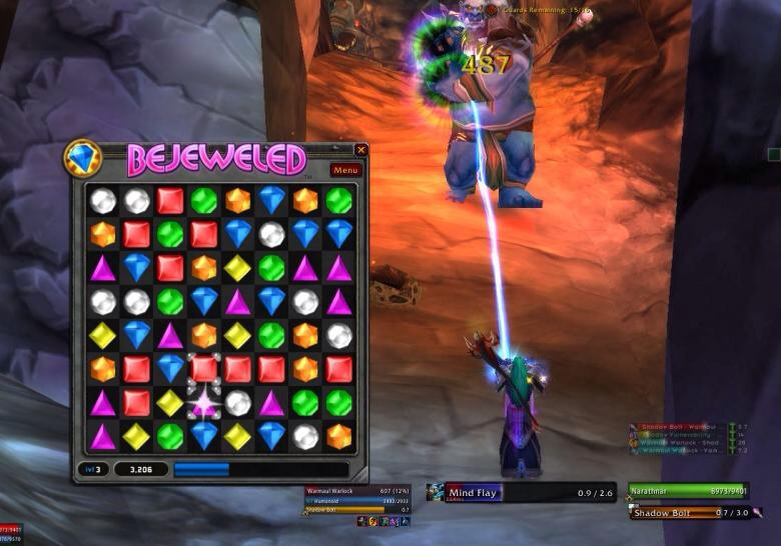
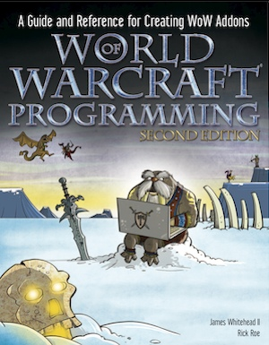

O MMORPG [Word of Warcraft](http://worldofwarcraft.com "WoW") da Blizzard não é só um jogo muito bom e um sucesso comercial que fez a empresa e o mercado de MMOs crescer muito, ele também tem uma API impressionante para programar addons.

Antes de falar sobre a programação no WoW, vou explicar algumas definições. API, ou Application Programming Interface, é uma especificação de funções que podem ser executadas para a comunicação entre dois softwares, neste caso o jogo e o seu add-on. O addon é um módulo ou plugin para um programa que complementa ou expande suas funcionalidades.

Agora vamos ao WoW! Da para imaginar a complexidade e o tamanho do seu projeto só pelo tamanho do jogo, mais de 30GB de conteúdo, e isso é só o que no nosso computador, existem ainda aplicações rodando nos servidores e bancos de dados, o que faz a arquitetura dele ser algo muito impressionante.

Mais impressionante do que isso é que ainda existe uma API para ter acesso a muitas coisas do jogo, e com isso podemos escrever addons para praticamente qualquer coisa! Os add-ons são programados em Lua, uma linguagem script brasileira que ficou muito famosa pelo seu uso no WoW.

Por ser uma linguagem script ela não precisa ser compilada, então o jogo (já compilado) consegue interpretar seu código dentro dele, é como se o WoW fosse o seu compilador para Lua. [Neste site](http://wowprogramming.com "WoW") existe uma lista das funções disponíveis na API, além de exemplos de código e um fórum para você tirar suas duvidas.

Este site é do autor do livro [WoW Programming](http://www.amazon.com/World-Warcraft-Programming-Reference-Creating/dp/0470481285 "Amazon"), que é um guia completo para a criação de addons. Existem os mais diversos addons disponíveis na comunidade do jogo, desde coisas que ajudam no jogo (dicas de quests, notícias, etc), até coisas inusitadas como mini-jogos (como o jogo bejeweled na imagem anterior) pra passar o tempo e aplicativos para pedir comida sem sair do jogo. Quanto mais addons o jogador tiver no jogo, menos ele vai precisar minimizar o WoW pra fazer alguma outra coisa no computador.

Pode parecer nerd demais fazer addons para o WoW, mas isso ensina muito sobre uso de APIs e programação em Lua, além da sensação de estar trabalhando dentro de um jogo gigante. Existem limitações, não é possível interferir muito no jogo, mas ao mesmo tempo não há limites para o uso da sua criatividade.

Acesse o site do [WoW Programming](http://wowprogramming.com "WoW") para saber mais!

 
