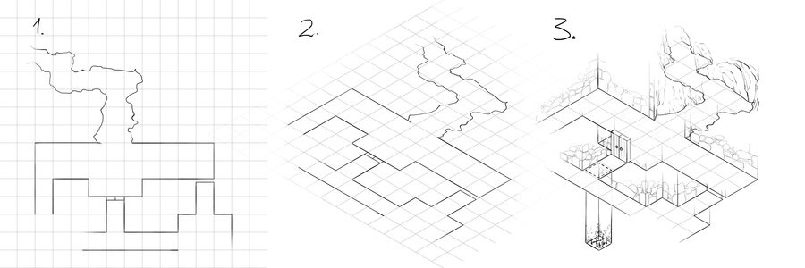

Eu não sou artista, mas achei este tutorial muito bom do artista [torstan](http://torstan.deviantart.com "Torstan"), postado no [devianart](http://www.deviantart.com "Devianart"). Ele ensina a criar mapas isométricos a partir da visão superior (top down).

O tutorial é tão simples que você acaba pensando como não fez isso antes. A imagem abaixo resume todo o processo, mas para conferir os detalhes de cada parte [acesse o link do tutorial aqui](http://torstan.deviantart.com/art/How-to-draw-isometric-dungeon-plans-278860194 "Tutorial").

Você pode usar isso para criar o mapa para seu jogo isométrico, ou até um esboço ou concept art para o documento de game design.

 

