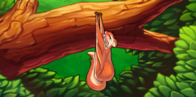
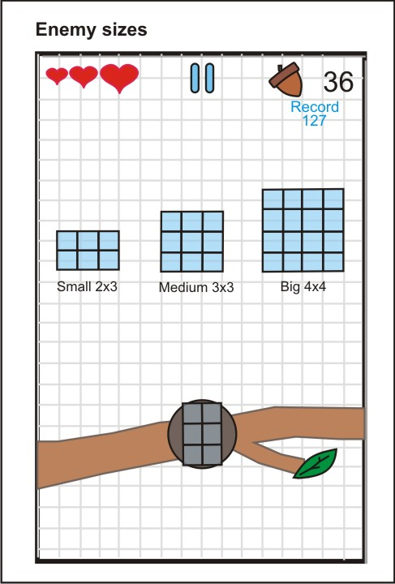

Mais um postmortem exclusivo para o blog, e desta vez é um jogo que eu participei do desenvolvimento como programador. Sabia como foi o precesso de produção do jogo Combo Nuts!

[Combo Nuts](http://www.aplaystudios.com/games.html "Combo Nuts") é um jogo independente da [Aplay Studios](http://www.aplaystudios.com "Aplay") para iOS e Android, que foi desenvolvido por uma equipe formada por ex-funcionários de grandes empresas, como [Ubisoft](http://ubisoft.com "Ubisoft"), [Glu Mobile](http://glu.com "Glu") e [Electronic Arts](http://ea.com "EA").

Este postmortem é muito especial para mim por que eu participei do desenvolvimento deste jogo em sua fase final e no primeiro update para ambas as plataformas. Toda a experiência com desenvolvimento de jogos da equipe foi empregada na produção de Combo Nuts, um jogo muito divertido e viciante!

Eu aprendi bastante, principalmente sobre o processo de publicação do jogo na App Store e no Google Play, mas isto é um assunto para outro post. Muito obrigado Sandro pelo postmortem e pela oportunidade de participar deste projeto! Alias, este jogo está concorrendo a Melhor Jogo Completo e Melhor Jogo Mobile na [SBGames 2013](http://gamedeveloper.com.br/blog/2013/07/03/sbgames-2013-em-sao-paulo/ "SBGames"), que acontece mês que vem em São Paulo.

> ## Postmortem: Combo Nuts
> 
> 
> 
> 
> ## 
> 
> 
> ## Descrição
> 
> Combo Nuts é um endless casual game com uma jogabilidade simples e intuitiva, com partidas rápidas e emocionantes.
> 
> O jogador controla Albert Squirrel, um esquilo voador que deve recolher as nozes que caem do céu roubadas pelos irmãos Wrong. A melhor maneira de recolher um grande número de nozes é através das sequências de nozes que aparecem, dessa maneira o jogador pode fazer diversos “combos”, recolhendo mais nozes e ganhando mais pontos.
> 
> O jogo é freemium e as formas de monetização implementadas foram através de propagandas e vendas de in-app purchases.
> 
> O jogo foi lançado para iOS e Android.
> 
> Links para download:
> 
> iOS: [http://bit.ly/combonuts_ios](http://bit.ly/combonuts_ios)
> 
> Android: [http://bit.ly/combonuts_android](http://bit.ly/combonuts_android)
> 
>   
> 
> 
> 
> ## Equipe
> 
> No início do projeto a equipe consistia em 3 pessoas, um game designer, um artista e um programador. Trabalhamos de forma remota, a principal forma de comunicação foi através de e-mails e reuniões via Skype e com encontros presenciais esporádicos. Ao final do projeto, mais 2 programadores nos auxiliaram para finalização do jogo.
> 
>   
> 
> 
> 
> ## Conceito
> 
> A idéia era criar um jogo casual no estilo endless com uma jogabilidade simples e divertida, onde as partidas fossem rápidas e dinâmicas.
> 
> Analisamos o mercado e o público alvo que gostaríamos de atingir. Estudamos os estilos de jogo e gameplay que gostaríamos de produzir, que fosse algo simples, divertido, bonito e original onde cada membro da equipe aprenderia algo de novo em sua respectiva área.
> 
>   
> 
> 
> 
> ## Estrutura para produção
> 
> Para a definição, organização e compartilhamento dos trabalhos utilizamos as seguintes ferramentas:
> 
> - Google Docs: criação e organização dos documentos e tabelas ([www.docs.google.com](http://www.docs.google.com));
> - Trello: Definição das tasks e prazos ([www.trello.com](http://www.trello.com));
> - Dropbox: Armazenamento dos assets de arte, plugins, GDD etc ([www.dropbox.com](http://www.dropbox.com));
> - BitBucket: repositório online para o projeto ([www.bitbucket.com](http://www.bitbucket.com));
> - Engine: Unity ([http://unity3d.com/](http://unity3d.com/));
> - TestFlight: Serviço para teste de builds remotamente ([https://testflightapp.com/](https://testflightapp.com/)).
> 
>   
> 
> 
> 
> ## Prototipagem
> 
> Desenvolvemos o Game Design Document (GDD) com o detalhamento inicial do gameplay principal do jogo, com as principais guidelines a respeito da mecânica do jogo para iniciarmos o quanto antes a prototipagem.
> 
> Com o decorrer da prototipagem e testes, fomos definindo na engine os editores que precisaríamos para criação e ajustes de todos os elementos do jogo como: posição, tamanho e velocidade do aparecimento dos objetos, criação dos padrões de sequência de objetos, controle dos intervalos de tempo e dos objetos para termos controle da curva de aprendizado e dificuldade etc.
> 
>   
> 
> 
> 
> ## Estudos iniciais
> 
> Paralelamente, fomos desenvolvendo o estilo artístico do jogo, estudando a melhor forma para a implementação dos elementos gráficos levando em conta a otimização dos recursos técnicos da engine e a beleza e composição da arte.
> 
> Nesse momento foram feitos estudos de animação na engine e nos principais devices para encontrar um equilíbrio entre otimização dos recursos técnicos e resultado artístico desejado.
> 
>   
> 
> 
> 
<table border="0"><tbody><tr><td></td><td></td></tr></tbody></table>
  
> 
> 
> 
> ## Game Design Document
> 
> No GDD foram detalhadas todas as mecânicas necessárias para implementação no jogo, funcionamento da câmera, personagem e controle, comportamento de todos os elementos do jogo, progressão de jogabilidade, signs e feedbacks, fluxograma das telas e das ações, interface de usuário, conteúdo do jogo, detalhamento do funcionamento da “loja” do jogo etc.
> 
> A medida que os elementos eram implementados e testados, ajustes eram feitos e essas informações eram atualizadas no GDD para manter a organização do projeto.
> 
>   
> 
> 
> 
<table border="0"><tbody><tr><td></td><td></td></tr><tr><td></td><td></td></tr></tbody></table>
  
> 
> 
> 
> ## Produção
> 
> Durante a produção do jogo adquirimos os efeitos sonoros e música que seriam implementados no jogo através do site [http://www.premiumbeat.com/](http://www.premiumbeat.com/)
> 
> Além dos in-app purchases foi adotado como método de monetização as propagandas dentro do jogo, nós utilizamos 2 serviços para isso:
> 
> - AdMob: serviço de banner in-game do Google ([www.admob.com](http://www.admob.com));
> - Chartboost: serviço de banners intersticiais ([www.chartboost.com](http://www.chartboost.com)).
> 
> No nosso projeto, o serviço do Chartboost é o mais efetivo e com maior retorno financeiro.
> 
> Foi comprado também diversos plugins para a Unity para facilitar a implementação de diversos elementos no jogo como integração com Game Center da Apple, Chartboost, AdMob, Flurry etc, os plugins foram adquiridos no site: [http://prime31.com/plugins](http://prime31.com/plugins)
> 
> Na fase final do projeto, contamos com mais 2 programadores para ajudar na implementação desses plugins.
> 
>   
> 
> 
> 
> ## Balanceamento, QA, bug fixes e polimento
> 
> O balanceamento do jogo foi constantemente executado durante o jogo, de todos os objetos, inimigos, itens especiais etc, com o objetivo de encontrar o melhor equilíbrio entre diversão e o estilo de gameplay com sessões rápidas e dinâmicas.
> 
> O QA (quality assurance) é o momento onde verificamos a integridade do jogo, se todos os elementos estão funcionando de acordo com o planejado e onde podemos melhorar para tornar melhor a experiência para o jogador. Fizemos sucessivos testes a fim de descobrir erros no jogo e solucioná-los.
> 
> Depois de implementado os principais itens do jogo iniciamos o procedimento de bug fixes, categorizando em 3 níveis, do mais ao menos crítico que influenciasse o gameplay e a experiência do jogador.
> 
> Nesse momento iniciamos o polimento do jogo, analisando o fluxo das telas e ações do jogo, colocando os assets de arte finais, revisando textos, melhorando signs e feedbacks etc.
> 
>   
> 
> 
>   
> 
> 
> 
> ## Validação e divulgação
> 
> Após os últimos testes, enviamos as builds finais para a validação do projeto, para iOS a validação levou 10 dias e para Android cerca de 3 horas.
> 
> Para a divulgação de nosso jogo, preparamos os seguintes meios:
> 
> - Website: [http://www.aplaystudios.com/games.html](http://www.aplaystudios.com/games.html)
> - Press release: [http://www.mediafire.com/?zsvd8o2njdjed](http://www.mediafire.com/?zsvd8o2njdjed)
> - Facebook Fan Page: [https://www.facebook.com/combonuts?fref=ts](https://www.facebook.com/combonuts?fref=ts)
> - Twiiter: [https://twitter.com/aplaystudios](https://twitter.com/aplaystudios)
> - Canal no YouTube: [http://www.youtube.com/user/aplaystudios/feed](http://www.youtube.com/user/aplaystudios/feed)
> - Trailer do jogo: <iframe allowfullscreen="true" class="youtube-player" frameborder="0" height="402" src="http://www.youtube.com/embed/4Hv4oHdvNfQ?version=3&rel=1&fs=1&autohide=2&showsearch=0&showinfo=1&iv_load_policy=1&wmode=transparent" type="text/html" width="660"></iframe>
> - Vídeo mashup com a banda He Saike: <iframe allowfullscreen="true" class="youtube-player" frameborder="0" height="402" src="http://www.youtube.com/embed/69OW6ji8cao?version=3&rel=1&fs=1&autohide=2&showsearch=0&showinfo=1&iv_load_policy=1&wmode=transparent" type="text/html" width="660"></iframe>
> 
> No lançamento, entramos em contato com diversos sites e blogs, nacionais e internacionais, especializados na cobertura e análise de jogos mobile, para apresentar o jogo.
> 
>   
> 
> 
> 
> ## Downloads, Feedbacks, métricas e updates
> 
> Durante a primeira semana de lançamento foram muitos downloads para iOS e Android, e no decorrer das próximas semanas esse número diminui e estabilizou até uma certa média. Porém os números do Android continuam a subir e atualmente já ultrapassou, e muito, os números de downloads do iOS.
> 
> Após o lançamento nos atentamos para os feedbacks dos jogadores através da área de comentários das lojas App Store e Google Play e das redes sociais.
> 
> Analisamos os números e estatísticas do jogo através de sites como App Annie ([http://www.appannie.com/](http://www.appannie.com/)) e Distimo ([http://www.distimo.com/](http://www.distimo.com/)) para
> 
> O Flurry ([http://www.flurry.com/](http://www.flurry.com/)) é uma ferramenta para analisar o comportamento do usuário em relação a seu aplicativo e/ou jogo. Através dele verificamos quais são os itens e ações mais e menos acessados e executados pelos jogadores o que nos auxilia a melhorar o nosso jogo nos próximos updates.
> 
> Após avaliarmos a série de feedbacks que recebemos, nos organizamos e definimos quais são os mais importantes para o primeiro update.
> 
>   
> 
> 
> 
> ## Problemas / Dificuldades
> 
> **1) Ritmo de produção**
> 
> O ritmo de desenvolvimento não foi constante, algumas vezes não conseguíamos nos dedicar todos os dias e ficamos período sem produzir nada no projeto o que comprometeu no número de iterações que gostaríamos para melhorar características e mecânicas do jogo.
> 
> **2) Balanceamento inicial**
> 
> No primeiro balanceamento a dificuldade do jogo estava muito alta, foi uma decisão tomada conscientemente, com o objetivo de tornar as partidas mais rápidas e dinâmicas, mas através dos feedbacks percebemos que poderíamos melhorá-lo nesse ponto oferecendo ao jogador 3 tentativas ao invés de apenas uma. Melhoramos isso no primeiro update que lançamos.
> 
> **3) Pouco divulgação**
> 
> Apesar dos esforços para divulgarmos nosso jogo, tivemos pouco exposição a respeito dele. Não tínhamos condição de investir nenhum valor nesse sentido, no que refletiu no baixo número de downloads do jogo. Uma característica interessante são os números do Android que, mesmo sem divulgação, mantém-se num número interessante e estável.
> 
>   
> 
> 
> 
> ## Sucesso / Aprendizado
> 
> **1) Experiência no processo de desenvolvimento**
> 
> Sem dúvida nenhuma, o principal ponto positivo do projeto foi a experiência adquirida em todo o processo necessário para lançar um jogo, desde a criação do conceito inicial, organização e produção para execução do projeto, cadastramento e processo de validação de um jogo, conhecer e trabalhar no processo de divulgação de um jogo, análise dos downloads, métricas e feedbacks gerados pelo jogo.
> 
> Diferente de experiências anteriores, onde todos os membros da equipe já trabalharam em empresas de jogos em suas áreas específicas, em nosso projeto tivemos que aprender e trabalhar em diferentes áreas como produção, marketing, análise de métricas etc, e todo esse conhecimento serviu para melhorar a nossa percepção em relação a produção de um jogo.
> 
> **2) Custo direto relativamente baixo**
> 
> O principal investimento do projeto foi o tempo de cada membro da equipe. Como utilizamos equipamentos próprios e a maioria das ferramentas eram grátis, conseguimos produzir um jogo sem custos muito elevados.
> 
> Os principais gastos foram em licenças para a engine, cadastramento  para ser desenvolvedores nas lojas, efeitos sonoros e música, plugins e manutenção do site para divulgação.
> 
> **3) Uso da Unity no projeto**
> 
> Produzir o jogo desde no início utilizando a Unity nos ajudou e muito no processo.
> 
> Com um grande número de usuários, documentações e plugins disponíveis, e com a possibilidade de compilar o jogo para diferentes plataformas (iOS e Android na primeira fase) foi a melhor opção para produzirmos nosso jogo.
> 
>   
> 
> 
> 
> ## Conclusão
> 
> A experiência em produzir um jogo do início ao fim foi o melhor aspecto de todo o projeto.
> 
> Muitos erros foram cometidos e aprendemos bastante a respeito de outras áreas tão importantes além do desenvolvimento direto na produção dos jogos, como análise dos números e métricas do jogo, criação de uma estratégia de marketing para otimizar a divulgação etc.
> 
> A criação de jogos envolve diversos setores distintos e a oportunidade de trabalhar e conhecer esses diferentes setores foi uma parte muito importante para a execução do projeto.
> 
> O objetivo agora é aplicar todo o conhecimento adquirido nos nossos próximos jogos, para que essa experiência e conhecimento possam nos ajudar a criar jogos cada vez melhores.
> 
> Obrigado pelo o seu tempo e atenção lendo esse Post Mortem e um obrigado especial para o Bruno Cicanci que ofereceu esse espaço para compartilharmos a nossa experiência, e pela ajuda direta em nosso jogo também, muito obrigado.
> 
> **Sandro Junki Morishita**
> 
> e-mail: [sandromorishita@aplaystudios.com](mailto:sandromorishita@aplaystudios.com)
> 
> portifólio: [www.junki1978.com](http://www.junki1978.com)

