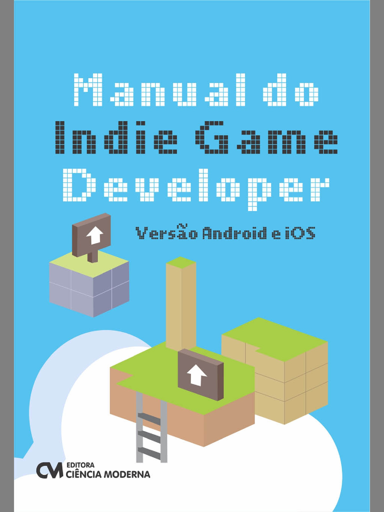

O livro Manual do Indie Game Developer – Versão Android e iOS foi lançado este ano pela editora Ciência Moderna e trás muitos conceitos de desenvolvimento de jogos explicados pelo autor Cleuton Sampaio.

Em um primeiro momento fiquei impressionado pela abordagem de alguns temas neste livro, como prototipagem, física e [OpenGL ES 2.0](http://www.khronos.org/opengles/2_X/ "OpenGL"). Na parte de prototipagem são apresentados conceitos de como fazer e até mesmo dicas de softwares, como o aplicativo [Codea](http://twolivesleft.com/Codea/ "Codea") para iPad. É muito interessante a ideia de criar um protótipo diretamente no iPad, por exemplo, pois isto possibilita testar o gameplay no próprio aparelho, o que ajuda bastante.

São apresentados frameworks de física como a famosa [Bullet](http://bulletphysics.org/wordpress/ "Bullet"), o pouco usado Chipmunk, e o preferido de qualquer framework 2D, a [Box2D](http://box2d.org/ "Box2D"). O autor se aprofunda nos conceitos da Box2D, o que é muito legal por que eu mesmo já apanhei bastante no começo, e o conteúdo deste livro com certeza ajuda a começar e entender como funciona a física neste framework usado em grandes jogos mobile como Angry Birds.

O capítulo sobre OpenGLES 2.0 merece destaque também pela explicação dos conceitos de computação gráfica, tudo com foco em 2D para dispositivos móveis. Não temos livros em português bons sobre este assunto, e com certeza este livro da uma boa introdução nesta parte da computação gráfica.

Algumas coisas me incomodaram no livro como o autor não deixar claro que devemos jogar o protótipo fora antes de fazer um jogo, pois é um código descartável apenas para testar conceitos, e também o fato dele considerar que a criação de personagens fazer parte de game design, o que não é verdade por que a única função do game designer é criar a jogabilidade e tornar o jogo divertido, seguindo o ciclo desafio-objetivo-recompensa.

Embora seja muito legal ver a implementação para Android em Java e para iOS em Objective-C, isto não é prático para o dia-a-dia de um desenvolvedor, pois escrever o mesmo código duas vezes em linguagens diferentes não faz sentido para lançar o mesmo jogo em duas plataformas mobile diferentes. Por isso, frameworks como a [Cocos2d-x](http://www.cocos2d-x.org/ "Cocos2dx") e [Corona SDK](http://www.coronalabs.com/ "Corona"), além de game engines como a [Unity 3D](http://unity3d.com/ "Unity"), são muito usados na indústria, pois permitem escrever apenas um código e publicar para diversas plataformas.

Este é um livro brasileiro muito bom, porém curto por ter apenas 300 e poucas páginas e não abordar com detalhes outros assuntos importantes, como [scale de imagens e spritesheets](http://gamedeveloper.com.br/blog/2013/09/17/sprite-sheets-texturepacker-corona-sdk/ "TexturePacker"). Porém, eu recomendo pela base de prototipagem, física e OpenGL que este livro explica muito bem.

Muito obrigado a editora Ciência Moderna pela versão digital deste livro! Você pode o comprar ambas versões, impressa ou digital, no [site da editora](http://www.lcm.com.br/site/#/livros/detalhesLivro/manual-do-indie-game-developer---versao-android-e-ios.html "Editora").

 

