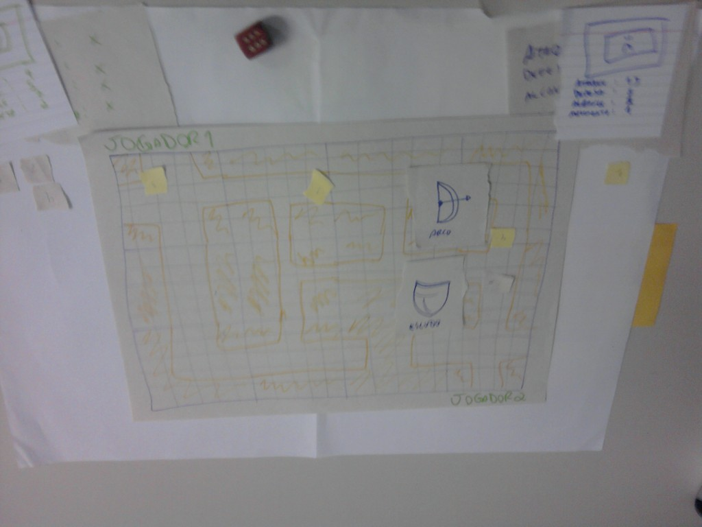

No último post desta série falei sobre a técnica de usar um [Playground](http://gamedeveloper.com.br/blog/2013/10/02/como-ser-um-programador-de-jogos-playground/ "Playground") para testar o jogo durante o desenvolvimento. Desta vez, o assunto será protótipos.

Em primeiro lugar, o mais importante que devemos sempre ter em mente é que protótipos são descartáveis. Nunca utilize o código do protótipo no seu jogo! Você pode fazer algumas coisas simples para evitar isso, como utilizar uma tecnologia diferente para desenvolver o protótipo, assim você não ficará tentado a continuar o jogo a partir do protótipo ou mesmo pegar pedaços do código e usar novamente.

Antes de falar por que o código do protótipo é descartável, vamos definir melhor o que é um protótipo. Antes de sentar e programar o jogo, precisamos validar se a jogabilidade definida pelo game designer é possível de ser desenvolvida e se ficará divertida de jogar. Muitas ideias de jogos são deixadas de lados através da realidade que o protótipo trás ao jogo.

Podemos dizer que é um recurso muito bom para colocar os pés no chão, muito melhor do que perder semanas, meses ou anos tentando fazer algo funcionar sem saber se ficará bom. Abaixo está um video do protótipo do Bioshock Infinite, usado para validar a jogabilidade de movimentar o personagem através de trilhos e atirar em alvos ao mesmo tempo. Sem o protótipo eles não teriam verificado se era possível e se ficaria divertido no jogo.

<iframe allowfullscreen="true" class="youtube-player" frameborder="0" height="402" src="http://www.youtube.com/embed/2XyJba0hVME?version=3&rel=1&fs=1&autohide=2&showsearch=0&showinfo=1&iv_load_policy=1&wmode=transparent" type="text/html" width="660"></iframe>

Mas, por que o código do protótipo é descartável? Isso é simples, pois tudo que você programar no protótipo será apenas código para testar. Neste caso, não é um teste como no Playground, onde usamos uma fase de testes dentro do jogo para verificar algo antes de programar. O protótipo é um código feito as pressas, sem técnicas e padrões, com o único objetivo de validar o quanto antes se aquela ideia é possível de fazer e se ficará divertida. A imagem abaixo é de um protótipo que desenvolvi antes de programar meu [primeiro jogo com SDL](http://gamedeveloper.com.br/blog/2009/06/18/primeiro-projeto-de-game-com-sdl-e-c/ "SDL") na pós-graduação.

Por tanto, no protótipo o programador está liberado para fazer qualquer coisa, contanto que a jogabilidade a ser testada seja implementada, e que o game designer consiga jogar e analisar o resultado. Com a ideia bem definida e testada no protótipo, jogamos tudo fora e partimos para o começar a produção do jogo. E, se for necessário testar algo durante o desenvolvimento, utilizamos o [Playground](http://gamedeveloper.com.br/blog/2013/10/02/como-ser-um-programador-de-jogos-playground/ "Playground").

O protótipo não necessáriamente precisa ser programado, podemos usar protótipos de papel ou qualquer outra coisa, como peças de Lego e objetos de jogos de tabuleiro. A foto abaixo é de um protótipo de papel de um jogo de explorar calabouços que desenvolvi com um grupo durante a pós-graduação. Fizemos apenas o protótipo para aprender e demonstrar a técnica com papel.

