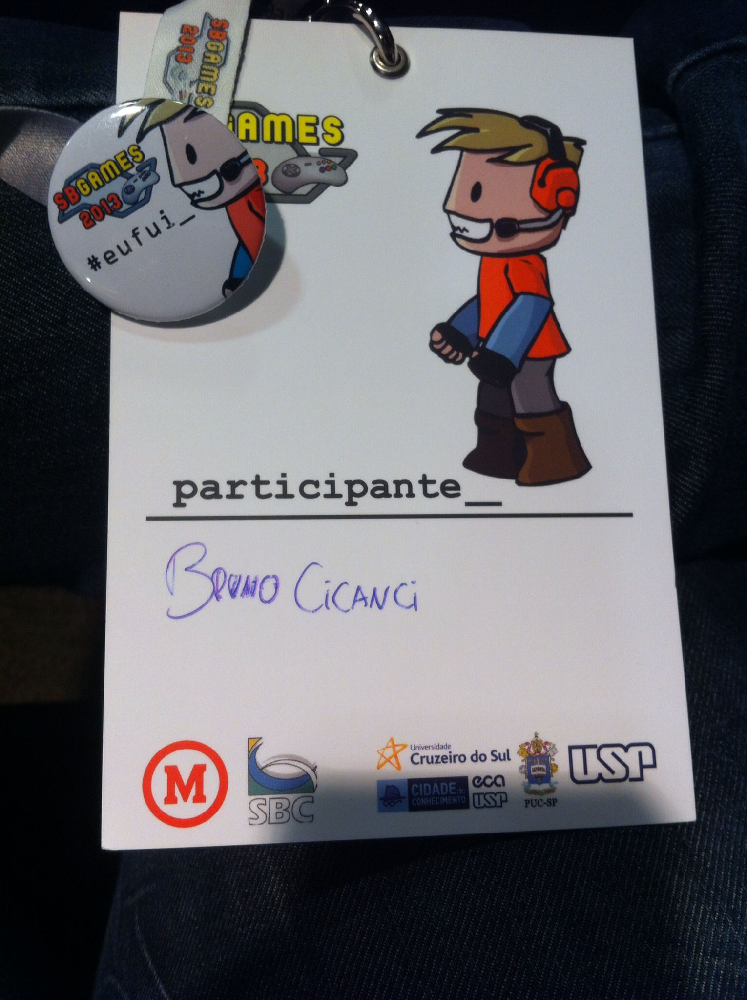

Este ano, o Simpósio Brasileiro de Desenvolvedores de Games foi realizado na Universidade Presbiteriana Mackenzie em São Paulo, e mostrou, principalmente, as pesquisas que os acadêmicos estão realizando na área de games no Brasil.

Em todas as trilhas muitos artigos foram apresentados, desde pesquisas mais técnicas, como captura de movimentos, até conceitos de game design e imersão. Este é o um dos poucos eventos de jogos que temos no Brasil, e por seu foco ser pesquisas acadêmicas podemos ver como estudantes e pesquisadores de todas as partes do país estão trabalhando para contribuir como esta área.

O evento teve também o Festival De Jogos Independentes, que premiou jogos brasileiros publicados e em produção. O Combo Nuts, jogo que participei do desenvolvimento, concorreu em duas categorias mas infelizmente não ganhou prêmios.

Todo conteúdo do evento foi muito interessantes, porém, na minha opinião, deveriam haver mais apresentações técnicas, além das teóricas, pois por termos poucos eventos de jogos eu considero importante conteúdos mais práticos para o dia-a-dia do desenvolvedor, como aconteceu no Unite.

Abaixo estão alguns vídeos gravados pelo [André Kishimoto](http://kishimoto.com.br/blog/ "Kishimoto") da apresentação chamada Postmortem, que contou com a participação dos desenvolvedores de Dungeonland, Favela Wars e Amazônia.

<iframe allowfullscreen="true" class="youtube-player" frameborder="0" height="402" src="http://www.youtube.com/embed/HnRf9GMaHJM?version=3&rel=1&fs=1&autohide=2&showsearch=0&showinfo=1&iv_load_policy=1&wmode=transparent" type="text/html" width="660"></iframe>

<iframe allowfullscreen="true" class="youtube-player" frameborder="0" height="402" src="http://www.youtube.com/embed/PXf8K_-sSr0?version=3&rel=1&fs=1&autohide=2&showsearch=0&showinfo=1&iv_load_policy=1&wmode=transparent" type="text/html" width="660"></iframe>

<iframe allowfullscreen="true" class="youtube-player" frameborder="0" height="402" src="http://www.youtube.com/embed/SLfD61FMQxQ?version=3&rel=1&fs=1&autohide=2&showsearch=0&showinfo=1&iv_load_policy=1&wmode=transparent" type="text/html" width="660"></iframe>

<iframe allowfullscreen="true" class="youtube-player" frameborder="0" height="402" src="http://www.youtube.com/embed/U1Dtn0jY8Bg?version=3&rel=1&fs=1&autohide=2&showsearch=0&showinfo=1&iv_load_policy=1&wmode=transparent" type="text/html" width="660"></iframe>

 
