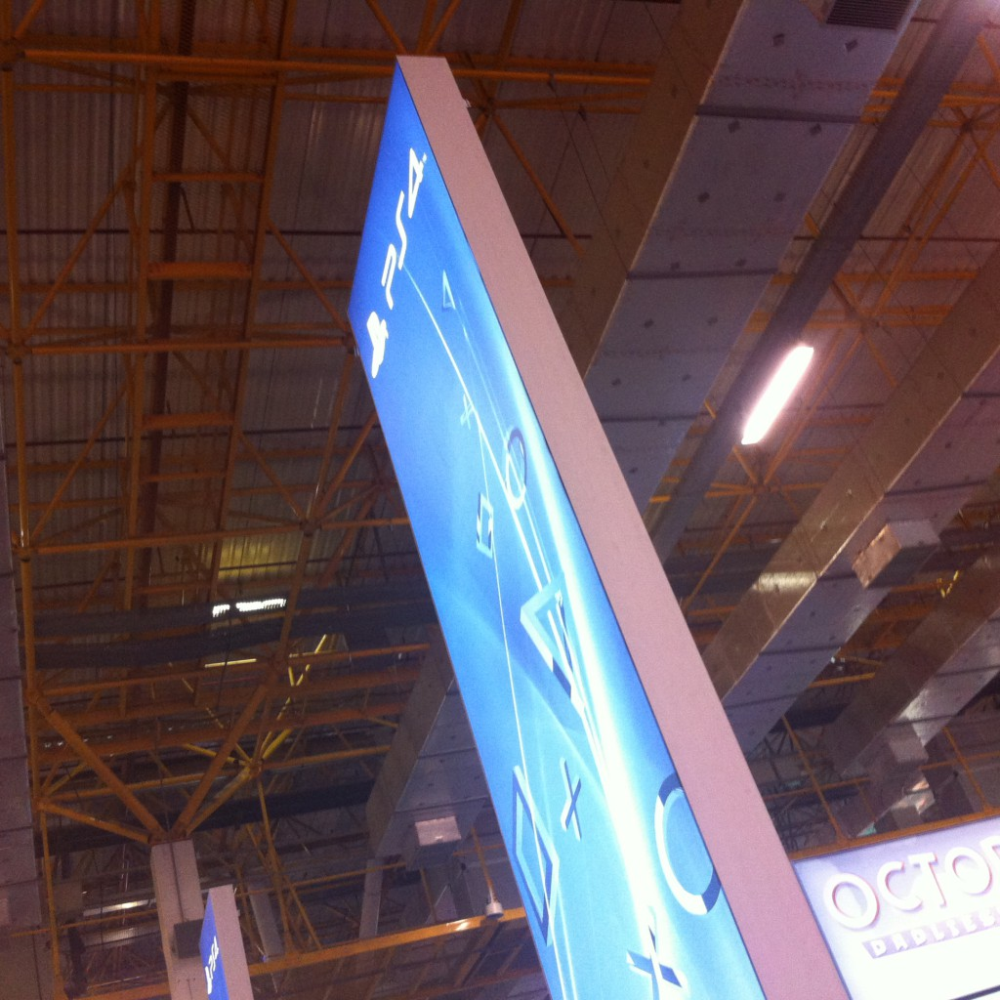

Estamos longe de ter eventos com o mesmo nível que vemos nos EUA, Europa e Japão, mas a BGS tem tudo para se tornar cada vez mais um evento importante para o mercado nacional e também para mostrar que o Brasil é realmente um grande consumidor de jogos.

Embora este ano o espaço da [BGS](http://www.brasilgameshow.com.br/ "BGS") foi um pouco maior do que no ano passado, ainda assim ficou pequeno para tantos gamers presentes no evento. Com certeza os grandes destaques foram poder jogar os novos consoles, Xbox One e PlayStation 4, antes do lançamento, além de grandes jogos como [Call of Duty: Ghosts](http://www.callofduty.com/ghosts "Cod Ghosts"), [Hearthstone](http://us.battle.net/hearthstone/pt/ "Hearthstone"), [Assassin’s Creed IV](http://assassinscreed.ubi.com/pt-br/home/index.aspx "Black Flag"), [Watch_Dogs](http://watchdogs.ubi.com/watchdogs/pt-BR/home/index.aspx "Watch_Dogs"), entre muitos outros.

Todos stands de empresas grandes estavam muito legais, mas nada se compara ao palco montado pela [Riot](http://www.riotgames.com/ "Riot") para as finais do campeonato de [League of Legends](http://www.riotgames.com/ "LoL"). Além de empresas grandes internacionais, o evento contou também com empresas brasileiras, como a [Flux](http://www.fluxgamestudio.com/ "Flux") e [Hoplon](http://www.hoplon.com/ "Hoplon").

Eu fui apenas no sábado, consegui jogar nos novos consoles, conheci pessoalmente o produtor brasileiro do [FIFA](http://www.easports.com/fifa/fifa14/ "FIFA"), [Gilliard Lopes](https://twitter.com/grunglopes "Gilliard"), tive meu jogo [Injustice](http://www.injustice.com/en "Injustice") autografado pelo produtor do game, [Hector Sanchez](https://twitter.com/hecterrific "Hector"), e também vi o [Jovem Nerd e Azaghal](http://jovemnerd.ig.com.br/ "JN"). Foi um dia muito bom, e nem consegui ver todo evento.

A organização do evento enviou um email com os números de visitantes de cada dia, que você do fere abaixo. E temos uma boa notícia, a BGS do ano que vem já foi confirmada para os dias 8 a 12 de outubro, e terá o dobro do espaço deste ano, então com certeza teremos muito mais coisas ano que vem!

**Público presente na Brasil Game Show 2013**

<table border="1" cellpadding="0" cellspacing="0" style="margin: 0px; padding: 0px; border: none; width: 500px;"><tbody><tr><td>
**25 de outubro (sexta-feira)  
 Jornalistas e Profissionais**
</td><td style="text-align: center;"> 7.392 Visitantes</td></tr><tr><td style="text-align: center;">**26 de outubro (sábado)  
 Aberto para o público**</td><td style="text-align: center;">37.220 Visitantes</td></tr><tr><td style="text-align: center;">**27 de outubro (domingo)  
 Aberto para o público**</td><td style="text-align: center;">41.811 Visitantes</td></tr><tr><td style="text-align: center;">**28 de outubro (segunda-feira)  
 Aberto para o público**</td><td style="text-align: center;">36.534 Visitantes</td></tr><tr><td style="text-align: center;">**29 de outubro (terça-feira)  
 Aberto para o público**</td><td style="text-align: center;">28.697 Visitantes</td></tr><tr><td style="text-align: center;">**TOTAL DE PÚBLICO CIRCULANTE***</td><td style="text-align: center;">**151.654 Visitantes**</td></tr></tbody></table>**Este número não reflete o número de ingressos vendidos, mas sim a quantidade total de pessoas que circularam nos Pavilhões do Expo Center Norte durante a BGS 2013.*

Considerando todas dificuldades de produzir um evento deste porte, a organização está de parabéns pela iniciativa e pelas atrações que conseguiram trazer. Eu acredito que a BGS irá crescer cada vez mais, e que cada ano será melhor que o anterior, e um dia poderemos ter um evento realmente grande e de importância mundial.

Para que eventos como este sejam cada vez maiores e frequentes aqui, temos que fazer nossa parte e apoiar a indústria de games. Todo mundo sabe que aqui é tudo mais caro por caso dos impostos, mas vemos alguns mudanças, como jogos lançados por R$150, que é algo muito próximo dos $60 dólares que são vendidos lá fora. Só para ressaltar, estou falando de jogo, de consoles. Este são caros mesmo por aqui, e nem preciso comentar o preço irreal do PS4K.

Reduzindo a pirataria, as empresas irão olhar para o Brasil cada vez com mais carinho, e podemos ter muitas coisas boa para indústria nacional. Lembre-se também que existem alternativas ainda mais baratas para PC, como o [Steam](http://store.steampowered.com/ "Steam") e o [Nuuvem](http://www.nuuvem.com.br/ "Nuuvem"), quem fazem promoções muito boas toda semana.

 
