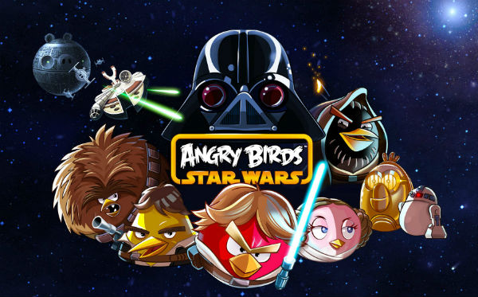

Os aplicativos de games para smartphones vieram para alegrar a minha vida a vida de quem já era fissurado em jogos antes da popularização dos celulares. A cada dia, surgem novos apps para divertir os que amam passar o tempo jogando.

Como smartphones são pequenos computadores, é preciso estar ligado na hora de escolher o que baixar no seu celular. Pesquise se os apps são de confiança – vá até os comentários dos usuários, procure saber. Um estudo publicado pela empresa de antivírus [PSafe](http://www.psafe.com/ "PSafe") mostrou que grande  parte dos problemas em celulares com sistema Android se dá por vírus originários de apps maliciosos.

Já temos que pensar em instalar no nosso celular um bom antivírus e sempre atualizá-lo. Então, fique de olhos bem abertos!

Atentos aos cuidados necessários, vamos à diversão? Abaixo está uma lista de alguns jogos grátis para Android:

**[Angry Birds Star Wars](https://play.google.com/store/apps/details?id=com.rovio.angrybirdsstarwars.ads.iap "Angry Birds Star Wars")**

Esta divertida versão do famoso jogo sueco Angry Birds continua a atirar pássaros em porcos, mas desta vez as aves estão vestidas como Chewbacca, Luke Skywalker e seus companheiros. A melhor versão de todas!

**[Pou](https://play.google.com/store/apps/details?id=me.pou.app&hl=pt_BR "Pou") **

****

Pou é diferente dos outros aplicativos, mas seu sucesso é esmagador. O app consiste em dar atenção ao seu bichinho de estimação, Pou, um alienígena que precisa comer, brincar, tomar banho – dentre outros cuidados. Tudo bem no estilo do tamagotchi, brinquedo que virou febre pelo mundo nos anos 90.

**[Plants vs. Zombies](https://play.google.com/store/apps/details?id=com.ea.game.pvz2_row "PvZ")**

****

Plants vs. Zombies lançou sua versão para o sistema Android em 2013. Sua missão no jogo é a de proteger sua casa de zumbis. Para tal, você utiliza sementes, que são germinadas e se tornam plantas que defendem sua casa dos mortos-vivos.

**  
[ Super Monsters Ate My Condo!](https://play.google.com/store/apps/details?id=com.pikpok.mamcb "Super Monsters")**

****

Um grupo de seres gigantescos e esfomeados da Adult Swim quer destruir uma série de edifícios (o seu incluso). Este é o Super Monsters Ate My Condo!, um jogo do tipo quebra-cabeças em que você deve destruir os monstrinhos para salvar as construções de irem ao chão.

**[The Simpsons: Tapped Out](https://play.google.com/store/apps/details?id=com.ea.game.simpsons4_row "Simpsons Tapped Out")**

****

Em **The Simpsons: Tapped Out**, game de construção muito bem-humorado, Springfield foi destruída por uma bomba nuclear. Seu objetivo é ajudar Homer e os demais personagens da série a reconstruir a cidade.
