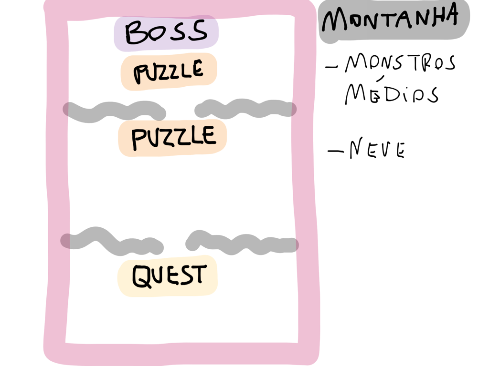

Testar um jogo é algo fácil, não é? Só jogar? Não! Existem maneiras de testar e, o mais importante, coletar dados destes testes para realmente melhorar o jogo. Alguns tipos de testes podem e devem ser feitos com um jogador, mas também existe o momento certo para cada tipo de teste.

Para ficar mais simples de explicar, vou dividir o texto em fases do processo de desenvolvimento e destacar os tipos de testes que podem ser realizados. Em todas as fases assuma sempre que quem está testando o jogo é um QA da equipe de desenvolvimento, e não artistas, programadores, produtores e game designers. Nas fases finais, além do QA da equipe, falarei também sobre testes com o público-alvo e público geral.

## **Protótipo**

Durante a elaboração do Documento de Game Design (GDD) é iniciado o desenvolvimento do protótipo do jogo que, [como expliquei neste post](http://gamedeveloper.com.br/blog/2013/10/09/como-ser-um-programador-de-jogos-prototipos/ "Protótipos"), é fundamental para a validação da ideia e do gameplay. Neste contexto, o teste deve focar na ideia que o game designer quer transmitir, e não em encontrar problemas técnicos.

O game designer também vai jogar e testar a jogabilidade, inclusive ele fará isso durante todo desenvolvimento, porém é importante um QA testar, pois o teste do game designer, assim como de todos desenvolvedores, pode ser algo viciado, que não vai ver o que um QA pode encontrar por não estar dentro do desenvolvimento.

## **Alpha**

Esta fase começa logo depois que o protótipo foi validado e o game designer está com boa parte do GDD pronto, então começamos o desenvolvimento do jogo de acordo com a orientação do produtor e do gerente do projeto. Embora o jogo esteja no começo do desenvolvimento, aqui o QA já pode ficar mais atendo a problemas técnicos.

É muito importante manter uma base de bugs encontrados, que também possua informações de como reproduzir e qual seu status (aberto, corrigido, não é bug, etc). Quando trabalhei na [Glu Mobile](http://www.glu.com "Glu") usávamos o [Bugzilla](http://www.bugzilla.org/ "Bugzilla"), e na [Electronic Arts](http://www.ea.com "EA") usávamos o [DevTrack](http://techexcel.com/products/devtrack/ "DevTRack"). Eu recomendo o Bugzilla por ser uma ferramenta gratuita e opensource que funciona muito bem para o que eu mencionei. Por favor, não use um Excel para isso já que temos opções profissionais e gratuitas.

Aqui ainda não temos testes com jogadores, pois o produto está em um estágio que pode causar uma impressão ruim ao jogador por não estar bem acabado, já que o foco é o gameplay. Por isso, nesta fase o teste é feito apenas pela equipe de QA interna. Vida de QA não é fácil, como mostra este [artigo do IGN](http://www.ign.com/articles/2012/03/29/the-tough-life-of-a-games-tester "IGN").

## **Beta fechado**

Aqui as coisas começam a ficar mais divertidas. Com um jogo com a base bem definida e testada pela equipe de QA na fase Alpha, agora podemos começar a testar com jogadores. A ideia do Beta fechado é selecionar jogadores que fazem parte do seu público-alvo para testar o jogo, e apenas isso. Por isso é fechado, devem ser convidados apenas as pessoas que você acredita que vão dar um bom feedback sobre o jogo. O objetivo é que todos problemas do jogo sejam encontrados e corrigidos para não acontecer problemas como no vídeo abaixo.

<iframe allowfullscreen="true" class="youtube-player" frameborder="0" height="402" src="http://www.youtube.com/embed/HdWRTleizFU?version=3&rel=1&fs=1&autohide=2&showsearch=0&showinfo=1&iv_load_policy=1&wmode=transparent" type="text/html" width="660"></iframe>

Existe diversas maneiras de recrutar pessoas para testes fechados, e por serem limitados você não precisa de muitas. Aqui o que vale é a qualidade, e não a quantidade de jogadores. Enquanto os programadores e artistas estão trabalhando, o gerente do projeto e o produtor devem conseguir esta lista de jogadores para serem a equipe de testes do beta fechado. A coordenação dos testes deve ser feita pela equipe de QA, e os jogadores devem responder questionários e enviar todo tipo de informação que, depois de filtradas, devem ser entregues a equipe de desenvolvimento.

Os formulários do Google Documents são uma boa forma de coletar dados, pois é uma ferramenta online e gratuita, onde os resultados são obtidos em tempo real. Por ser uma fase bem limitada, é possível também convidar jogadores para testar dentro do próprio estúdio. Neste caso a equipe de QAs, junto com o game designer, devem fazer apenas uma coisa: observar. Deixe os jogadores explorarem o jogo, e ao final da sessão peça para preencher algum formulário ou até converse com cada um para obter o feedback. Isso é muito importante para que o jogo dê certo.

## **Beta aberto**

Depois de toda experiência com os jogadores no Beta fechado, o teste aberto e feito para o público em geral é mais simples. É importante lembrar que provavelmente boa parte do público não vai enviar feedback sobre os testes, e talvez jogue apenas uma vez para ver como o jogo é. Por isso, toda informação mais importante é obtida pelo Beta fechado, que geralmente demora mais do que esta fase. Um jogador que está testando deve sempre ser orientado a reportar qualquer tipo de problema que encontrar, mesmo que ele ache que não é um problema.

Por ser aberto, nesta fase fica difícil de receber jogadores para testar, por isso tudo deve ser feito online através de pesquisas. Muitas empresas oferecem incentivos para os jogadores, como algum item especial ou desconto no jogo em troca do feedback deles, e isso funciona muito bem, como o exemplo da imagem acima. Outro detalhe muito importante é que todo feedback coletado deve ser apresentado a equipe de desenvolvimento resumido e com tudo que é mais importante destacado. O objetivo disso é ajudar a ter um jogo melhor, e não atrapalhar o desenvolvimento, por isso se for feito de qualquer jeito, a equipe de desenvolvimento não vai parar para ver tudo com calma.

## **Conclusão**

Cada fase possui um foco diferente, mas em todas a figura do QA é muito importante para garantir a qualidade do jogo. Nos testes em que deve-se observar o jogador, faça anotações das reações deles em cada parte, se demoraram muito para concluir uma missão, se estão com cara de desanimo ou empolgados. A expressão deles é a mesma que você pode ter quando seu jogo for lançado, por isso é importante entender se o jogo está agradando ou não, e cabe ao game designer mudar isso caso seja necessário.

Embora pareça que tudo que eu escrevi aqui serve apenas para empresas grandes, isto não é verdade. O público-alvo pode ser seus amigos que tem os mesmos gostos e os testes podem ser feitos até em um encontro para tomar café, o importante é que estes testes sejam feitos e as informações coletadas. Você não precisar ser uma empresa grande para fazer grande jogos, mas pode e precisar ter o mesmo nível de profissionalismo.
