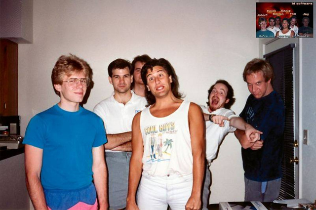

Este mês fez 20 anos que o jogo DOOM foi lançando, um game que introduziu muitos conceitos e técnicas usados até hoje em muitos FPS, além de inspirar muita gente a desenvolver jogos.

John Carmack, o cara mais badass em computação gráfica do mundo, e John Romero falaram sobre suas memórias da época em que desenvolveram o DOOM. A entrevista com os dois está [disponível no Kotaku](http://kotaku.com/memories-of-doom-by-john-romero-john-carmack-1480437464 "DOOM"). A foto abaixo foi tirada do texto publicado, e coloquei apenas para mostrar como eles eram e o tamanho da equipe que criou um dos jogos mais importantes para a indústria de games.

Se ficou som saudades de jogador DOOM ou curioso para conhecer este jogo que está fazendo 20 anos este mês, leia [este post](http://gamedeveloper.com.br/blog/2013/10/16/como-ser-um-programador-de-jogos-codigos-opensource/ "Opensource") que contém links para baixar o código-fonte do projeto completo, e mais outros jogos publicados pela Id Software, como Quake e Wolfenstein.
