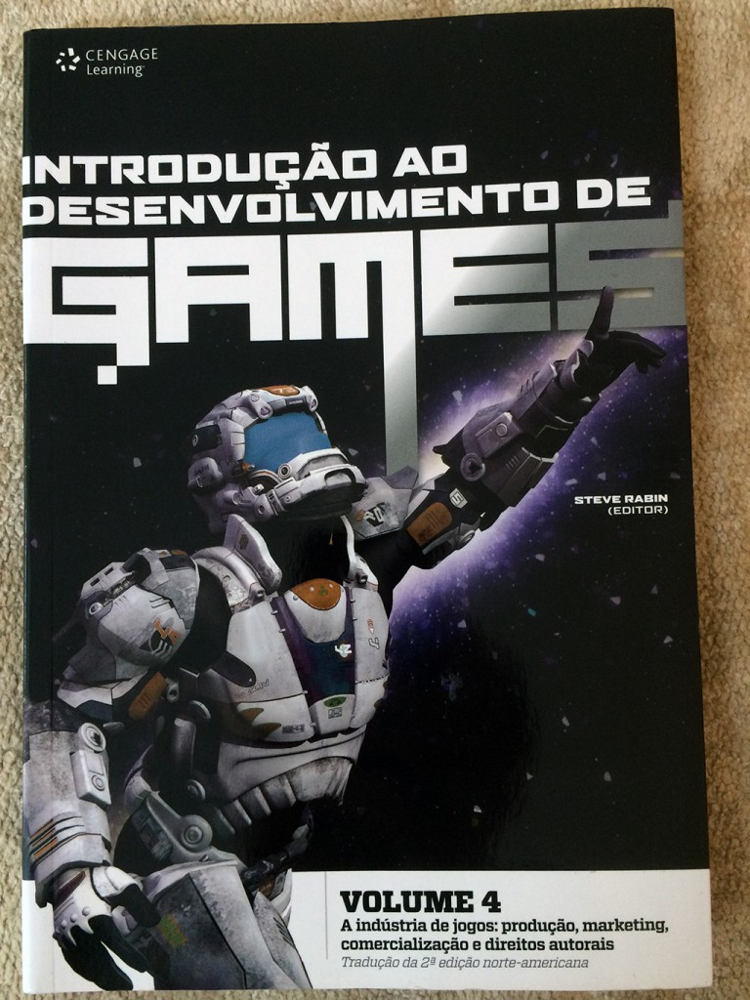

O quarto e último livro da série americana Introdução ao Desenvolvimento de Games, publicado em português no Brasil pela editora Cengage Learning, trata a parte final da produção de um jogo, que envolve marketing, comercialização e direitos autorais.

O editor do livro, Steve Rabin, reuniu seu time de profissionais da indústria de jogos AAA para tratar de um assunto que muita gente não lida, mas que faz toda a diferença no sucesso de um jogo, que é a comercialização e a parte legal burocrática da propriedade intelectual.  Confira a review do [volume 1](http://gamedeveloper.com.br/introducao-ao-desenvolvimento-de-games/ "Volume 1"), [volume 2](http://gamedeveloper.com.br/introducao-ao-desenvolvimento-de-games-2/ "Volume 2") e do [volume 3](http://gamedeveloper.com.br/introducao-ao-desenvolvimento-de-games-volume-3/ "Volume 3") que fiz no blog também.

Enquanto os demais livros da série focam no game design, programação e arte, este último apresenta resumidamente diversos tópicos interessantes e essenciais que buscam viabilizar o jogo, tratando-o como um produto que deve ser comercializado para gerar lucro e também deve ter sua propriedade intelectual protegida.

A primeira parte do livro é **obrigatória** para todo desenvolvedor **antes** de começar a fazer um jogo, que é a organização da produção e o gerenciamento do projeto do game. Existe uma fase chamada pré-produção, e nela muitas coisas são documentadas, produzidas e testadas, como o documento de game design (GDD), o cronograma do projeto e a organização da equipe. Depois disso começamos a fase de produção, que é onde o jogo é criado de fato. Por fim, a fase de pós-produção, onde muitos detalhes são acertados antes e durante o lançamento do game.

Estas fases de produção são incrivelmente detalhadas no livro, e acredite que são muitas. Vale ressaltar dois detalhes: nem tudo que está no livro é válido para o Brasil; e pode parecer muita coisa mas lembre-se de que este livro foi escrito por veteranos da indústria que criaram jogos AAA, e não indies.

Eu conhecia um pouco dessa parte de produção, mas após este capítulo o livro me surpreendeu com um conteúdo inesperado. Existem capítulos que falam sobre o relacionamento do desenvolvedor com a publisher (ou editora, como foi traduzido), e até sobre a economia da indústria de games. São coisas muito interessantes para ler e conhecer, mesmo que você não use isto agora ajuda a entender que não basta fazer um jogo, para ele ser um sucesso existem diversos fatores e tarefas.

O capítulo sobre marketing é outro destaque do livro, uma vez que nunca vi um livro focando em marketing para games. Se pra mim que sou programador foi bem legal de ler, tenho certeza de que alguém desta área que tem interesse em jogos vai gostar e aproveitar muito esta parte do livro.

Por fim, dois capítulos respondem as dúvidas mais comuns de um desenvolver sobre regulação de conteúdo no mundo e a lei e prática sobre conteúdo de propriedade intelectual (IP, em inglês). Eu sempre tive interesse em ler sobre isso, mas nunca fui atrás de um livro sobre o assunto, não sei dizer se existe um para games também. Porém, estes capítulos são um ótimo ponto de partida para entender o que você deve fazer para proteger a IP do seu jogo e também a importância da regulação do conteúdo do jogo para poder publicá-lo em outros países.

Novamente, lembre-se de que todo o conteúdo do livro foi escrito para o mercado norte americano e para jogos AAA. Claro que tudo pode ser usado em mercado brasileiro e em jogos indies, mas muitos detalhes devem ser pesquisados por que são diferentes.

Fechando com chave de ouro a série, este volume 4 é quase tão essencial quanto a parte técnica de se desenvolver um jogo. Por mais que você desenvolva por paixão, se o jogo virar um negócio lucrativo é bom estar preparado e informado sobre o que fazer para ter sua propriedade intelectual protegida, como fazer o marketing do jogo e também como funcionam as fases da produção de um game.

Muito obrigado novamente a editora Cengage Learning por tem enviado o livro! Este volume, assim como toda coleção, esta disponível em várias livrarias e no [site da editora](http://www.cengage.com.br/ls/introducao-ao-desenvolvimento-de-games-vol-4-traducao-da-2a-edicao-norte-americana/ "Cengage"). Siga a Cengage Learning no [Facebook](https://www.facebook.com/cengagebrasil "Facebook") e no [Twitter](https://twitter.com/cengagebrasil "Twitter") para ficar por dentro dos lançamentos da editora.
