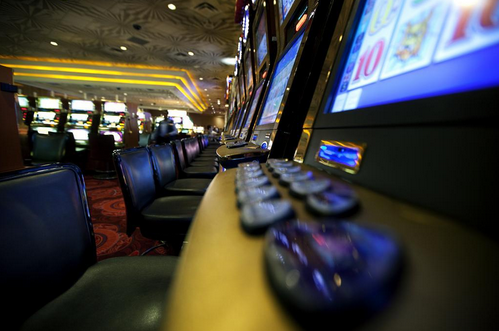

Com a variedade e diversidade de casinos online que os jogadores têm hoje em dia á sua disposição cada detalhe conta quando é para atrair jogadores.

Embora seja muito importante a variedade de jogos e de prémios que os casinos online oferecem aos jogadores, um dos factores que também conta muito na hora de um jogador escolher um site para jogar é o design e a estrutura desse site. Apesar dos casinos online terem [algumas diferenças para os casinos reais](http://www.europacasino.com/pt/Designing-the-Casino-Experience), cada vez mais os sites se preocupam em arranjar maneiras de trazer essa experiência para os jogos online.

Imagem: [Travis Isaacs](https://www.flickr.com/photos/tbisaacs/4082049121)

Hoje em dia é vantajoso que um site de jogos de casino online seja atraente, chamativo e muito funcional para cativar logo a atenção do jogador, e para que este consiga encontrar facilmente o que procura.

A “home page” de um site de casino online é a primeira pagina que um jogador vê quando acessa o site, sendo que esta deve conter o máximo de informação possível sobre jogos, prémios e bónus.

Muitos sites também escolhem colocar cores chamativas e imagens relacionadas com os jogos de casino, como por exemplo um casino de Las Vegas como fundo.

Normalmente o sites também optam por colocarem na “home page” os jogos mais populares e mais procurados pelos jogadores, como é o caso:

- Poker
- Roleta
- Blackjack
- Baccarat

Para que assim os jogadores tenham acesso de imediato aos seus jogos favoritos, sem terem que andar a fazer pesquisas no site.

Outro dos factores a ter em conta quando acessamos um site para além do design, da funcionalidade e dos jogos é se o site contam informações detalhadas sobre:

- [Segurança,](http://en.wikipedia.org/wiki/Safe_and_Secure_Internet_Gambling_Initiative)
- Pagamentos e depósitos,
- Regras,
- Informações de contacto
- Certificação por parte de outras identidades,

Todos estes factores dão mais credibilidade a um site de jogos de casino online e oferece também mais segurança para quem procura jogar este tipo de jogos online.

Referir que um bom site não deverá estar sub-carregado de links de bónus promocionais relativos á vários jogos, deve sim mostrar o link para o bónus de inscrição que o jogador pode receber ao inscrever-se num site, sendo este um incentivo para novos jogadores.

Com o passar dos anos e com a evolução da tecnologia os designs dos casinos online sofreram muitas alterações, o que veio trazer mais credibilidade a muitos sites.

Uma das muitas coisas que foram melhoradas com o passar dos anos foi a jogabilidade deste tipo de jogos quer nos computadores ou nos aparelhos móveis (como os tablets ou smartphones).

Os sites que no passado usavam o Flash, tiveram que começar a usar CSS, para assim os jogadores poderem jogar os seus jogos preferidos sem problemas nenhuns, quer joguem nos seus computadores ou aparelhos moveis. A [CSS e HTML5](http://www.phonearena.com/news/HTML-5-A-closer-look-at-the-technology-that-will-replace-Flash_id23722) veio fazer com os jogos de casino online tenham muito mais qualidade nos tablets e smartphones.

Com o aumento da procura por parte dos jogadores os designers que desenvolvem os casinos online também tiveram que se preocupar em arranjar soluções para que os sites suportem milhares de acessos ao mesmo tempo, oferecendo sempre qualidade e rapidez, este é um dos factores que destinge um bom casino online.

Algumas vantagens deste casino online:

- Várias Promoções e bónus
- Serviço de apoio ao cliente,
- Várias formas de pagamento e depósito
- Disponível para computadores e aparelhos móveis Android e Apple
- Possui um blog, onde publica diversos artigos sobre as várias temáticas dos jogos online
- Guias de aprendizagem
- etc…

Por ultimo referir que alguns casinos online têm vindo a ter a preocupação de tentar trazer para os jogos online a verdadeira experiência de estar a jogar num casino real.

