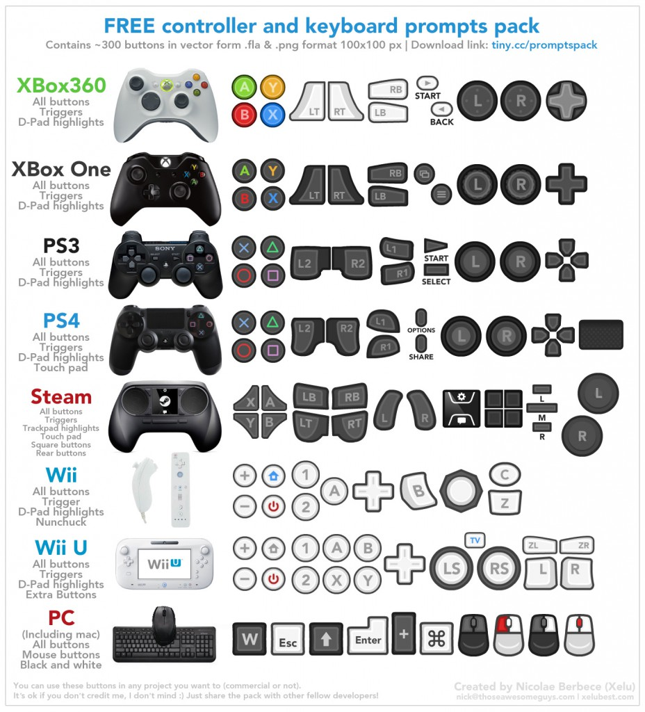

As vezes queremos usar imagens de botões de controles nos jogos para algum tutorial ou mesmo em interfaces touch como botões de ação, e este pack com vários botões de controles de consoles pode ajudar bastante.

Infelizmente não lembro onde vi isso para dar o devido crédito, mas toda arte foi criada pelo [Nicolae Berbece (Xelu)](http://xelubest.com/ "Xelu") e pode ser usada em projetos gratuitos e comerciais, e nem é necessário dar crédito a ele (mas é legal você fazer isso caso use!).

Você pode baixar todos os botões em imagens individuais [clicando aqui](http://tiny.cc/promptspack "Pack").

Fonte: [http://puu.sh/7bBk0](http://puu.sh/7bBk0 "http://puu.sh/7bBk0")
