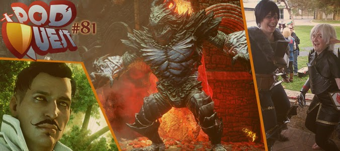
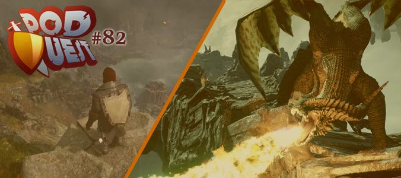
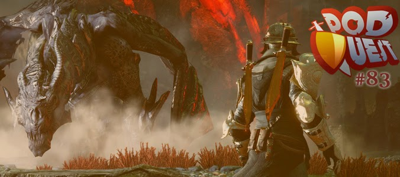

O [PodQuest](http://www.podquest.com.br/ "PodQuest") é um podcast onde 3 profissionais da indústria internacional de games falam sobre suas experiências na área. Recentemente eles fizeram um postmortem do novo jogo Dragon Age: Inquisition, e além de um programador da BioWare que faz parte do PodQuest, eles também receberam um produtor e outro programador, todos brasileiros.

O postmortem do Dragon Age: Inquisition foi bem legal, principalmente por ser um jogo muito bom e que acabou de sair. Muitos detalhes do desenvolvimento foram revelados e discutidos, recomendo para todo mundo ouvir os três episódios abaixo.

### [PodQuest #81: Postmortem de Dragon Age, Parte 1 – Teabag no Dragão!](http://www.podquest.com.br/2014/12/podquest-81-postmortem-de-dragon-age.html "PodQuest")

### [PodQuest #82: Postmortem de Dragon Age, Parte 2 – Rogue de Snowboard](http://www.podquest.com.br/2014/12/podquest-82-postmortem-de-dragon-age.html "PodQuest")

### [PodQuest #83: Postmortem de Dragon Age, Parte 3 – Stress Test Pra Cardíaco](http://www.podquest.com.br/2014/12/podquest-83-postmortem-de-dragon-age.html "PodQuest")

As [equipe do PodQuest](http://www.podquest.com.br/p/equipe.html "Equipe") é formada por: Gilliard Lopes, Produtor da Electronic Arts e responsável pela série FIFA (publiquei uma entrevista com ele [aqui](http://gamedeveloper.com.br/?s=gilliard+lopes "Entrevista") em duas partes); Rafael Kuhnen, Game Designer na Gameloft; e Fernando Secco, Programador na BioWare. Só pelo cargo atual deles da pra ver que possuem muita experiência na área, eu sempre aprendo algo novo apenas ouvindo suas discussões nos podcasts.
