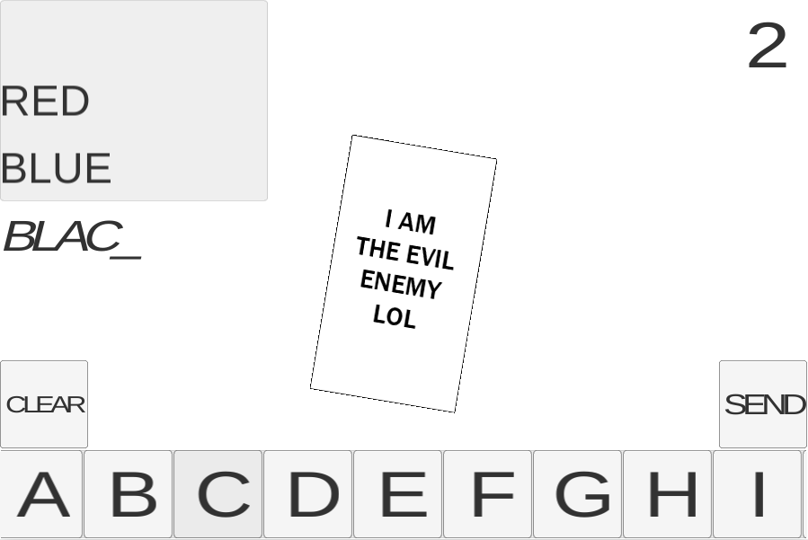

Faz 6 anos que eu trabalho com jogos e nunca tinha participado do game jam chamado Ludum Dare. Por acaso vi que neste fim de semana ia começar a edição #32, então decidi participar.

[Ludum Dare](http://ludumdare.com/compo/ "LD") é uma game jam dividida em duas categorias: Compo e Jam. Na compo cada desenvolvedor deve criar o jogo sozinho e tudo relacionado a ele (código, arte, efeitos sonoros, etc) em 48 horas. A outra categoria é mais tranquila, pois na Jam é possível trabalhar em equipes, utilizar recursos prontos e os participantes tem 1 dia a mais para enviar seu jogo.

O que é comum nas duas categorias é que o jogo desenvolvido precisa ter alguma coisa relacionada ao tema, que só é revelado no início da competição. Na [edição #32](http://ludumdare.com/compo/ludum-dare-32/ "LD32") o tema foi “An Unconventional Weapon” (uma arma não-convencional), e eu decidi participar da categoria Compo.

Como uma dos itens mais importantes da Ludum Dare é a facilitar o acesso ao seu jogo, decidi que a plataforma principal seria Web e utilizei a nova [Unity 5](http://unity3d.com/ "Unity") para o desenvolvimento. Como o plugin da Unity não está mais sendo suportado em alguns navegadores, arrisquei exportar utilizando a opção de HTML5/WebGL da Unity 5.

Minha ideia inicial era um jogo onde você digitava uma palavra e ela se transformava em um objeto para atacar o inimgo que está indo na sua direção. Como isso iria exigir arte (que eu teria que criar sei lá como, pois sou programador), decidi que as próprias palavras iriam atacar o inimigo, porém estas palavras deveriam ser válidas dentro de um tema. Decidi também colocar um nível de dificuldade para separar a escolha do tema. Infelizmente, devido ao tempo, cada dificuldade tem apenas um tema fixo (que são diferentes entre si). O jogador também não pode utilizar umas das 3 últimas palavras usadas para atacar o inimigo, e cada palavra/inimigo morto contam 1 ponto para o jogador. E assim nasceu o “Word Battle”.

Uma das coisas que deixou o desenvolvimento mais lento foi a nova UI da Unity, que apesar de ter sido lançada há um tempo eu nunca tinha trabalhado com ela. Minha sorte é que lembra muito a NGUI, um plugin de interface que estou acostumado. Não tive muito tempo para estudar as diferenças, então acredito que tudo que eu fiz poderia ser feito melhor.

 

Como eu tive dois dias para fazer o jogo sozinho acabei dividindo da seguinte forma: o primeiro dia iria focar no gameplay e no segundo dia no resto (arte, menu, efeitos sonoros). Esta estratégia até deu certo, porém no segundo dia ainda tinha algumas coisas de gameplay para finalizar. Sem muito tempo sobrando decidi que não iria fazer arte e deixei toda arte temporária no jogo, e então me dediquei um pouco aos efeitos sonoros.

Esta foi uma parte bem divertida, pois fiquei andando pela casa com meu celular na mão gravando vários barulhos diferentes para colocar no jogo, e no final consegui alguns resultados bons, porém não ideais para um jogo. A qualidade da gravação não ficou boa, e por causa do microfone do celular alguns ruídos permaneceram no som. Mas, isso foi o que consegui fazer a tempo de enviar. Na verdade terminei 4 horas antes do prazo, mas não quis arriscar mexer em mais nada já que tudo estava funcionando.

O meu jogo está publicado [nesta página do Ludum Dare #32](http://ludumdare.com/compo/ludum-dare-32/?action=preview&uid=52021 "LD32"), e também pode ser jogado através [deste link](http://cicanci.com/LD32 "LD32"). Como esta foi minha primeira vez em uma game jam de 48 horas, pra mim o resultado até que ficou razoável. O importante é que isto serviu de experiência para as próximas edições, que com certeza vou querer participar.

O código do jogo está disponível [neste link do GitHub](https://github.com/cicanci/game_unity_ld32 "LD32"). Acabei me arrependendo um pouco de utilizar a Unity, e o principal motivo foi que o jogo exportado ficou muito grande. Todo conteúdo (arte, som e código) ficou com menos de 500KB, porém a build final HTML5/WebGL ficou com mais de 40MB. Com certeza esta não é uma solução aceitável para um jogo, porém foi mais uma lição que aprendi. Ah, sem falar que minha máquina chorou muito pra compilar o projeto e levou uns 10 minutos para exportar a versão release (Intel i5, 8GB de ram, GTX260).

Agora vem a parte em que os jogadores e outros desenvolvedores começam a jogar os jogos publicados e dar feedback sobre eles. O Ludum Dare não tem uma premiação, mas isso torna a competição bem interessante por que todos estão lá apenas para se divertir. Deixem abaixo comentários e feedbacks sobre meu jogo, e também comentem sobre suas experiências em game jams!
