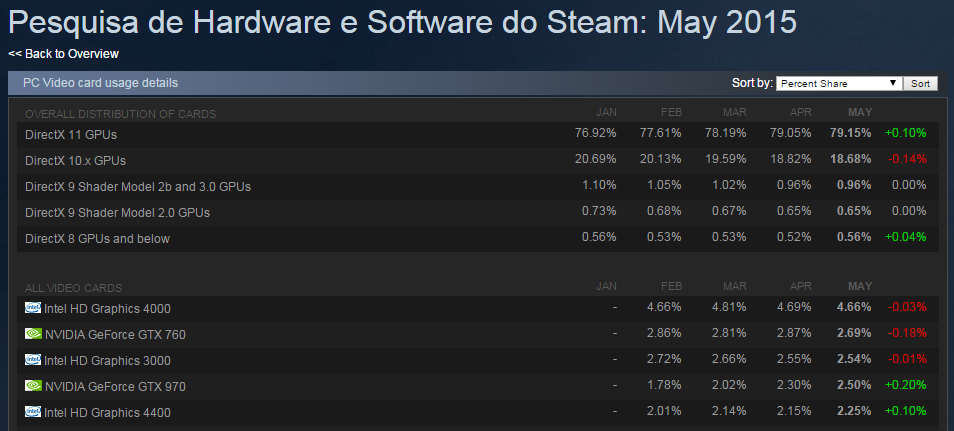

Uma das principais preocupações de um programador de games é a performance do seu jogo e qual é o hardware mínimo que ele pode rodar, seja mobile ou desktop. Mas pra isso, primeiro você precisa saber quais são os hardwares mais usados para jogar.

Há muito tempo atrás empresas de pesquisa cobravam fortunas para fornecerem relatórios sobre o mercado. Quanto mais específico era seu público, mais demorado, caro e limitado era o resultado da sua pesquisa. Muitas vezes empresas reutilizavam pesquisas antigas para não precisar pagar uma nova. Embora isso ainda exista e seja muito utilizado, hoje temos algumas opções muito boas, gratuitas e que estão sempre atualizadas.

A primeira que vou comentar é provavelmente uma das mais famosas para o público que joga PC, e hoje ela é muito importante para desenvolvedores independentes que querem publicar seu jogo nesta plataforma: o [Steam](http://store.steampowered.com/hwsurvey/).

A empresa do nosso querido [Gabe](https://en.wikipedia.org/wiki/Gabe_Newell) fornece estatísticas do hardware de toda sua base de jogadores, sem cobrar nada por isso. Basta [clicar aqui](http://store.steampowered.com/hwsurvey/) e fuçar em tudo que quiser saber sobre o público que está na maior plataforma de jogos de PC do mundo.

Se você está desenvolvendo um jogo e quer publicar ele no Steam Greelight, este tipo de informação pode te ajudar a definir qual vai ser o requisito mínimo do seu jogo e te deixar livre para explorar os recursos de sua engine ou framework sem ficar na dúvida.

O segundo que vou comentar provavelmente será ainda mais útil, pois muita gente utiliza esta engine e esta página fornece dados sobre hardware mobile também: a [Unity](http://stats.unity3d.com/).

Segundo o que foi apresentado pelo CEO da Unity no evento Unite de 2013 em São Paulo (a primeira edição do evento), o Brasil era o terceiro país que mais utilizava a Unity, e acredito que isso possa ter até aumentado hoje. [Esta página](http://stats.unity3d.com/) da Unity mostra dados de hardware relacionado a jogos publicados para web, desktop e mobile, além de mostrar estatísticas de uso do hardware que os desenvolvedores usam quando trabalham no editor da Unity.

Nem preciso dizer o quanto isto é valioso para desenvolvedores indie, pois combina informação de hardware com o público que joga games feitos com Unity. Ou seja, basta analisar isso para saber quais são os devices que os jogadores mais usam para jogar. E novamente, é gratuito e atualizado mensalmente.

Mesmo se você não estiver desenvolvendo algo neste momento que precise destas informações, é bem interessante ver quais são os hardwares mais utilizados por jogadores (eu geralmente olho as estatísticas da Steam para ver se meu desktop vai precisar de um upgrade ou não).

Imagem da capa: [Flat Design Vector Illustration Concept of Game Environemnt](http://www.shutterstock.com/pic-180754775/stock-vector-flat-design-vector-illustration-concept-of-game-environment-tools-and-essentials-various-devices.html?src=csl_recent_image-1) do Shutterstock.
