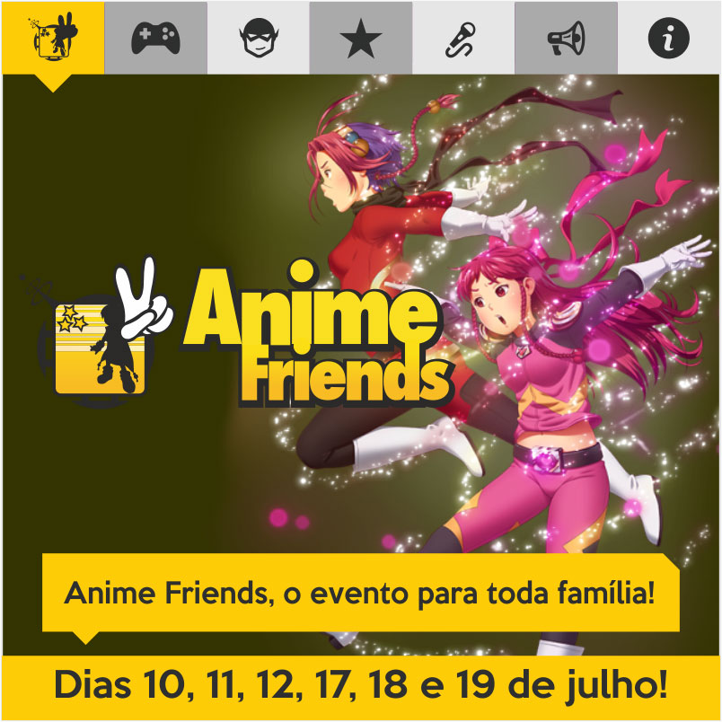

Anime Friends, maior festival de cultura pop da América Latina, começa em julho. Megaevento oferece atrações nacionais e internacionais, entre elas cosplays, shows musicais, campeonatos de videogames e quadrinhos [www.animefriends.com.br](http://www.animefriends.com.br/)

Cerca de 120 mil fãs de quadrinhos, cinema, séries, mangás, música, anime e jogos de videogame vão invadir o Campo de Marte, na capital paulista, a partir de 10 de julho. Eles participarão do Anime Friends 2015, maior festival de cultura pop da América Latina, que completa 12 anos, e será realizado em dois fins de semana, nos dias 10, 11, 12, 17, 18 e 19 de julho.

O megafestival para toda família terá centenas de atrações nacionais e internacionais, que abrangem grandes shows musicais com bandas japonesas renomadas, concursos mundiais de cosplay, feira de colecionáveis e de quadrinhos, exposição e campeonatos de videogames, encontro com youtubers, comidas típicas, palestras e autógrafos com convidados nacionais e internacionais.

O local é de fácil acesso na capital paulista, no Campo de Marte, perto do Metrô Santana, e deve receber visitantes que vem em caravanas de todo o país. Além de estrangeiros da América Latina e Europa, que virão para a final do **Yamato Cosplay Cup International, **campeonato que premia o melhor cosplayer – aquele que se veste como seu personagem favorito – do mundo.

 

**MÚSICA**

Em um palco imenso e cheio de luzes e efeitos especiais, irão se apresentar artistas nacionais e internacionais, como a aclamada banda japonesa **Flow**, conhecida por representar temas de animes como Naruto, no dia 19, domingo, às 19h, e o brasileiro **Detonator**, no dia 11, sábado, às 16h30.

Também se apresentarão as bandas japoneses **Home Made Kazoku** (18, às 19h), **INKT** (11, às 20h), **Screw** (10, às 19h30) e **Snowkew** (17, às 19h), além do grupo **Cross Gene**, formada por seis integrantes do Japão, China e Coréia (10, às 18h). No dia 12, às 19h, o show *Super Friends Spirits* irá reunir grandes intérpretes de canções dos desenhos animados, com apresentações de **Matsuko Mawatari, Sasaki Sayaka, Joe Inoue** e do brasileiro **Ricardo Cruz**.

 

**COSPLAY**

Uma das atrações mais aclamadas pelo público cativo do Anime Friends são os cosplayers. Centenas de visitantes transitam pelo espaço vestindo roupas exuberantes, imitando seus personagens preferidos. Parte deles prontos para participar das competições que premiam em dinheiro ou passagem para o Japão.

1. ** Yamato Cosplay Cup Brazil (YCC):** o concurso reúne participantes de várias regiões do Brasil. A grande final acontece no evento, com apresentação dos classificados nos dias 18 (17h) e 19 (16h) de julho.
2. ** Yamato Cosplay Cup International (YCCI):** competição internacional que premia o melhor cosplayer do mundo. Conta com participantes de diversos países da América Latina e Europa. A final acontece no dia 11 de julho, às 16h30h.
3. ** Yamato Cosplay World (YCW)**: seletiva do maior concurso de cosplay em duplas do Brasil. Acontece em todos os dias e irá garantir duas vagas para a final, em dezembro. O grande prêmio é uma passagem para o Japão.
4. ** Ultimate Cosplay Contest: **premia os melhores cosplayers de heróis da Marvel ou DC Comics que se apresentarem no concurso regular de cosplay, durante todos os dias. Aquele que receber a maior nota levará o prêmio de R$ 2 mil, no dia 19.
5. **5****. Desfile C****osplay Kids: **espaço dedicado às crianças de até 10 anos que gostam de se vestir como seus personagens favoritos. Acontece nos dias 11, 12, 18 e 19, das 13h às 18h, com direito a brindes aos participantes.
6. ** Teatro Cosplay: **apresentação do grupo de teatro Piriri Cosplayers, que utiliza elementos de animes, games, desenhos, cinema e comics, no dia 19, às 17h30.
7. ** Concurso Cultural Cosplay**: tem as inscrições gratuitas feitas no próprio evento, e os participantes concorrem a prêmios em dinheiro.

Neste ano, dois famosos cosplayers japoneses estarão no evento: **R****eika Arikawa **e** Kaname**, conhecidos mundialmente pelos seus belíssimos ensaios fotográficos. Reika fará parte da banca de júri do YCCI e falará sobre sua carreira em uma palestra no dia 12, às 18h, no Palco Cosplay. Já Kaname se apresentará no dia 11, às 16h30, no Palco Principal, e no dia 12, às 18h, no Palco Cosplay.

 

**GAMES**

O evento deste ano conta com dois espaços para os gamers: os campeonatos Press Start e o espaço Free Play. Os campeonatos ocorrerão durante todos os dias e os vencedores irão disputar prêmios na grande final, dia 21. As inscrições são feitas no local.

A Bandai Namco Entertainment vai mostrar dois lançamentos em seu estande: J-Stars Victory VS + e Naruto Shippuden: Ultimate Ninja STORM 4. No estande do CrossFire os gamers poderão disputar partidas da versão 2.0 deste game, que é o FPS mais disputado do mundo. A Ankama Games, responsável pelos MMOs Dofus e Wakfu, também estará no Anime Friends.

Já no espaço Free Play é possível treinar para os campeonatos ou simplesmente jogar com um amigo os mais variados jogos de PlayStation 3 e Xbox 360 sem pagar nada.

 

**ATRAÇÕES PARA TODOS OS PÚBLICOS**

O ator japonês **Tetsuo Kurata**, protagonista da série “Kamen Rider Black” e sua continuação, “Kamen Rider Black RX”, será um dos convidados do Anime Friends.  Kurata fará um bate-papo sobre sua carreira e sobre a série no dia 18 às 12h30. No dia 19 às 14h30, participará de um encontro com os fãs.

O designer automotivo **Bryan Benedict**, responsável pelas miniaturas da marca Hot Wheels desde 2004, estará no Anime Friends nos dias 18 e 19, sábado e domingo, no espaço Colecon. Quem quiser conhecer mais sobre sua carreira poderá acompanhar um painel que será realizado por ele no dia 18, às 17h, no Auditório Brasil Comic Con.

Os admiradores de dublagem também terão espaço. Na sexta-feira, dia 10, às 13h, Marcelo Campos, dublador de personagens como Mu de Áries, de Cavaleiros do Zodíaco, e Trunks, de Dragon Ball, estará no Palco Cosplay para um bate-papo com o público. No domingo, 12, também às 13h, será a vez de Miriam Ficher e Manolo Rey, que atuaram no anime Digimon, nas vozes de Patamon e Agumon, respectivamente, subirem juntos ao Palco.

 

**Confira os outros eventos que serão apresentados dentro do Anime Friends:**

**BRASIL COMIC CON**

Edição nacional baseada no mais famoso evento de quadrinhos e cultura nerd do mundo, a San Diego Comic Con. Durante todos os dias, os geeks aficionados terão uma extensa programação no evento. Haverá palestras sobre literatura, quadrinhos e mangás, além de bate papos com autores e empresas do ramo. Carolina Munhoz, autora de “O Reino das Vozes que não se Calam”, e Rafael Draccon, autor de “Dragões do Éter”, são duas das atrações do espaço e conversam com os leitores no dia 12, às 14h.

**EIRPG**

O Encontro Internacional de RPG (EIRPG), de São Paulo, já deteve o título de segundo maior evento do gênero do mundo. Este ano ele estará em todos os dias do Anime Friends, no Campo de Marte. Haverá mesas com Card Game, jogos de tabuleiro, RPG clássico e campeonatos de Magic: The Gathering e Yu-Gi-Oh. Neste ano, Jason Bulmahn, principal desenvolvedor dos jogos da linha Pathfinder, será o convidado internacional do espaço e estará no evento para bater um papo com os fãs de RPG, distribuir autógrafos e participar de atividades.

**Festival LUG Brasil**

Os fãs de LEGO também têm espaço garantido no Anime Friends. Durante todos os dias do evento, exposições com diversos blocos, onde cada um representará um tema diferente, estarão disponíveis para apreciação dos amantes do brinquedo de montar. LUG Brasil é a primeira comunidade de fãs de LEGO do país, com representação junto a LEGO System A/S (Dinamarca).

**Colecon**

A “Conveção de Colecionadores de Miniaturas de Carros e Outros”, também conhecida como Colecon, reúne os mais diversos fãs de colecionismo do Brasil. A convenção conta com espaço dedicado para venda e troca de produtos colecionáveis, exposições, concursos de customização e bate-papo com convidados durante todos os dias.

**EXPO Sci-fi**

A Expo Sci-Fi reunirá o conteúdo e os fãs das principais séries e filmes de ficção científica, como Star Wars, Star Trek e Battle Star Galactica, em uma área que promoverá palestras sobre temas variados, exposições de itens de colecionador, estandes, desfiles cosplay e um espaço para os próprios fã-clubes exporem seus itens e receber os fãs.

**WEB POP Festival**

WEB POP FESTIVAL é um evento que tem como foco aproximar os internautas de seus Youtubers preferidos com uma interação mais direta. Durante todos os dias de evento, serão realizadas diversas palestras, bate-papos e brincadeiras com a participação do público, como os jogos de perguntas e respostas, gincanas, sessão de autógrafos e fotos. Entre os Youtubers convidados estão Cauê Moura, Irmãos Piologo, Rato Borrachudo, Muca Muriçoca, Ayu Brasil, entre outros.

 

**Serviço**

**Anime Friends 2015**

**Quando**: 10, 11, 12, 17, 18 e 19 de Julho

**Horários:** Sextas-feiras das 12h às 21h, sábados e domingos das 10h às 21h.

**Local**: Campo de Marte, em São Paulo – Av. Santos Dumont, 2241 (perto do Metrô Santana)

**Valores:** Ingressos individuais de R$ 30 a R$ 80 ou o combo para 3 dias de R$ 90 a R$ 180. Ingressos no dia do evento de R$ 50 a R$ 120.

**Compre online:**[http://www.animefriends.com.br/e_ingressoson.shtml#conteudo](http://www.animefriends.com.br/e_ingressoson.shtml#conteudo)

**Página Oficial:**[http://www.animefriends.com.br/ ](http://www.animefriends.com.br/)

 
