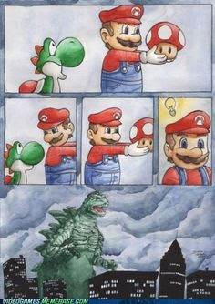
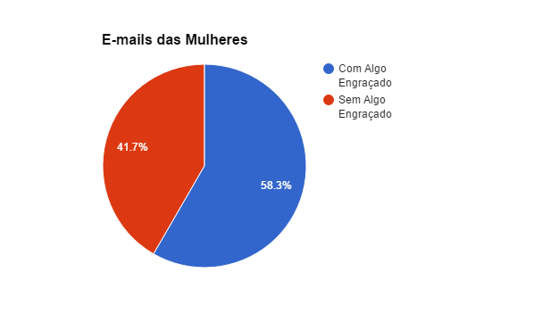

Depois de pouco mais de duas semanas, hoje é o dia de anunciar o vencedor do [sorteio](http://gamedeveloper.com.br/game-design-modelos-de-negocio-e-processos-criativos-sorteio-do-livro/) do livro Game Design: Modelos de Negócio e Processos Criativos da editora Cengage Learning.

O sorteio foi realizado da seguinte maneira: eu recebi 127 e-mails com o título “SORTEIO GAME DESIGN” até ontem a noite. Para selecionar o ganhador eu fui no site [random.org](https://www.random.org/) e gerei um número de 1 a 127, e o resultado foi 37 conforme a imagem a baixo.

Então, considerando a ordem de recebimento dos e-mails, o de número 37 foi do **João Paulo Leite Costa**, parabéns! Vou te enviar um e-mail em breve pedindo o seu endereço. Não era obrigatório enviar uma imagem engraçada, mas por acaso ele também enviou uma:

Para fechar o post, vou colocar algumas estatísticas sobre o sorteio que achei interessantes. Estes gráficos mostram a porcentagem de homens e mulheres que participaram do sorteio e também quantos enviaram algo engraçado.

  

Muito obrigado a todos que participaram do sorteio, logo vou responder cada um dos 127 e-mails (vocês merecem!).

Imagem da capa: [Dice Icon With Long Shadow](http://www.shutterstock.com/pic-238921480/stock-vector-dice-icon-with-long-shadow-flat-style-vector-illustration.html) do Shutterstock.
