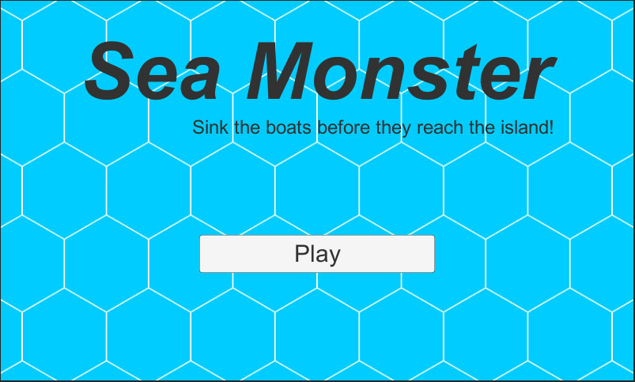
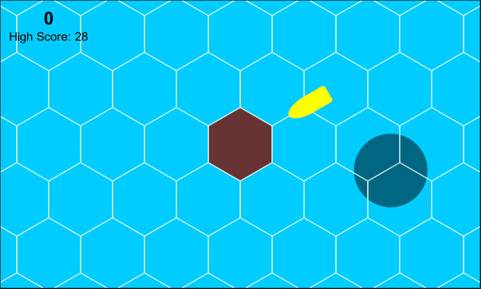

Esta foi minha segunda participação no game jam [Ludum Dare](http://ludumdare.com/), e isto me fez entender uma coisa: não é apenas o tema que muda, mas tudo é diferente em cada edição.

Vou fazer um resumo de como foi minha participação neste Ludum Dare e o jogo [Sea Monster](http://ludumdare.com/compo/ludum-dare-33/?action=preview&uid=52021) que eu desenvolvi para categoria chamada compo. Nesta categoria, o desenvolvedor tem que criar tudo do zero em 48 horas: código, arte, efeitos sonoros e música.

No evento anterior o tema foi “An Unconventional Weapon” (uma arma não-convencional), e foi ótimo por que permitiu explorar diversas mecânicas diferentes. Porém, o tema desta vez foi “You are the monster” (você é o monstro), e se levarmos ao pé da letra não existem tantas opções: seu jogo deve ter um monstro que será representado pelo jogador. Existem discussões sobre este tema, e muita gente fez coisas diferentes, mas muitos também pensando da mesma maneira que eu e fizeram um jogo onde o jogador é o monstro.

Esta foi uma das primeiras dificuldades que tive: pensar em que jogo fazer. Na edição anterior a minha ideia veio em poucos minutos após ver qual era o tema, e então comecei a desenvolver na sexta-feira a noite e só terminei domingo a tarde, algumas horas antes do prazo.

Desta vez só consegui ter uma ideia de jogo interessante no sábado (isso que fiquei pensando em opções desde sexta-feira a noite), o que me fez perder um bom tempo de desenvolvimento. Só comecei a desenvolver no sábado a noite, e mesmo assim foram poucas horas. No domingo só tive a parte da tarde disponível para programar, então meu jogo foi desenvolvido em mais ou menos 8 horas, sendo que perdi pelo menos umas 8 horas pensando no que fazer.

Com pouco tempo para fazer o jogo, foquei em desenvolver todo gameplay antes de pensar em arte e efeitos sonoros. Novamente utilizei a [Unity](http://unity3d.com/), porém não foquei em desenvolver o jogo para Web. Fiz uma lista de features que queria desenvolver e segui ela, porém por falta de atenção deixei de fora uma feature que faria uma grande diferença no jogo. A falta de ideias iniciais me custou o valioso tempo e também tirou minha atenção para detalhes que deveriam estar no jogo.

Com a mecânica do jogo definia, comecei a pensar na “arte” do jogo. Não sou artista, então pensei em fazer algo que fosse visualmente simples mas aceitável, e então pensei em deixar o jogo com uma cara de tabuleiro e [meeples](https://en.wiktionary.org/wiki/meeple). Para uma arte de programador feita em poucos minutos para uma game jam de 48 horas, ficou até que bom.

O próximo passo foram os efeitos sonoros e a música. Na edição anterior eu gravei vários barulhos na minha casa e usei no jogo, e fiz a mesma coisa desta vez. Como eu precisava de uma barulho envolvendo água, enchi uma vasilha de água e gravei alguns sons com meu celular. O som mais legal foi de mergulhar um copo com a boca pra cima, e também de jogar um copo dentro da vasilha. A combinação desses efeitos é o som do monstro afundando o barco ou apenas batendo na água. Novamente, pra quem tinha pouco tempo, ficou aceitável.

Uma coisa que eu não fiz na versão anterior foi música, e dessa vez quis arriscar colocar algo. Peguei meu violão e gravei algumas coisas simples com o celular, e no final selecionei músicas para o menu, o jogo e game over. Por ter gravado tudo usando meu celular e apenas ter usado um software para converter de m4a para ogg, o resultado ficou bom e com poucos ruídos.

Desta vez meu foco foi criar um jogo com mecânicas mobile, então decidi não exportar para web. Na edição anterior este foi um dos meus maiores problemas, a versão WebGL que a Unity exporta é muito ruim, pesada e demora para compilar. Desta vez exportei para Windows, Mac, Linux e Android, e funcionou em todas plataformas sem problemas.

No final, eu queria ter feito isso: “Um jogo onde o jogador controla um monstro marinho que precisa impedir os barcos de atracarem no porto e sem ser visto pelo farol da ilha. Diferentes barcos iriam exigir mais de um ataque ou estratégias diferentes para serem afundados”. E isto foi o que consegui fazer: “Um jogo onde o jogador controla um monstro marinho que precisa impedir os barcos de atracarem no porto”.

O código-fonte do jogo está disponível no meu [GitHub](https://github.com/cicanci/game-unity-ld33) e o jogo pode ser [baixado aqui](http://ludumdare.com/compo/ludum-dare-33/?action=preview&uid=52021). Este Ludum Dare foi mais difícil pra mim do que o anterior, mas ainda é o meu segundo e muitas outras experiências virão nas próximas edições. Aprendi muitas coisas novas, e também cometi muitos erros novos, e tudo isso será lembrado na próxima edição em dezembro.

**UPDATE:** Mais um item pra lista de falta de atenção, não esperava que um jogador pudesse ficar embaixo da ilha destruindo barcos sem parar. Deveria ter impedido o monstro de ficar debaixo da ilha ou colocado um delay em seu ataque.
