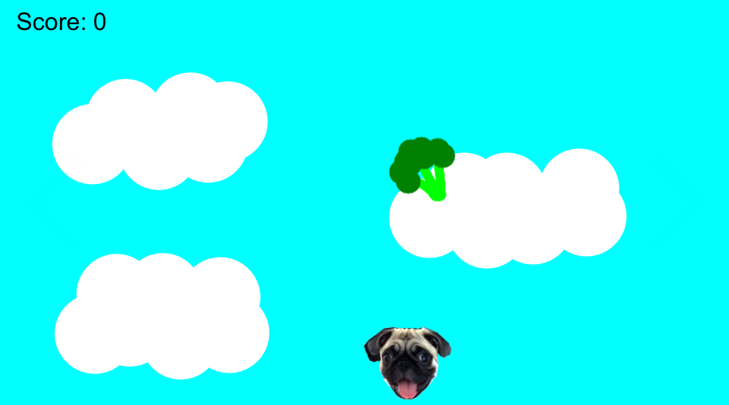
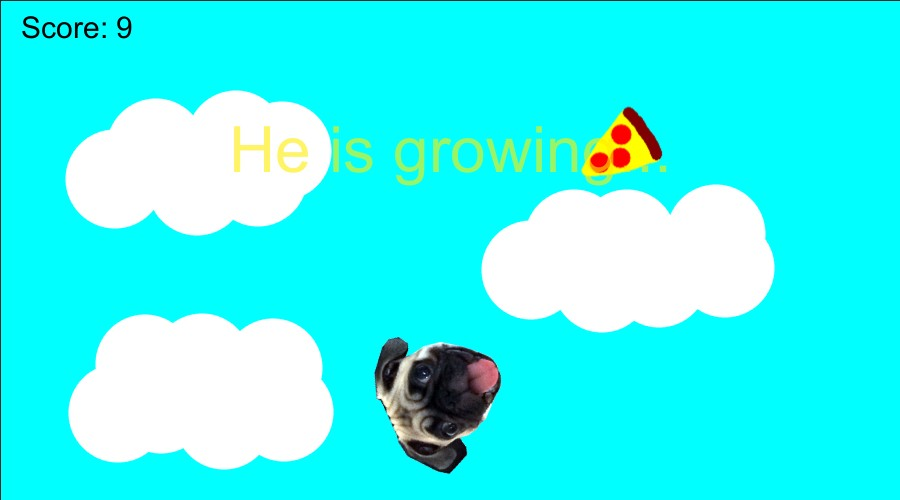
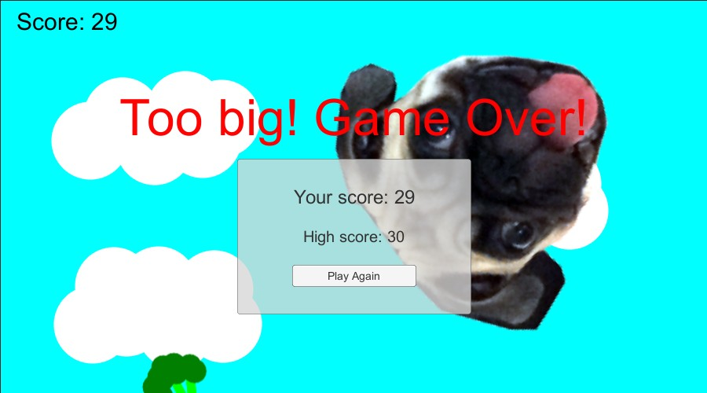

Participei do [Ludum Dare](http://ludumdare.com/compo) pela terceira vez mas sempre parece ser a primeira pela quantidade de coisas que aprendo. Mudei algumas coisas desta fez, tentei ficar mais organizado, mas como sempre o tempo é o maior vilão.

Desta vez houve um empate na votação do tema, e dois ficaram disponíveis. Cada participante poderia escolher um deles ou os dois, e eu acabei escolhendo fazer um jogo com ambos. Os temas eram Growing (crescimento) e Two button controls (controle com dois botões). Diferente da edição #33 onde demorei para pensar no jogo, desta vez foi bem fácil e rápido.

Minha ideia foi fazer um jogo com meu cachorro, um pug chamado Spock. Neste jogo ele se movimentaria para esquerda e direita coletando itens que cairiam do céu. O brocolis é um item saudável, que dá pontos. Já a pizza não dá pontos, e faz ele ficar maior e lento. Com seu crescimento, ao invés de se movimentar ele iria rolar pela pela. E quando atingisse um tamanho máximo, iria explodir em confetti e o jogo terminaria.

Novamente escolhi utilizar a [Unity](http://unity3d.com/pt/), principalmente pela facilidade de exportar para diversas plataformas e facilitar o teste do jogo. Existem muitos casos onde os desenvolvedores publicam apenas para uma plataforma e isso pode limitar um pouco o publico. Hoje por exemplo estou trabalhando usando um Mac, então jogos que não tem versão para Mac ou Web eu estou deixando pra testar depois quando ligar meu desktop Windows, mas há uma chance de eu não jogá-los também. Por isso escolhi usar a Unity e publicar para Mac, Windows, Linux e Android.

Eu cheguei a [mencionar](http://gamedeveloper.com.br/hoje-comeca-o-ludum-dare-34/) que estava planejando exportar para Web utilizando o WebGL da Unity que saiu do beta na versão 5.3, porém decidi não utilizá-lo neste momento. Provavelmente vou fazer upload do jogo na página do jogo no Ludum Dare depois, para ter mais uma opção disponível.

Desta vez tentei brincar de artista e desenhei a pizza, o brocolis e o céu utilizando [GIMP](https://www.gimp.org/). Não sou artista, mas o resultado ficou até que aceitável e engraçado. Para o personagem utilizei a foto do Spock.

Ao invés de utilizar um pedaço de papel com as tarefas decidi me organizar utilizando o [Trello](https://trello.com/), e criei um board com todas tarefas. A grande vantagem disso foi que caso eu queria continuar o jogo já deixei algumas coisas listadas lá como ideias futuras ou melhorias. Nos outros dois jogos pensei em várias coisas para melhorar, mas por não anotar deixei pra lá. Esta com certeza foi uma boa decisão para eu poder continuar o projeto.

Novamente a parte mais difícil foi a falta de tempo, e isso me prejudicou muito neste projeto. Planejei muitas coisas que não tive tempo de fazer, e esta foi a primeira vez que não coloquei música e efeitos sonoros em um jogo do Ludum Dare. As fotos do Spock eram algo temporário, pois eu iria desenhar de algum jeito ele, mas também não tive tempo para isto. Como o uso de fotos são permitidas, eu deixei elas na versão final do jogo. Também não tive tempo de fazer a explosão em confetti no final do jogo.

Alguns fatores que me prejudicaram:

- Publicar para várias plataformas: lembra que eu mencionei lá em cima no texto que isso era algo bom para testar? Realmente é, mas durante um game jam pensar em várias plataformas requer compilar e testar, e sempre é necessário fazer algum ajuste (principalmente no caso de mobile). Por isso da próxima vez vou focar em apenas uma plataforma;
- Criar a arte: diferente dos outros dois jogos que fiz nas edições passadas, este exigiu um pouco mais de “arte”, e por não ser artista acabei fazendo apenas os itens e o background;
- Fim de ano: Geralmente no fim de semana no final do ano temos muitas coisas para fazer por causa do Natal e viagens, e isto me deixou com pouco menos de 10 horas disponíveis para trabalhar no projeto. Outro problema é que nestas 10 horas disponíveis eu não estava descansado para me concentrar, então não renderam tanto quando eu gostaria. Por conta disso, acabei cortando coisas legais do jogo.

O próximo Ludum Dare #35 será em Abril de 2016 e provavelmente irei tentar utilizar um framework diferente para fazer o jogo, além de focar em apenas uma plataforma. Vou tentar estar mais preparado para improvisar arte e fazer o possível para ter mais tempo disponível. Também quero tentar fazer um jogo melhor e maior, geralmente faço esses jogos simples por medo de não terminar a tempo.

[Neste link](http://ludumdare.com/compo/ludum-dare-34/?action=preview&uid=52021) você pode conferir a página do jogo no Ludum Dare os links para download do jogo. O código do jogo está disponível no meu [GitHub](https://github.com/cicanci/game-unity-ld34).

**UPDATE**: Adicionei uma build web lá na página do jogo no Ludum Dare, realmente está muito melhor essa versão nova da Unity 5.3 para exportar WebGL. Ainda quero fazer testes com um jogo mais pesado, mas fiquei realmente surpreso pela melhora.

