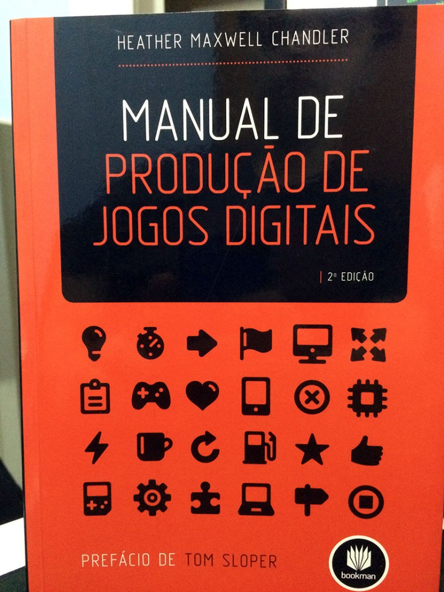

Existem alguns livros que são tão únicos na abordagem de seus assuntos que se tornam referência e sempre são recomendados para quem tem interesse de estudar seu assunto específico. Isto acontece com este livro que, como o próprio título diz, é um [manual para produção de jogos digitais](http://www.grupoa.com.br/livros/gerenciamento-de-projetos/manual-de-producao-de-jogos-digitais/9788540701830).

A autora Heather Maxwell Chandler trabalha com produção de jogos desde 1996 e já passou por empresas como Ubisoft, Activision e Electronic Arts. Embora o livro tenha sido escrito visando projetos de jogos em equipes, muita coisa nele vai ser bem útil para desenvolvedores independente.

O primeiro capítulo é um belo resumo das 4 principais fases da criação de um jogo: Pré-Produção, Produção, Testes e Pós-Produção. Todos os demais capítulos vão detalhar bem cada uma dessas fases do ciclo de produção, explicar tudo que é recomendável ter ou fazer em cada uma elas, mas isso não significa que tudo deve ser seguido a risca. No capítulo 2 são apresentados praticamente todos papéis possíveis na produção de um jogo, e o capítulo 3 fala rapidamente sobre métodos para gerenciar um projeto.

A parte II e III do livro eu tenho quase certeza de que este é o único livro que deve abordar este assunto na indústria de jogos. Detalhes sobre a parte legal de um projeto, como licenças e contratos, são apresentados para deixar claro como proteger seu projeto. Além disso, existe um capítulo inteiro sobre como deve ser o relacionamento entre o desenvolvedor e uma publisher de jogos, algo bem raro de se encontrar por ai, principalmente do ponto de vista de uma produtora de jogos. Na parte III o foco é a gestão das pessoas, desde como contratar e manter talentos na equipe, até como ter uma comunicação eficaz com o time.

Na parte IV o foco é a produção técnica, e assuntos como música, voiceover, captura de movimentos, jogos online, marketing e relações públicas são abordados. É interessante que grande parte destes assunto possuem poucos livros sobre eles. Imagino que de maneira proposital assuntos como física e inteligência artificial foram deixados de lado aqui porque existem muitos livros sobre eles.

O restante do livro tem um foco maior no papel do produtor e são apresentados em detalhes os assuntos Pré-Produção, Produção, Testes e Pós-Produção. São tantas coisas legais como testes com usuários, postmortem, localização, classificação de jogos, análise SWOT, entre muitos outros tópicos, que este texto ficaria do tamanho do livro para falar de tanto conteúdo de qualidade apresentado.

Em resumo, este é um livro obrigatório para qualquer pessoa que quer trabalhar com jogos, não importante se é um desenvolvedor independente ou não. Este livro serve para programadores, artistas, designers, músicos e, é claro, produtores.

Muito obrigado a editora [Bookman](http://www.grupoa.com.br/livros/gerenciamento-de-projetos/manual-de-producao-de-jogos-digitais/9788540701830) por me enviar está cópia para fazer esta review! Você pode comprar este livro no site da editora ou em outras livrarias virtuais.
