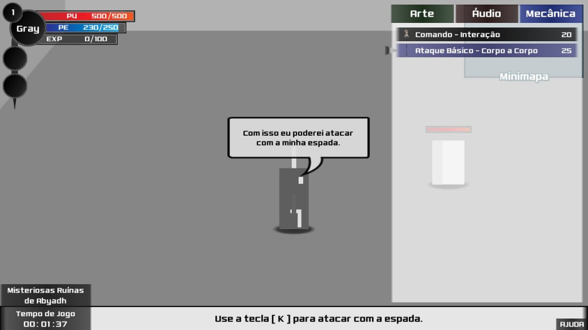
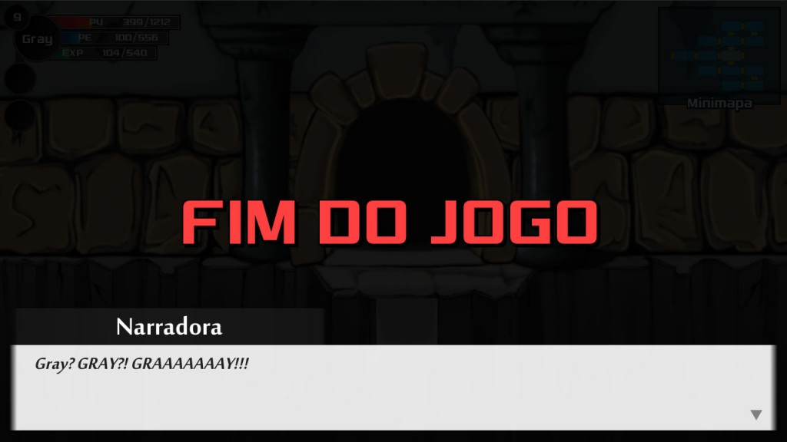

Este é o primeiro postmortem de um jogo de RPG publicado aqui no blog. [Teharth Prologue – The Resources Dissolution](http://www.souking.com.br/teharth-resources-dissolution) é o terceiro jogo do [Maurílio Eudes Okamoto](http://okamotoprojects.wix.com/site "Okamoto"), que já publicou os jogos [Sou Sustentável](http://gamedeveloper.com.br/postmortem-sou-sustentavel/) e [Manual do Skate](http://gamedeveloper.com.br/postmortem-manual-do-skate/), e o primeiro do [Teharth Studios](http://teharthstudios.wix.com/home). Confira aqui um resumo de como foi o desenvolvimento deste projeto as dificuldades que a equipe encontrou para terminar e publicar o jogo e [clique aqui](http://www.souking.com.br/teharth-resources-dissolution) para fazer o download do jogo.

1. **Descrição do jogo**

O jogo tem como gênero um RPG de ação 2D, com bastante uso de metaficção (quebra da quarta parede), um pouco de humor com paródias e *non-sense*. E trata-se de apenas um Prólogo do que está por vir futuramente, possui cerca de 1 hora de jogo.

<iframe allowfullscreen="" frameborder="0" height="371" src="https://www.youtube.com/embed/w_9YOWUg7tg?feature=oembed" width="660"></iframe>

A história se passa em Baghdah, um país localizado no extremo leste do continente. Gray um aventureiro iniciante, decide explorar todo o mundo de Teharth. Sua primeira parada foi nas Misteriosas Ruínas de Abyadh, onde ele encontra um ser lendário chamado Azazil. Esse ser tem o poder de dissolver os recursos do jogo, como a aparência física, os sons e os mecanismos de seres e objetos de Teharth.

O jogador possui o poder de evoluir de volta os recursos do jogo, auxiliando assim o Gray a conseguir atingir seus objetos e a resolver os quebra-cabeças. Pois Gray não consegue fazer muita coisa sem os recursos dele e o jogador não pode interagir diretamente com os elementos de Teharth. O jogador está participando do jogo como entidade jogador e não personificando o protagonista.

2. **Postmortem**

Dessa vez fiz o postmortem um pouco diferente, em vez de separar em pontos positivos e negativos, vou citar pontos “importantes” que acreditamos que podem ser interessantes. O motivo de não fazer essa separação é porque nesse projeto tivemos muitos pontos que são tanto positivos quanto negativos.

1. **O Projeto Nasceu de Um Problema**

No Teharth Studios, até poucas semanas atrás, nosso maior problema era falta de artistas, para fazer a parte gráfica/arte dos jogos. Na época, em março, pensamos em tentar fazer um projeto um pouco mais simples e que pesasse menos em arte.

Foi então que nasceu a ideia de evoluir o jogo de protótipo para final durante a jogada. Como gostamos de tentar inovar e colocar metaficção, colocamos o poder de evoluir o jogo no jogador, sendo um co-protagonista do jogo.

Desse modo, conseguimos dar um tempo maior para os artistas, pois as artes mesmo só seriam usadas na segunda metade do projeto. E também tivemos mais tempo para recrutar novos artistas.

Então de um problema, conseguimos um projeto e novos membros. Porém isso também gerou um outro problema. No começo do ano estávamos desenvolvendo outro projeto e tivemos que pausar ele, pois manter dois projetos seria um pouco complicado.

2. **Inexperiência da Equipe Gerou Experiência**

Começamos projetar algumas coisas em 2014, porém só conseguimos começar algo efetivamente em janeiro de 2015. Ao longo de 2015 começamos estabilizar a equipe. Porém o grande problema era que a maioria não havia criado nenhum outro jogo completo anteriormente, por mais simples e curto que seja. Então decidimos fazer 1 ou outro prólogo, seriam projetos não necessariamente simples, mas curtos para a equipe começar ganhar mais experiência prática.

O problema de alguns era falta de conhecimento em áreas específicas, outros tinham conhecimento, mas não sabiam direito como aplicar em jogos. Então vimos que um prólogo poderia ser perfeito para iniciar as coisas, mesmo porque a maioria dos membros não se conheciam entre si, seria um bom jeito de aumentar o engajamento e o trabalho em equipe.

Como é geralmente comum em equipes pequenas, muitas pessoas acabam tendo que participar de várias áreas diferentes. Por um lado ruim isso diminui o foco, por outro lado melhora a comunicação entre os membros. Ao aprender e entender mesmo que bem pouco uma outra área de desenvolvimento. Faz você entender melhor o que os outros membros passam, que não é tão fácil ou não é tão difícil fazer tal tarefa daquela área.

Então a inexperiência gera experiência, de certa forma isso é meio óbvio, porém somente é verdade quando a pessoa corre atrás para evoluir.

3. **Objetivo do Projeto: Velocidade X Qualidade**

Colocamos em mente que nosso objetivo principal seria o ganho de experiência e o projeto deveria ser algo breve. Como citado no item 1, existe outro prólogo que estava em desenvolvimento. Então a ideia era terminar logo esse projeto para continuar o “prólogo de verdade”.

O lado ruim disso é que o jogo não foi lapidado até o final, poderíamos ter melhorado muitas coisas, como deixar a mecânica ainda mais divertida, melhorar o roteiro que foi feito as pressas, criar animações melhores, algumas delas estão meio estranhas. Muitos desses problemas são consequências de a gente não ter sentado para fazer o GDD do projeto direito, já saímos desenvolvendo sem uma planejamento bem definido.

Porém de forma positiva esse objetivo manteve melhor o nosso foco e conseguimos concluir o projeto e o objetivo dele. Com uma qualidade final razoável e uma ideia de jogo bacana, com potencial a ser explorado.

Basicamente o desenvolvimento desse jogo foi um treino para fazer o próximo. Absorver os feedbacks positivos e negativos para fazer melhor futuramente.

4. **Mudanças**

Este item é consequência dos outros três anteriores. Começamos o projeto “do nada”, nós acreditávamos que a ideia era boa, mas precisávamos ver como aplicar isso. Sabemos que muitas mudanças geram diversos problemas, como retrabalho, frustração, conflitos, entre outros. Porém pode deixar o projeto ainda melhor. Abaixo segue um breve histórico do projeto.

**Abril de 2015:** Pelo nosso foco em velocidade, decidimos fazer um jogo 2D do gênero plataforma. Arte 100% minimalista, com evolução do jogo apenas em mecânicas. Chegamos a criar um GDD simplificado as pressas e um protótipo. Porém pensamos depois, que poderíamos evoluir arte e áudio também, temos artistas (mesmo que pouco) e músicos. O gênero plataforma é um dos mais usados em jogos indies, tanto brasileiro quanto de fora. O feedback que mais recebemos na época foi que parece muito com Evoland ou DLC Quest. Mas a gente não achava isso, não estávamos apresentando a ideia de jeito certo. Como gostamos de tentar fazer diferente, cancelamos o projeto.

**Maio de 2015:** Mas como a gente achou a ideia da evolução muito bacana e queríamos testar como o público iria reagir. Então pensamos em outro projeto usando essa ideia. Aqui o jogo passou a ser um RPG de ação 2D, com evolução de arte e áudio além da mecânica, deixando o projeto 5 vezes mais complexo que o anterior, indo contra o objetivo inicial. Porém o foco do grupo Teharth Studios é fazer RPG ou pelo menos híbridos com RPG, mais especificamente JRPGs. Após criar um novo GDD simplificado e um protótipo dele, vimos que o jogo não ficaria muito bom, com o tempo e equipe que temos. Aí cancelamos o projeto novamente. Pois, só o fato de ter RPG na descrição do projeto já fazia tudo ficar mais complexo.

(Em junho e julho o responsável da equipe e projeto, teve que mudar de casa, que demorou muito para terminar e teve a perda de um irmão. Com isso o projeto acabou ficando de lado, sem ele a equipe não se sustenta direito.)

**Agosto de 2015:** Decidimos então fazer algo ainda usando a ideia da evolução, mas seria um jogo de puzzles (quebra-cabeças), sem batalha e roteiro.. Algo por fases em vez de contínuo, algo bem mais casual e possivelmente para mobile. Ficamos o mês todo rabiscando algo, mas o projeto não dava aquela motivação de querer desenvolver ele.

**Setembro de 2015:** Ficamos na dúvida e basicamente não fizemos nada em setembro. Somente no final do mês, decidimos voltar na ideia de maio, era ela que a gente achava gostava, decidimos tentar mesmo sabendo que poderia dar errado. Podemos dizer que o projeto começou efetivamente no final desse mês.

**Outubro de 2015:** O velho problema da falta de artistas pesou novamente. Porém decidimos fazer o projeto mesmo assim, qualquer coisa ficaria com menos evoluções de arte. Porém no final do mês conseguimos ajuda de 3 novos artistas e conseguimos fazer tudo que estava dentro do planejado. Nessa época um dos músicos teve que sair, ele que faria a orquestração das músicas, com isso as músicas ficaram um pouco menos lapidadas, mas ainda ficaram bacanas. Depois disso o projeto finalmente fluiu bem.

**Dezembro de 2015:** Tivemos alguns atrasos aqui, pois a maioria dos membros fazem faculdade e estavam em final de semestre com provas e tudo mais. Aí a fase final do projeto que era testar e lapidar o projeto, durou bem menos tempo que o previsto. Mas conseguimos corrigir os problemas que encontramos e melhorar algumas coisas.

5. **Conclusão**

Apesar de o projeto não ter ficado tão bom quanto queríamos, cumprimos os objetivos com ele. Observamos que temos conhecimento para fazer algo bem melhor, se fizermos com calma e um melhor planejamento. Até agora já recebemos bastante feedback e em sua grande maioria foram positivos, então foi bastante gratificante desenvolver esse jogo.

Para terminar, agradeço novamente ao Bruno Cicanci, pelo espaço e oportunidade de postagem de um postmortem por aqui, no Game Developer. E obrigado a todos que leram, aguardem que em 2016 quando atingirmos nossa meta iremos dobrá-la. Hahaha.

**Acompanhe-nos:**

– Site: [http://teharthstudios.wix.com/home](http://teharthstudios.wix.com/home)  
 – Facebook: [https://www.facebook.com/teharth.studios](https://www.facebook.com/teharth.studios)  
 – Twitter: [https://twitter.com/teharthstudios](https://twitter.com/teharthstudios)

